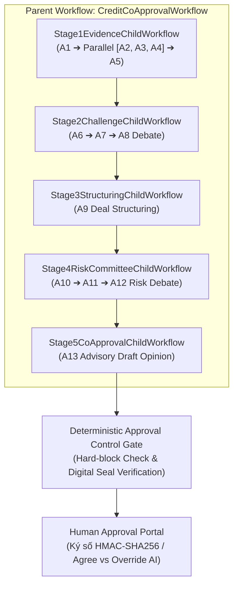

# CreditAgent POC

POC sản phẩm **Kiến trúc Multi-Agent Đồng Phê Duyệt Tín Dụng SME** được điều phối bởi **Temporal.io**. Mục tiêu là chứng minh cách 13 AI Agent được điều phối qua Shared State, gọi 25 backend tools qua cổng an toàn Tool Gateway, thực thi bền vững qua Temporal Child Workflows và bảo mật bởi bộ quy tắc kiểm soát **Deterministic Approval Control Gate** không trao quyền quyết định duyệt/giải ngân cho LLM.

---

## 🎯 POC chứng minh điều gì

- **Đủ 13 Logical Agents A1–A13** chạy end-to-end qua 5 Giai đoạn (Stage 1 đến Stage 5).
- **Điều phối Temporal Parent & Child Workflows**: Workflow chính `CreditCoApprovalWorkflow` quản lý 5 Child Workflows độc lập từng Stage.
- **Tách biệt Động cơ Thực thi (Execution Engine) & Kết quả Nghiệp vụ (Business Outcome)**: `RUNNING`/`COMPLETED` tách bạch với `PASS` (xanh), `WARNING` (vàng), `ESCALATE` (tím), `FAIL` (đỏ).
- **Thực thi song song Fan-out/Join Barrier**: A2, A3 và A4 chạy song song trên cùng một State snapshot và merge qua State ownership.
- **Agent không chat hoặc gọi trực tiếp Agent khác**: Mọi thay đổi đi qua `StatePatch` và optimistic `state_version`.
- **Cổng An toàn Tool Gateway**: Từ chối các Tool không nằm trong allowlist của Agent, tự động ghi vết vi phạm vào Audit Trail.
- **25 Logical Tool Contracts & Enterprise Adapters**: Hỗ trợ simulated backends và sẵn sàng đầu nối với CIC, Core Banking, IDP/OCR BCTC và Định giá TSBĐ.
- **Hai vòng phản biện (Credit Debate & Risk Debate)** dạng append-only.
- **AI chỉ tạo Ý kiến Tư vấn Bản nháp (`CoApprovalOpinion.status=DRAFT`)**.
- **Chữ ký số & Phê duyệt Con người (Human-in-the-Loop)**: Ký duyệt bằng mã băm Chữ ký số HMAC-SHA256, quy tắc bắt buộc giải trình khi Override AI và Báo cáo Chất lượng Cán bộ (Quality Index KPIs).
- **Deterministic Control Plane**: Mã lệnh cố định, không trao quyền phê duyệt hoặc giải ngân cho AI.
- **Sáu kịch bản tín dụng** có kết quả đầu ra khác nhau và chạy lặp lại offline/online 100%.

---

## 🚀 Chạy nhanh (Quick Start)

Yêu cầu Python 3.9 trở lên và gói `temporalio`.

### 1. Chạy CLI Offline / Test Contracts
```bash
cd CreditAgent
PYTHONPATH=src python3 -m credit_agent_poc list
PYTHONPATH=src python3 -m credit_agent_poc run --scenario approve_conditions
PYTHONPATH=src python3 -m credit_agent_poc run-all --output-dir demo-output
```
Lệnh `run-all` sinh báo cáo chi tiết JSON và HTML cho từng case trong thư mục `demo-output/`.

### 2. Chạy trên Native Temporal Server Cluster (`127.0.0.1:7233`)

```bash
# Terminal 1: Khởi động Temporal Server start-dev
temporal server start-dev --ip 127.0.0.1 --port 7233

# Terminal 2: Khởi động Temporal Worker Process
PYTHONPATH=src python3 -m credit_agent_poc worker --target-host 127.0.0.1:7233 --task-queue credit-approval-queue

# Terminal 3: Chạy kịch bản qua Temporal Server Cluster
PYTHONPATH=src python3 -m credit_agent_poc run --scenario approve_conditions --engine temporal-cluster
```
*Giao diện Temporal Web UI quản lý Workflow tại: **[http://localhost:8233](http://localhost:8233)**.*

---

## 🌐 Giao diện Web Review UI & Phê duyệt Con người (Port 8080)

```bash
PYTHONPATH=src python3 -m credit_agent_poc serve --port 8080
```

Truy cập: **[http://127.0.0.1:8080](http://127.0.0.1:8080)** để xem giao diện trực quan:

- **Hỗ trợ Song ngữ (English / Tiếng Việt)**: Công cụ chuyển đổi ngôn ngữ hiển thị động ở thanh Topbar (`🌐 Lang: [🇻🇳 Tiếng Việt | 🇬🇧 English]`).
- **Hiển thị Động cơ Backend Real-time**: Nhãn trạng thái hiển thị rõ luồng đang chạy trên `🚀 Native Temporal Server Cluster (127.0.0.1:7233)` hay `Temporal.io In-Memory Engine` kèm đường dẫn trực tiếp `[Mở Temporal Web UI Port 8233 ↗]`.
- **Workflow Canvas 5 Stage**: Trực quan hóa tiến trình thực thi, Fork/Join barrier, Debate direction, Decision boundary.
- **State Timeline & Risk Propagation**: 14 bounded snapshots lưu vết thay đổi State version và đường đi lan truyền rủi ro.
- **Bảng Ký số & Giải trình Phê duyệt Con người (Human Decision Panel)**:
  - Cho phép Cán bộ chọn **Đồng ý với AI (AGREE)** hoặc **Bác bỏ AI (OVERRIDE)**.
  - Bắt buộc chọn Mã lý do (`OVERRIDE_REASON_CODE`) và nhập Nội dung giải trình (>10 ký tự) khi bác bỏ AI.
  - Tự động sinh Mã băm Chữ ký số HMAC-SHA256 bảo vệ tính toàn vẹn của Tờ trình.
- **Báo cáo Chất lượng Cán bộ (Approver Quality Analytics)**: Dashboard phân tích lịch sử phê duyệt, tỷ lệ Override AI và Chỉ số Tuân thủ Chất lượng (Quality Index) của Cán bộ Phê duyệt.

---

## 📋 Danh mục 6 Kịch bản Tín dụng (Credit Scenarios)

| ID | Nội dung | Outcome Mong đợi |
|---|---|---|
| `approve_conditions` | Repayment tốt, DSCR ≥ 1.2, concentration cần monitoring | `APPROVE_WITH_CONDITIONS` |
| `escalate_policy_exception` | Economics tốt nhưng tenor vi phạm pilot policy | `ESCALATE_TO_CRO_RISK` |
| `reject_missing_evidence` | Thiếu financial statement và window sao kê quá ngắn | `REJECT_INSUFFICIENT_EVIDENCE` |
| `escalate_circular_funds` | Đồ thị giao dịch phát hiện điểm rủi ro dòng tiền vòng quanh high score | `ESCALATE_TO_CRO_RISK` |
| `reject_weak_cashflow_high_collateral` | Collateral cao nhưng DSCR không đạt (Collateral không chữa lỗi nguồn thu chính) | `REJECT_INSUFFICIENT_EVIDENCE` |
| `reject_tool_failure` | Cashflow backend bị lỗi, hệ thống tự động Fail-Closed | `REJECT_INSUFFICIENT_EVIDENCE` |

---

## 🏛️ Kiến trúc Điều phối Temporal (Parent & Child Workflows)



---

## 🗺️ Cấu trúc Mã Nguồn Dự án (Source Map)

```text
src/credit_agent_poc/
  agents/                # Mô-đun hóa 13 Agent theo 5 Stage nghiệp vụ
    prompts/             # Quản lý các Markdown Prompt Templates (.md)
    stage1_evidence.py   # Agent A1, A2, A3, A4, A5
    stage2_challenge.py  # Agent A6, A7, A8
    stage3_structuring.py# Agent A9
    stage4_risk.py       # Agent A10, A11, A12
    stage5_opinion.py    # Agent A13
    registry.py          # Dynamic Agent Registry & Lookup
  tools/                 # Cổng an toàn Tool Gateway & Adapters
    gateway.py           # Tool Gateway phân quyền Allowlist & Audit Log
    simulated/           # Nhóm công cụ giả lập cho Demo/Test (intake, financial, integrity, structuring)
    adapters/            # Enterprise Adapters thực tế (CIC, Core Banking, IDP OCR, Collateral)
  control_gate.py        # Thẩm định Độc lập, Hard-block checker & Chữ ký số HMAC-SHA256
  workflow.py            # Temporal Parent Workflow & 5 Stage Child Workflows
  orchestrator.py        # Engine điều phối cao cấp & persistence
  scenarios.py           # 6 kịch bản tín dụng thử nghiệm
  models.py              # Shared State, StatePatch & Ownership validator
  model.py               # Offline ScenarioModel & OpenAI-compatible adapters
  db.py                  # SQLite repository, Audit Trail & Quality Analytics
  report.py              # Động cơ tạo báo cáo HTML/JSON
  web.py                 # REST API Web Review Server
  static/index.html      # Giao diện Web Review UI Song ngữ (VI/EN)
```

---

## 🧪 Bộ Kiểm thử Tự động (Automated Tests)

```bash
PYTHONPATH=src python3 -m unittest discover -s tests -v
```

Hệ thống bao gồm **79 unit tests tự động** kiểm tra toàn diện:
- Bộ 20 Tiêu chuẩn Nghiệm thu Ranh giới (`AC1` đến `AC20`).
- Kiểm soát an toàn Control Gate, Hard-block và phân cấp Thẩm quyền (`Exception Authority`).
- Xác minh Mã băm Chữ ký số HMAC-SHA256 và phát hiện hồ sơ bị can thiệp (Tampered record).
- Tính nguyên tử và chống trùng lặp dữ liệu (`Idempotency & Concurrency`).
- Phân tích chỉ số Chất lượng Cán bộ Phê duyệt (Quality Index).

---

## 📖 Thư mục Tài liệu Kỹ thuật Chi tiết (`docs/`)

1. **[01. Kiến Trúc Tổng Quan Multi-Agent](docs/01_kien_truc_tong_quan_multi_agent.md):** 13 Logical Agents, 5 Tầng Workflow, Shared State & Ma trận Quyền ghi `OWNERSHIP`.
2. **[02. Temporal.io Orchestration & LocalDB Persistence](docs/02_temporal_orchestration_va_persistence.md):** Luồng Durable Execution (`@workflow.defn`, `@activity.defn`), Parent/Child Workflows & SQLite Checkpoint Schema.
3. **[03. Danh Mục 25 Backend Tools & Mapping Hệ Thống Ngân Hàng](docs/03_danh_muc_25_tools_va_backend_mapping.md):** Bảng mapping 25 Tools với DMS, Core Banking, Graph DB, BRE, LOS & Yêu cầu dữ liệu sẵn sàng.
4. **[04. Hướng Dẫn Vận Hành & Lộ Trình Triển Khai MVP](docs/04_huong_dan_van_hanh_va_trien_khai_mvp.md):** Hướng dẫn bật Temporal Server, Worker, Web UI và Roadmap 6 tháng cho Production MVP.
5. **[05. Kiến Trúc & Công Nghệ IDP/OCR Tín Dụng](docs/05_kien_truc_ocr_va_idp_cho_tin_dung.md):** Mô hình VLM/OCR tốt nhất (Qwen2-VL, PaddleOCR, LayoutLMv3), Tech Stack & Schema JSON chuẩn hóa cho BCTC và Sao kê.
6. **[06. Quy Trình Phê Duyệt Con Người & Đánh Giá Chất Lượng Cán Bộ](docs/06_luong_phe_duyet_con_nguoi_va_danh_gia_chat_luong.md):** Luồng ký duyệt con người, mã băm chữ ký số, quy tắc giải trình Override AI & Báo cáo chất lượng phê duyệt (Approver Quality KPIs).
7. **[07. Định Hướng Kiến Trúc & Cấu Trúc Thư Mục Enterprise](docs/07_dinh_huong_kien_truc_va_cau_truc_thu_muc_enterprise.md):** Cấu trúc thư mục chuẩn hóa Enterprise phân tách Clean Architecture (Domain, Agents, Tools Adapters, Governance, Infrastructure, WebUI).
8. **[08. Thiết Kế Hạ Tầng & Quy Hoạch Năng Lực (Sizing Guide) Enterprise](docs/08_thiet_ke_ha_tang_va_sizing_enterprise.md):** Quy hoạch tài nguyên máy chủ, tính toán Peak TPS (10.000 hồ sơ/ngày), Sizing K8s Workers, Temporal Cluster, PostgreSQL DB & Private LLM (NVIDIA A100/H100).
9. **[09. Sổ Tay Kỹ Thuật & Tổng Hợp Giải Pháp Kiến Trúc (Living Technical Playbook)](docs/09_tong_hop_trao_doi_ky_thuat_va_giai_phap_kien_truc.md):** Tổng hợp 10 chuyên đề kỹ thuật chuyên sâu, quyết định thiết kế kiến trúc (ADR), bài toán tải, xử lý OCR/IDP chống timeout và hệ thống Audit Traceability.
10. **[10. Luồng Thực Thi Temporal.io Workflow (Mermaid Sequence & Flowchart)](docs/10_luong_thuc_thi_temporal_workflow.md):** Sơ đồ Mermaid sequence & flowchart chi tiết luồng thực thi Temporal.io (Client, Server, Task Queue, Worker, Workflow, Activity & LocalDB).
11. **[Architecture Flow Diagram (Interactive HTML)](docs/architecture_diagram.html):** Sơ đồ tương tác toàn bộ 6 tầng kiến trúc hệ thống CreditAgent.
12. **[Temporal.io Workflow Diagram (Interactive HTML)](docs/temporal_workflow_diagram.html):** Sơ đồ HTML quy trình 6 bước thực thi luồng Temporal.io Durable Execution.
13. Xem thêm [kiến trúc Multi-Agent đồng phê duyệt tín dụng](kien-truc-multi-agent-dong-phe-duyet-tin-dung.md) gốc.
