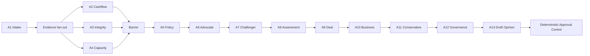

# CreditAgent POC

POC chạy được cho kiến trúc Multi-Agent đồng phê duyệt tín dụng SME. Mục tiêu là chứng minh cách 13 AI Agent được điều phối, trao đổi qua Shared State, gọi backend tools qua allowlist và tạo ra nhiều kết quả khác nhau mà không trao quyền phê duyệt thật cho LLM.

## POC chứng minh điều gì

- Đủ 13 logical agents A1–A13 chạy end-to-end.
- A2, A3 và A4 fan-out trên cùng một State snapshot, sau đó merge bằng State ownership.
- Agent không chat hoặc gọi trực tiếp agent khác.
- Mọi thay đổi đi qua `StatePatch` và optimistic `state_version`.
- Tool Gateway từ chối tool không nằm trong allowlist của agent.
- 25 logical tool contracts giả lập document, transaction, graph, financial, policy và deal backends.
- Hai vòng phản biện tạo `CreditDebate` và `RiskDebate` dạng append-only.
- A13 chỉ tạo `CoApprovalOpinion.status=DRAFT`.
- Approval Control là deterministic code và không cấp quyền approve/disburse cho AI.
- Checkpoint và audit trail sau từng node.
- Sáu scenario có outcome khác nhau và chạy lặp lại được offline.

## Chạy nhanh

Yêu cầu Python 3.9 trở lên. POC mặc định không cần API key và không có dependency ngoài standard library.

```bash
cd CreditAgent
PYTHONPATH=src python3 -m credit_agent_poc list
PYTHONPATH=src python3 -m credit_agent_poc run --scenario approve_conditions
PYTHONPATH=src python3 -m credit_agent_poc run-all --output-dir demo-output
```

Lệnh `run-all` sinh JSON và HTML report cho từng case trong `demo-output/`.

## Review UI

```bash
PYTHONPATH=src python3 -m credit_agent_poc serve --port 8080
```

Mở [http://127.0.0.1:8080](http://127.0.0.1:8080), chọn scenario và bấm **Chạy kịch bản**. UI hiển thị:

- Execution status (`RUNNING`, `COMPLETED`, `PENDING`) được tách khỏi business outcome (`PASS` xanh, `WARNING` vàng, `ESCALATE` tím, `FAIL` đỏ); A2–A4 có thể cùng `RUNNING` trong fan-out.
- Workflow canvas chia đúng năm stage: Evidence Production, Credit Challenge, Deal Structuring, Risk Committee và Advisory Opinion/Control.
- Fork/join barrier, debate direction, manager/judge và decision boundary được thể hiện trực tiếp trên graph.
- 13 node và State version sau mỗi node.
- Input context đã giới hạn, system/role prompt, structured output và tool calls của từng agent.
- Bốn evidence reports.
- Credit Debate và Risk Committee turns.
- Deal proposal và A13 draft opinion.
- Deterministic control status và blocked reasons.
- Simulated backend calls, checkpoints và audit trail.

### Sprint 1: outcome và risk observability

- Outcome policy được version tại `src/credit_agent_poc/config/outcome_policy.json`. Mỗi node outcome trả về `level`, `reason_code`, `reason`, `rule_version` và execution status riêng biệt.
- API result có `risk_propagation`: risk source, đường đi qua các agent, từng edge và terminal node.
- Workflow có bộ lọc `ISSUES`, `PASS`, `WARNING`, `ESCALATE`, `FAIL`; stage header tổng hợp outcome count.
- Chọn một risk chain để làm mờ node không liên quan và theo dõi đường lan truyền từ evidence tới Approval Control.

Mở mục **Input / output trace theo từng Agent** sau khi run hoàn tất. Mỗi agent có bốn ô: `INPUT CONTEXT`, `STRUCTURED OUTPUT`, `SYSTEM + ROLE PROMPT` và `TOOL CALLS`. Đây là trace phục vụ POC; production phải áp dụng redaction, access control và retention policy trước khi lưu prompt/context.

Bạn cũng có thể click trực tiếp một agent trên workflow canvas để mở và cuộn tới trace tương ứng.

## Các scenario

| ID | Nội dung | Expected A13 outcome |
|---|---|---|
| `approve_conditions` | Repayment tốt, concentration cần monitoring | `APPROVE_WITH_CONDITIONS` |
| `escalate_policy_exception` | Economics tốt nhưng tenor vi phạm pilot policy | `ESCALATE_TO_CRO_RISK` |
| `reject_missing_evidence` | Thiếu financial statement và statement window quá ngắn | `REJECT_INSUFFICIENT_EVIDENCE` |
| `escalate_circular_funds` | Graph phát hiện circular flow score cao | `ESCALATE_TO_CRO_RISK` |
| `reject_weak_cashflow_high_collateral` | Collateral cao nhưng DSCR không đủ | `REJECT_INSUFFICIENT_EVIDENCE` |
| `reject_tool_failure` | Cashflow backend lỗi và workflow fail closed | `REJECT_INSUFFICIENT_EVIDENCE` |

Kết quả baseline của `ScenarioModel`: 6/6 scenarios khớp expected outcome, mỗi case chạy đủ 13 agents và khoảng 31–32 simulated tool calls.

## Luồng orchestration



## Model modes

### Offline `ScenarioModel`

Đây là model double có output tái lập. Nó vẫn nhận Base Prompt, Role Prompt và bounded context qua `ModelAdapter`. Mục đích là kiểm tra orchestration và control mà không phụ thuộc network, API key hoặc model nondeterminism.

### OpenAI-compatible endpoint

Adapter này dành cho thử nghiệm sau khi POC offline đã pass:

```bash
export CREDIT_AGENT_LLM_BASE_URL=https://your-compatible-endpoint/v1
export CREDIT_AGENT_LLM_API_KEY=replace-with-secret-from-your-secret-manager
export CREDIT_AGENT_LLM_MODEL=your-model-deployment
PYTHONPATH=src python3 -m credit_agent_poc run --scenario approve_conditions --model openai-compatible
```

Không commit `.env` hoặc key. Adapter remote là điểm mở rộng, chưa phải phần được chứng minh bởi test baseline vì output schema của từng provider cần được harden riêng.

## Source map

```text
src/credit_agent_poc/
  scenarios.py     # six synthetic credit cases
  models.py        # Shared State, StatePatch and ownership validator
  tools.py         # Tool Gateway, allowlists and simulated backends
  prompts.py       # shared safety prompt and 13 role prompts
  model.py         # offline and OpenAI-compatible model adapters
  agents.py        # context/tool/output contract for A1-A13
  orchestrator.py  # graph, fan-out/barrier, checkpoints and control
  report.py        # standalone JSON/HTML report
  web.py           # zero-dependency local review server
  static/index.html
tests/test_poc.py
```

## Tests

```bash
PYTHONPATH=src python3 -m unittest discover -s tests -v
```

Tests kiểm tra outcome của toàn bộ scenarios, đủ 13 node, 14 checkpoints, tool denial, stale StatePatch, State ownership, backend failure và nguyên tắc collateral không thay thế primary repayment.

## Ranh giới của POC

- Simulated tools không chứng minh chất lượng OCR, transaction categorization hoặc policy retrieval thật.
- `ScenarioModel` chứng minh graph/control contract, không chứng minh chất lượng suy luận của model production.
- State/checkpoint đang nằm trong memory của một process.
- Local UI không có production IAM, multi-tenancy hoặc PII controls đầy đủ.
- Không có action phê duyệt, ký hợp đồng hoặc giải ngân.

Bước tiếp theo hợp lý là thay từng simulated adapter bằng sandbox backend, dùng gold set đã được Credit/Risk gán nhãn và chạy shadow mode trước khi cân nhắc bất kỳ hard gate production nào.

## Tài liệu kiến trúc

Xem [kiến trúc Multi-Agent đồng phê duyệt tín dụng](kien-truc-multi-agent-dong-phe-duyet-tin-dung.md) để biết State schema mục tiêu, ownership, debate protocol và Approval Control design.
