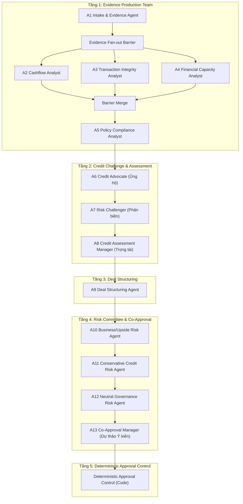

# 01. Kiến Trúc Tổng Quan Multi-Agent Đồng Phê Duyệt Tín Dụng SME

---

## 1. Tóm Tắt Mục Tiêu Hệ Thống

Hệ thống **CreditAgent** được thiết kế dựa trên mô hình **Multi-Agent đồng phê duyệt tín dụng SME (Small and Medium Enterprises)**. 

### Ranh giới an toàn cốt lõi (Fail-Closed Control Principle)
- **AI không giữ thẩm quyền pháp lý:** Các AI Agent chỉ đóng vai trò tham mưu, thẩm định và đưa ra dự thảo ý kiến (`DRAFT`).
- **Lớp kiểm soát xác định (Deterministic Approval Control Plane):** Kết quả cuối cùng phải đi qua một lớp kiểm soát bằng code xác định (không sử dụng LLM), thực thi nguyên tắc **Fail-Closed** (tự động phong tỏa hoặc leo thang lên cấp quản lý nếu phát hiện bất kỳ thiếu hụt bằng chứng, rủi ro giao dịch nghiêm trọng hoặc lỗi kỹ thuật).
- **Thẩm quyền con người:** Quyết định phê duyệt pháp lý và giải ngân cuối cùng thuộc về Giám đốc Chi nhánh / Hội đồng Tín dụng con người.

---

## 2. Kiến Trúc 13 Logical Agents & 5 Tầng Workflow

Hệ thống điều phối 13 AI Agent logic chia thành 5 tầng xử lý riêng biệt:

### Chi tiết vai trò 13 Agents:

| Agent Node | Tên Agent | Nhiệm vụ chính |
| :--- | :--- | :--- |
| **A1** | Intake & Evidence Agent | Tiếp nhận hồ sơ, kiểm tra tính đầy đủ của chứng từ, xác thực danh tính bên vay. |
| **A2** | Cashflow Analyst | Phân tích biến động dòng tiền thực tế qua sao kê, phát hiện sụt giảm hoặc phụ thuộc khách hàng. |
| **A3** | Transaction Integrity Analyst | Xây dựng đồ thị giao dịch, quét rủi ro dòng tiền vòng tròn (circular funds) & pass-through. |
| **A4** | Financial Capacity Analyst | Đánh giá sức khỏe tài chính BCTC, đối soát doanh thu khai báo & tính toán DSCR. |
| **A5** | Policy Compliance Analyst | Rà soát tuân thủ quy chế tín dụng, hạn mức, kỳ hạn (tenor) & xác định ngoại lệ. |
| **A6** | Credit Advocate | Tổng hợp lập luận **Ủng hộ cấp tín dụng** dựa trên các bằng chứng tích cực. |
| **A7** | Risk Challenger | Đưa ra lập luận **Phản biện rủi ro**, xoáy sâu vào các điểm yếu của hồ sơ. |
| **A8** | Credit Assessment Manager | Trọng tài đánh giá 2 luồng tranh luận, đưa ra kết luận thẩm định cân bằng. |
| **A9** | Deal Structuring Agent | Đề xuất cấu trúc khoản vay (Hạn mức, Lãi suất, Lịch trả nợ, TSBĐ & Điều kiện tiên quyết). |
| **A10**| Business/Upside Risk Agent | Đánh giá khía cạnh cơ hội kinh doanh & tiềm năng phát triển của doanh nghiệp. |
| **A11**| Conservative Credit Risk Agent | Đánh giá theo quan điểm rủi ro bảo thủ (Thế chấp không thay thế nguồn trả nợ gốc). |
| **A12**| Neutral Governance Risk Agent | Đánh giá từ góc nhìn quản trị rủi ro trung lập & tuân thủ hạn mức tín dụng. |
| **A13**| Co-Approval Manager | Tổng hợp toàn bộ hồ sơ, phát hành bản thảo **Co-Approval Opinion** (`DRAFT`). |

---

## 3. Cơ Chế Shared State, State Ownership & Audit Trail

### Shared Case State (`CreditState`)
Các Agent **không chat tự do** và **không trực tiếp gọi nhau**. Dữ liệu được chia sẻ tập trung qua đối tượng [`CreditState`](file:///Users/giangbh/Documents/Codex/2026-08-12/co/CreditAgent/src/credit_agent_poc/models.py#L35).

### Ma Trận Phân Quyền Ghi (`OWNERSHIP`)
Mỗi Agent chỉ được phép ghi (write) vào các trường được quy định cứng trong ma trận `OWNERSHIP`:
- `A1`: `case_file`, `evidence_catalog`, `data_quality`
- `A2`: `analyst_reports.cashflow`
- `A3`: `analyst_reports.transaction_integrity`
- `A4`: `analyst_reports.financial_capacity`
- `A5`: `analyst_reports.policy`
- `A6`, `A7`: `credit_debate` (Append-only)
- `A8`: `credit_assessment`
- `A9`: `deal_proposal`
- `A10`, `A11`, `A12`: `risk_debate` (Append-only)
- `A13`: `coapproval_opinion`
- `CONTROL`: `control`

### Optimistic State Patching (`StatePatch`)
Mọi thay đổi dữ liệu phải thông qua `StatePatch` kèm theo `state_version` kỳ vọng. Nếu `state_version` bị sai lệch (stale write), hệ thống từ chối patch để đảm bảo toàn vẹn dữ liệu khi chạy fan-out song song.

### State Checkpoints & Hash Audit
Sau mỗi bước xử lý của một node, hệ thống chụp một **Explainable State Snapshot** và tính toán mã băm **SHA-256**. Toàn bộ 14 checkpoints này được ghi nhận liên tục vào cơ sở dữ liệu localDB để phục vụ vết kiểm toán (Audit Trail).
