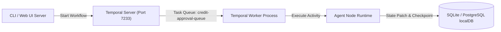

# 02. Temporal.io Orchestration Engine & LocalDB Persistence

---

## 1. Kiến Trúc Điều Phối Durable Execution (Temporal.io)

Hệ thống **CreditAgent** chuyển đổi luồng điều phối từ ThreadPoolExecutor đơn giản sang **Temporal.io Workflow Engine** nhằm đảm bảo tính bền vững (Durable Execution), khả năng khôi phục khi có sự cố (Fault-tolerance/Resume), và giám sát trực quan quá trình thực thi trên Temporal Server Cluster.



### Thành phần chính trong [`workflow.py`](file:///Users/giangbh/Documents/Codex/2026-08-12/co/CreditAgent/src/credit_agent_poc/workflow.py)

#### 1. Temporal Activities (`@activity.defn`)
- **`execute_agent_activity(node_id, state_dict, scenario_id)`:** Đóng gói quá trình thực thi của 1 Agent Node.
- Mỗi Activity nhận `state_dict` hiện tại, chạy logic thu thập dữ liệu / suy luận của Agent qua [`AgentRuntime`](file:///Users/giangbh/Documents/Codex/2026-08-12/co/CreditAgent/src/credit_agent_poc/agents.py#L41), áp dụng `StatePatch` vào State và trả về snapshot mới nhất.
- Đã được cấu hình `schedule_to_close_timeout=timedelta(seconds=30)` và hỗ trợ xử lý bất đồng bộ `async def`.

#### 2. Temporal Workflows (`@workflow.defn`)
- **`CreditCoApprovalWorkflow.run(scenario_id)`:** Định nghĩa luồng DAG tổng thể:
  1. Kích hoạt Activity `A1 Intake`.
  2. Kích hoạt song song 3 Activities `A2 Cashflow`, `A3 Integrity`, `A4 Capacity` qua `asyncio.gather()` (Fan-out Barrier).
  3. Gộp kết quả báo cáo thẩm định (`analyst_reports`) từ 3 nhánh vào `current_state`.
  4. Thực thi tuần tự các Activities từ `A5` đến `A13`.
  5. Trả về kết quả cuối cùng kèm `final_state`.

#### 3. Temporal Worker & Server Integration
- **Temporal Server:** Chạy mặc định tại `127.0.0.1:7233` (Web UI tại `http://127.0.0.1:8233`).
- **Temporal Worker:** Lắng nghe trên Task Queue `credit-approval-queue` via command:
  ```bash
  PYTHONPATH=src python3 -m credit_agent_poc worker --target-host 127.0.0.1:7233 --task-queue credit-approval-queue
  ```

---

## 2. Kiến Trúc Lưu Trữ Bền Vững (LocalDB Persistence)

Lớp lưu trữ dữ liệu được thiết kế trong [`db.py`](file:///Users/giangbh/Documents/Codex/2026-08-12/co/CreditAgent/src/credit_agent_poc/db.py) bằng **SQLite** (`credit_agent.db` hoặc `:memory:`), chuẩn hóa theo thiết kế tương thích 100% với cơ sở dữ liệu **PostgreSQL** trong môi trường Production.

### Cấu Trúc Bảng CSDL (Schema Design)

```sql
-- 1. Bảng lưu trữ trạng thái hồ sơ tín dụng
CREATE TABLE IF NOT EXISTS credit_cases (
    case_id TEXT PRIMARY KEY,
    scenario_id TEXT NOT NULL,
    run_id TEXT NOT NULL,
    state_version INTEGER NOT NULL DEFAULT 0,
    case_revision INTEGER NOT NULL DEFAULT 1,
    state_data TEXT NOT NULL, -- JSON blob chứa toàn bộ CreditState
    updated_at TEXT NOT NULL DEFAULT CURRENT_TIMESTAMP
);

-- 2. Bảng lưu trữ 14 Explainable Checkpoints sau từng Node
CREATE TABLE IF NOT EXISTS state_checkpoints (
    checkpoint_id TEXT PRIMARY KEY,
    run_id TEXT NOT NULL,
    after_node TEXT NOT NULL,
    agent_name TEXT NOT NULL,
    state_version INTEGER NOT NULL,
    state_hash TEXT NOT NULL,
    changed_paths TEXT NOT NULL, -- JSON list các đường dẫn dữ liệu bị thay đổi
    state_snapshot TEXT NOT NULL, -- JSON blob Explainable State
    created_at TEXT NOT NULL DEFAULT CURRENT_TIMESTAMP
);

-- 3. Bảng lưu vết Audit Trail chi tiết
CREATE TABLE IF NOT EXISTS audit_events (
    id INTEGER PRIMARY KEY AUTOINCREMENT,
    run_id TEXT NOT NULL,
    event TEXT NOT NULL,
    node_id TEXT NOT NULL,
    details TEXT NOT NULL, -- JSON details của sự kiện
    timestamp TEXT NOT NULL
);
```

### Quản lý Repository Class (`StateRepository`)
Lớp `StateRepository` cung cấp các phương thức làm việc với CSDL:
- `save_case(state)`: Lưu / Cập nhật hồ sơ tín dụng (sử dụng `UPSERT` / `ON CONFLICT`).
- `load_case(case_id)`: Trích xuất và nạp lại trạng thái `CreditState` từ CSDL.
- `save_checkpoint(run_id, checkpoint)`: Ghi nhận snapshot của từng node sau khi hoàn tất execution.
- `get_checkpoints(run_id)`: Lấy danh sách 14 checkpoints theo thứ tự `state_version`.
- `log_audit_event(run_id, event)`: Ghi vết nhật ký kiểm toán theo thời gian thực.
