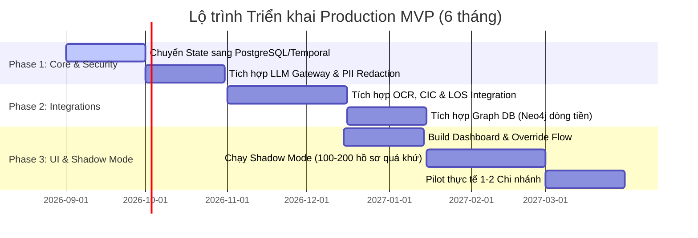

# 04. Hướng Dẫn Vận Hành & Lộ Trình Triển Khai Production MVP

---

## 1. Yêu Cầu Môi Trường & Thao Tác Chạy Nhanh

### Yêu cầu môi trường
- Python 3.9 trở lên.
- Thư viện `temporalio` (v1.18.2 trở lên).
- Homebrew `temporal` CLI (cho máy macOS local dev).

---

## 2. Hướng Dẫn Khởi Chạy Hệ Thống

### Bước 1: Khởi động Temporal Dev Server & Worker Process

Mở **Terminal 1** để bật Temporal Cluster Server:
```bash
temporal server start-dev --ip 127.0.0.1 --port 7233
```
*(Giao diện Temporal Web UI xem tại: `http://127.0.0.1:8233`)*

Mở **Terminal 2** để khởi tạo Cụm Temporal Multi-Worker Pool (lắng nghe đồng thời cả 4 task queues):
```bash
cd CreditAgent
PYTHONPATH=src python3 -m credit_agent_poc worker --target-host 127.0.0.1:7233 --task-queue credit-approval-queue --count 4
```

### Bước 2: Khởi chạy Web Review UI Server (Port 8080)

Mở **Terminal 3** để khởi chạy Web Server review kịch bản trực quan:
```bash
cd CreditAgent
PYTHONPATH=src python3 -m credit_agent_poc serve --port 8080 --db-path credit_agent.db
```
Truy cập giao diện Web Review UI tại: **[http://127.0.0.1:8080](http://127.0.0.1:8080)**

---

## 3. Các Lệnh CLI Thường Dùng

### 1. Chạy 1 kịch bản qua Temporal Server Cluster
```bash
PYTHONPATH=src python3 -m credit_agent_poc run --scenario approve_conditions --engine temporal-cluster
```

### 2. Chạy toàn bộ 6 kịch bản & xuất báo cáo HTML/JSON
```bash
PYTHONPATH=src python3 -m credit_agent_poc run-all --engine temporal-cluster --output-dir demo-output
```

### 3. Chạy Kiểm thử tải (Load & Stress Testing) với Hồ sơ Động
```bash
# Test 20 hồ sơ động với 4 luồng đồng thời qua HTTP API:
PYTHONPATH=src python3 scripts/load_test.py -n 20 -c 4 -m api -d

# Test trực tiếp vào Temporal Engine:
PYTHONPATH=src python3 scripts/load_test.py -n 30 -c 6 -m temporal -d
```

### 4. Chạy toàn bộ bộ Unit Tests tự động (119 test cases)
```bash
PYTHONPATH=src python3 -m unittest discover -s tests -v
```

---

## 4. Lộ Trình Nâng Cấp Triển Khai Production MVP (6 Tháng)



### Chi tiết các mốc quan trọng:

1. **Giai đoạn 1 (Tháng 1-2): Core Hardening & Security Isolation**
   - Chuyển `CreditState` sang **PostgreSQL**.
   - Bổ sung module **PII Redaction/Anonymizer** (Mã hóa tên doanh nghiệp, số CMND/CCCD, số tài khoản trước khi gửi prompt tới LLM).
   - Tích hợp **Enterprise LLM Gateway** (vLLM/Azure OpenAI) ép kiểu Structured Output via Pydantic.

2. **Giai đoạn 2 (Tháng 3-4): Real Backend Data Connectors**
   - Thay 25 simulated tools bằng API tích hợp thực tế từ LOS, Core Banking và hệ thống OCR.
   - Tích hợp **Neo4j / Memgraph** cho Agent `A3 (Transaction Integrity Analyst)` quét tự động các chu trình dòng tiền vòng tròn.
   - Xây dựng **Policy RAG Vector DB** cho Agent `A5`.

3. **Giai đoạn 3 (Tháng 5-6): Shadow Mode Testing & Human Override UI**
   - **Giao diện Dashboard:** Cho phép Cán bộ Thẩm định xem Side-by-side (Tờ trình con người vs Ý kiến AI Co-approval).
   - **Luồng Bác bỏ AI (Human Override):** Bắt buộc nhập lý do giải trình khi đi ngược ý kiến AI để ghi vết Audit Trail cho Ngân hàng Nhà nước.
   - **Shadow Mode:** Chạy thử nghiệm ngầm trên 200 hồ sơ quá khứ để đo đạc chỉ số chính xác (Precision/Recall) trước khi Go-live.

---

> 📖 **Tham khảo chi tiết cấu trúc thư mục mở rộng Enterprise:**  
> Xem chi tiết sơ đồ cây thư mục và quy tắc phân tầng Clean Architecture tại [07. Định Hướng Kiến Trúc & Cấu Trúc Thư Mục Enterprise](07_dinh_huong_kien_truc_va_cau_truc_thu_muc_enterprise.md).

