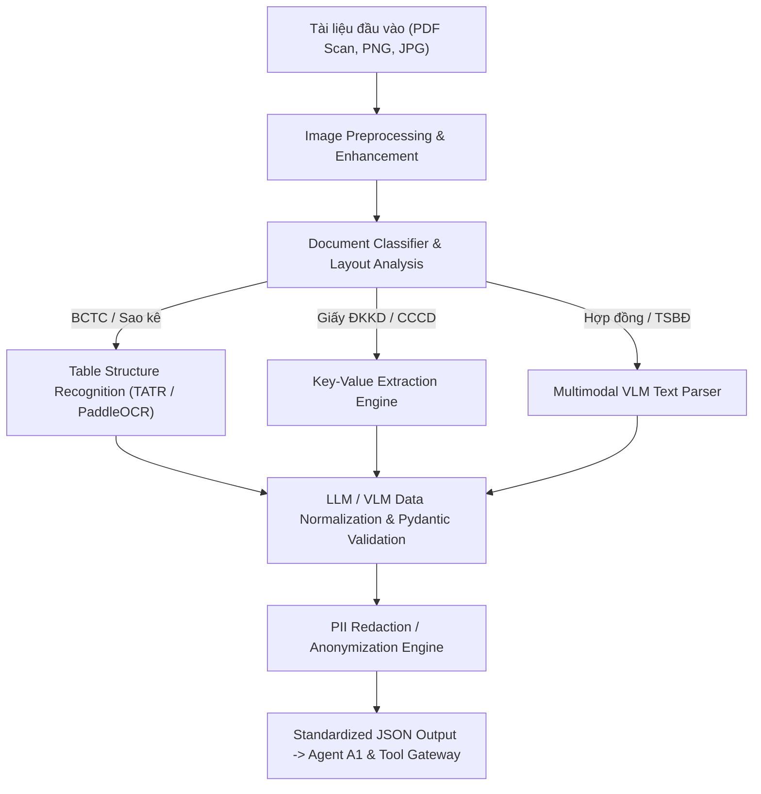

# 05. Kiến Trúc và Công Nghệ Xử Lý Tài Liệu Thông Minh (Intelligent Document Processing - IDP / OCR)

---

## 1. Bài Toán và Thách Thức OCR trong Phê Duyệt Tín Dụng SME

Trong quy trình thẩm định tín dụng SME tại Việt Nam, các tài liệu đầu vào cho Agent `A1 (Intake & Evidence Agent)` có độ phức tạp rất cao:

1. **Báo cáo Tài chính (BCTC):** Bảng cân đối kế toán, Báo cáo KQKD, LCTT chứa các bảng biểu phức tạp (Complex Tables), chữ ký tay, mộc đỏ đóng chèn lên chữ, căn chỉnh lệch góc do scan.
2. **Sao kê Ngân hàng (Bank Statements):** Định dạng khác nhau giữa các ngân hàng (VCB, TCB, MB, BIDV...), chứa hàng nghìn dòng giao dịch trải dài nhiều trang (Multi-page Tables).
3. **Giấy ĐKKD, CCCD/CMND, Giấy tờ TSBĐ:** Tài liệu bán cấu trúc, chứa thông tin định danh nhạy cảm (PII).

---

## 2. Kiến Trúc Tầng OCR / IDP Chuyên Dụng (Enterprise Architecture)



---

## 3. So Sánh & Đề Xuất Các Mô Hình OCR / VLM Tốt Nhất

### A. Mô hình Vision-Language Models (VLM) & Multimodal AI (SOTA 2026)

| Mô hình | Loại hình | Ưu điểm nổi bật | Phù hợp nhất cho |
| :--- | :--- | :--- | :--- |
| **Qwen2-VL (7B / 72B)** | Open-source (Self-hosted) | Hiểu bảng biểu phức tạp cực tốt, đọc chữ viết tay, hỗ trợ đa ngôn ngữ bao gồm Tiếng Việt, có thể deploy On-Premise. | **BCTC & Sao kê scan mờ/nghiêng** |
| **Google Document AI** | Managed Cloud Service | Bộ Parser chuyên biệt cho BCTC, Hóa đơn, Sao kê ngân hàng. Độ chính xác bảng biểu > 98%. | **Doanh nghiệp dùng Hybrid Cloud** |
| **GOT-OCR 2.0 / Donut** | Open-source Model | Mô hình End-to-End OCR chuyển trực tiếp ảnh tài liệu sang Markdown/JSON mà không cần qua OCR truyền thống. | **Bóc tách văn bản hợp đồng** |
| **LayoutLMv3 (Microsoft)**| Open-source Layout Engine | Phân tích bố cục văn bản, nhận diện vùng chứa bảng (Table Detection) và vùng mộc đỏ/chữ ký. | **Phân loại & định vị bố cục tài liệu** |

### B. Công nghệ OCR Truyền thống & Trích xuất Bảng (Table Extraction Engines)

- **PaddleOCR (Baidu):** Mô hình OCR mã nguồn mở tốt nhất hiện nay cho tiếng Việt. Tốc độ nhận diện nhanh (chạy mượt trên CPU/GPU local), độ chính xác cao đối với văn bản in nghiêng/lệch.
- **Table Transformer (TATR - Microsoft):** Mô hình chuyên dụng xác định ranh giới hàng, cột, ô hợp nhất (merged cells) của BCTC.
- **PyMuPDF (fitz) + Camelot:** Dành cho các file PDF gốc dạng text (Digital Native PDF).

---

## 4. Bảng Đề Xuất Công Nghệ (Tech Stack Recommendation)

### 🟢 Lựa chọn 1: On-Premise Banking Stack (Khuyên dùng cho Ngân hàng - Bảo mật 100%)

- **Tiền xử lý ảnh (Preprocessing):** `OpenCV` (Khử nhiễu, cân chỉnh góc nghiêng Deskew, tăng độ tương phản B&W).
- **Phân loại & Định vị layout:** `LayoutLMv3` + `PyMuPDF`.
- **Đọc chữ & Trích xuất bảng BCTC/Sao kê:** **PaddleOCR v4 + Table Transformer (TATR)** hoặc **Qwen2-VL-7B-Instruct** (deploy via vLLM Container local).
- **Mã hóa PII (Anonymization):** `Microsoft Presidio` + Custom Regex Việt Nam (Số CMND, Số TK, Tên doanh nghiệp).
- **Chuẩn hóa đầu ra:** `Pydantic` v2 (Ép kiểu schema JSON chuẩn xác 100%).

### 🔵 Lựa chọn 2: Cloud / Hybrid Managed Stack (Dành cho thử nghiệm/SaaS)

- **Engine chính:** **Google Document AI (Financial Document Workbench)** hoặc **Azure Form Recognizer (Document Intelligence)**.
- **Parsing nâng cao:** `Unstructured.io` / `LlamaParse`.

---

## 5. Schema Dữ Liệu Đầu Ra Chuẩn Hóa cho Agent `A1`

Sau khi qua Tầng OCR / IDP, dữ liệu tài liệu được chuẩn hóa thành JSON để Agent `A1` tiêu thụ qua Tool `parse_bank_statement` và `extract_document_fields`:

```json
{
  "document_id": "DOC-BCTC-2025",
  "document_type": "FINANCIAL_STATEMENT",
  "confidence_score": 0.97,
  "extracted_data": {
    "fiscal_year": 2025,
    "declared_revenue": 15000000000,
    "net_profit": 1200000000,
    "short_term_assets": 8500000000,
    "short_term_liabilities": 5000000000,
    "tables": [
      {
        "table_name": "BALANCE_SHEET",
        "rows": [
          {"code": "110", "item": "Tiền và các khoản tương đương tiền", "amount": 1200000000},
          {"code": "130", "item": "Các khoản phải thu ngắn hạn", "amount": 3500000000}
        ]
      }
    ]
  },
  "verification": {
    "stamp_detected": true,
    "signature_detected": true,
    "tamper_check": "PASSED"
  }
}
```
