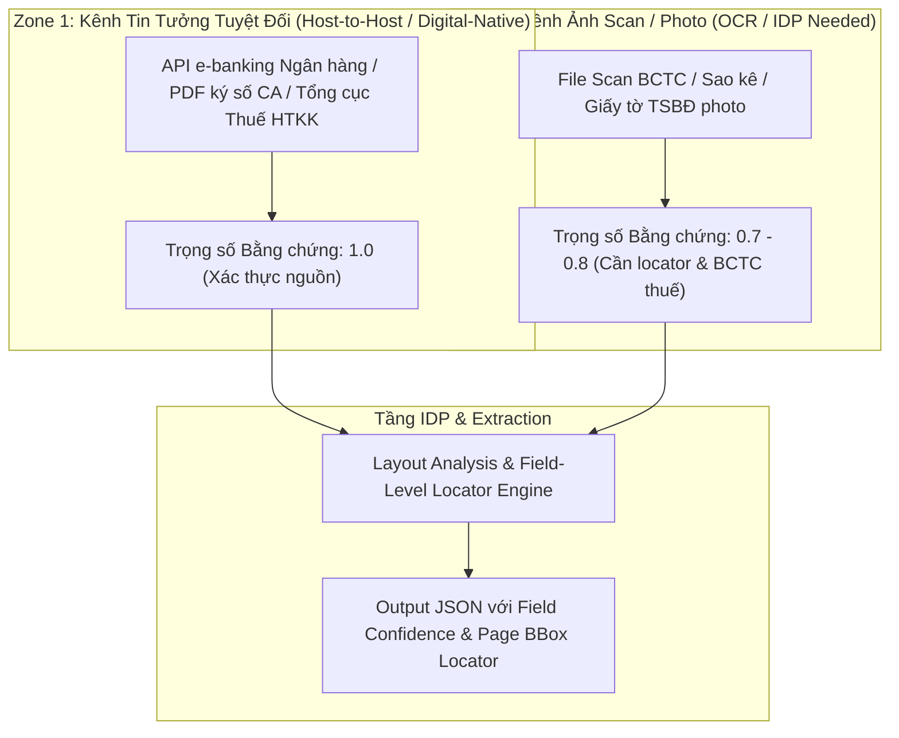

# 05. Kiến Trúc và Công Nghệ Xử Lý Tài Liệu Thông Minh (Intelligent Document Processing - IDP / OCR)

---

## 1. Bài Toán và Thách Thức OCR trong Phê Duyệt Tín Dụng SME

Trong quy trình thẩm định tín dụng SME tại Việt Nam, các tài liệu đầu vào cho Agent `A1 (Intake & Evidence Agent)` có độ phức tạp rất cao:

1. **Báo cáo Tài chính (BCTC):** Bảng cân đối kế toán, Báo cáo KQKD, LCTT chứa các bảng biểu phức tạp (Complex Tables), chữ ký tay, mộc đỏ đóng chèn lên chữ, căn chỉnh lệch góc do scan.
2. **Sao kê Ngân hàng (Bank Statements):** Định dạng khác nhau giữa các ngân hàng (VCB, TCB, MB, BIDV...), chứa hàng nghìn dòng giao dịch trải dài nhiều trang (Multi-page Tables).
3. **Giấy ĐKKD, CCCD/CMND, Giấy tờ TSBĐ:** Tài liệu bán cấu trúc, chứa thông tin định danh nhạy cảm (PII).

---

## 2. Nguyên Tắc Phân Tầng Nguồn & Xác Thực Bằng Chứng (Source Trust Zone Framework)

Để chống giả mạo tài liệu hiệu quả, hệ thống **không dựa vào mô hình thị giác máy tính (Computer Vision) để tự đưa ra kết luận "không giả mạo" (`tamper_check PASSED`)**, mà phân tầng bằng chứng dựa trên kênh thu thập nguồn:



### Phân tầng Trọng số Bằng chứng (`SourceDocument.trust_zone`):
- **`TRUSTED_API_HOST_TO_HOST` (Zone 1):** Dữ liệu sao kê trực tiếp qua kênh API H2H hoặc PDF Digital Native có chữ ký số của Ngân hàng phát hành.
- **`VERIFIED_TAX_DATA` (Zone 1):** BCTC có mã giao dịch điện tử đối chiếu trực tiếp với Tổng cục Thuế.
- **`SCAN_DOCUMENT_OCR` (Zone 2):** Tài liệu ảnh scan. Bắt buộc tạo **`EvidenceRef` đầy đủ Locator (`page`, `bbox`, `cell_range`)** để A1 neo vị trí kiểm chứng, không tự đưa ra khẳng định chống giả mạo.

---

## 3. So Sánh & Đề Xuất Các Mô Hình OCR / VLM Tốt Nhất

### A. Mô hình Vision-Language Models (VLM) & Multimodal AI (SOTA 2026)

| Mô hình | Loại hình | Ưu điểm nổi bật | Phù hợp nhất cho |
| :--- | :--- | :--- | :--- |
| **Qwen2-VL (7B / 72B)** | Open-source (Self-hosted) | Hiểu bảng biểu phức tạp, đọc chữ viết tay, hỗ trợ tiếng Việt, có thể deploy On-Premise. | **BCTC & Sao kê scan mờ/nghiêng** |
| **Google Document AI** | Managed Cloud Service | Bộ Parser chuyên biệt cho BCTC, Hóa đơn, Sao kê ngân hàng Âu-Mỹ/Đông Nam Á. | **Doanh nghiệp dùng Hybrid Cloud** |
| **GOT-OCR 2.0 / Donut** | Open-source Model | Mô hình End-to-End OCR chuyển trực tiếp ảnh tài liệu sang Markdown/JSON. | **Bóc tách văn bản hợp đồng** |
| **LayoutLMv3 (Microsoft)**| Open-source Layout Engine | Phân tích bố cục văn bản, nhận diện vùng chứa bảng (Table Detection) và vùng mộc đỏ/chữ ký. | **Phân loại & định vị bố cục tài liệu** |

### B. Công nghệ OCR Truyền thống & Trích xuất Bảng (Table Extraction Engines)

- **PaddleOCR (Baidu):** Mô hình OCR mã nguồn mở tốt cho tiếng Việt. Tốc độ nhận diện nhanh đối với văn bản in nghiêng/lệch.
- **Table Transformer (TATR - Microsoft):** Mô hình chuyên dụng xác định ranh giới hàng, cột, ô hợp nhất (merged cells) của BCTC.
- **PyMuPDF (fitz) + Camelot:** Dành cho các file PDF gốc dạng text (Digital Native PDF).

---

## 4. Bảng Đề Xuất Công Nghệ (Tech Stack Recommendation)

### 🟢 Lựa chọn 1: On-Premise Banking Stack (Khuyên dùng cho Ngân hàng)

- **Tiền xử lý ảnh (Preprocessing):** `OpenCV` (Khử nhiễu, cân chỉnh góc nghiêng Deskew, tăng độ tương phản B&W).
- **Phân loại & Định vị layout:** `LayoutLMv3` + `PyMuPDF`.
- **Đọc chữ & Trích xuất bảng BCTC/Sao kê:** **PaddleOCR v4 + Table Transformer (TATR)** hoặc **Qwen2-VL-7B-Instruct** (deploy via vLLM Container local).
- **Mã hóa PII (Anonymization):** `Microsoft Presidio` + Custom Regex Việt Nam (Số CMND, Số TK, Tên doanh nghiệp).
- **Chuẩn hóa đầu ra:** `Pydantic` v2 (Ép kiểu schema JSON khắt khe).

---

## 5. Schema Dữ Liệu Đầu Ra Chuẩn Hóa cho Agent `A1` (Bao gồm Locators)

Dữ liệu sau IDP trích xuất đầy đủ tọa độ locator (`page`, `bbox`, `cell_range`) để Agent `A1` tạo `EvidenceRef` chuẩn xác:

```json
{
  "document_id": "DOC-BCTC-2025",
  "document_type": "FINANCIAL_STATEMENT",
  "trust_zone": "SCAN_DOCUMENT_OCR",
  "document_confidence": 0.94,
  "extracted_fields": {
    "fiscal_year": {
      "value": 2025,
      "confidence": 0.99,
      "locator": {"page": 1, "bbox": [120, 45, 200, 65]}
    },
    "declared_revenue": {
      "value": 15000000000,
      "confidence": 0.96,
      "locator": {"page": 2, "bbox": [340, 210, 520, 230], "cell_range": "Row 15, Col 3"}
    }
  },
  "layout_observations": {
    "stamp_region_detected": true,
    "signature_region_detected": true
  }
}
```

