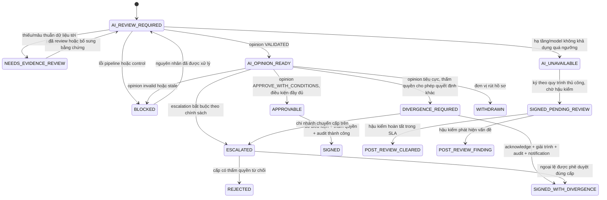
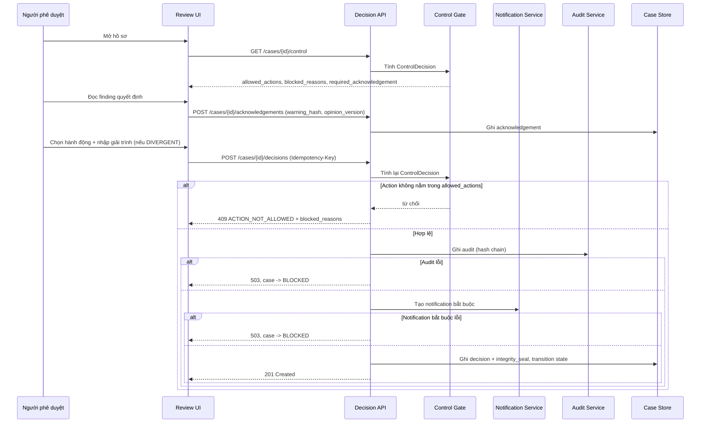

# 06. Luồng quyết định của con người và đo lường chất lượng phê duyệt

**Phiên bản:** 2.0 (viết lại toàn bộ từ v1.0)
**Trạng thái:** Đề xuất thiết kế — cần Khối Rủi ro, Pháp chế và Kiểm toán nội bộ xác nhận trước khi implement
**Phạm vi:** Từ thời điểm `CoApprovalOpinion` được validate cho tới khi hồ sơ đạt trạng thái kết thúc (SIGNED / SIGNED_WITH_DIVERGENCE / REJECTED / WITHDRAWN)

---

## 0. Những thay đổi so với v1.0 và lý do

| # | v1.0 | v2.0 | Lý do thay đổi |
|---|------|------|----------------|
| 1 | `quality_index` xếp loại cán bộ theo tỷ lệ override AI (`HIGH_COMPLIANCE` khi override ≤ 15%) | Bỏ hoàn toàn. Thay bằng khung đo 3 tầng dựa trên kết quả tín dụng thực tế, chất lượng giải trình và hiệu chuẩn hai chiều | Chấm điểm cao cho việc đồng ý với một mô hình chưa được validate là thiết kế automation bias vào KPI, và đảo ngược trách nhiệm pháp lý. Xem §7 |
| 2 | Thuật ngữ "Phủ quyết AI" (`OVERRIDE_AI`) | "Quyết định khác ý kiến AI" (`DIVERGENT`) | AI không có thẩm quyền nên không có gì để "phủ quyết". Thuật ngữ cũ ngầm gán uy quyền quy chế cho mô hình |
| 3 | `digital_signature_hash` SHA-256, mô tả là "chống chối bỏ" | `integrity_seal` = HMAC-SHA256 với khóa trong KMS; chữ ký số PKI là hạng mục riêng ở lộ trình | SHA-256 trần là checksum, ai ghi được DB đều tính lại được. Non-repudiation theo Luật GDĐT 2023 / NĐ 130/2018 cần chứng thư số từ CA được cấp phép. Xem §6 |
| 4 | Bảng `human_decisions` không có `opinion_id` / `opinion_version` | Bắt buộc có, kèm bảng `decision_acknowledgements` và cơ chế vô hiệu hóa khi opinion đổi | Kiến trúc gốc §7.13 yêu cầu điều này. Thiếu nó thì mất control chống ký dựa trên ý kiến AI đã cũ |
| 5 | `POST /api/human-decision` nhận `user_id`, `role`, `branch_id` từ body | Danh tính lấy từ phiên xác thực; thẩm quyền kiểm tra server-side theo ma trận hạn mức | Danh tính do client tự khai là lỗ hổng mạo danh |
| 6 | Không kiểm tra `allowed_actions` trước khi ghi quyết định | Endpoint bắt buộc đi qua Control Gate; action ngoài `allowed_actions` bị từ chối `409` | Không có bước này thì Approval Control Layer chỉ là nhãn hiển thị, không phải cổng kiểm soát |
| 7 | `approved_amount INTEGER`, `approved_interest_rate REAL` | `NUMERIC(18,2)` và `NUMERIC(7,4)` | Không dùng số thực dấu phẩy động cho tiền và lãi suất trong bản ghi phê duyệt |
| 8 | `audit_events` chỉ có id tự tăng | Hash chain (`prev_hash`, `entry_hash`) + actor | Không có chuỗi băm thì không thể tuyên bố append-only tamper-evident |
| 9 | Không có trạng thái khi AI/hạ tầng không khả dụng | Bổ sung `AI_UNAVAILABLE` là trạng thái hợp pháp, có hậu kiểm bắt buộc | Fail-closed với hạ tầng sẽ làm dừng toàn bộ hoạt động cho vay và tạo áp lực vá bypass. Xem §3.3 |
| 10 | Không có SLA cho escalation, không phân tầng thông báo | SLA theo mức độ + thông báo phân tầng | Escalation không SLA sẽ thành hố đen; thông báo CRO mọi lúc sẽ bị bỏ qua sau 3 tháng |
| 11 | Không có cơ chế phát hiện việc sửa hồ sơ cho vừa ý AI | Đo `case_revision` churn và diff nội dung giữa các revision | Đây là hành vi né tránh có xác suất cao nhất khi bật kiểm soát. Xem §7.4 |

---

## 1. Nguyên tắc nền

### 1.1 Ranh giới thẩm quyền

1. **AI không giữ thẩm quyền pháp lý.** Sản phẩm của 13 agent là `CoApprovalOpinion` — ý kiến rà soát độc lập trước phê duyệt. Nó không phải quyết định cấp tín dụng và không tự kích hoạt giải ngân.
2. **Người phê duyệt chịu trách nhiệm đầy đủ** cho quyết định của mình, dù đồng thuận hay khác với ý kiến AI. Hệ thống không tạo ra căn cứ miễn trừ trách nhiệm dưới bất kỳ hình thức nào.
3. **Việc đưa ra quyết định khác ý kiến AI là hành vi hợp lệ và được kỳ vọng**, không phải sự cố cần trừng phạt. Cái được kiểm soát là *chất lượng giải trình* và *thẩm quyền*, không phải *tần suất*.
4. Hệ thống chỉ chặn ở đúng ba chỗ: thiếu thẩm quyền, thiếu bằng chứng bắt buộc, và lỗi ghi audit/notification.

### 1.2 Bảng thuật ngữ (thay thế thuật ngữ v1.0)

| Thuật ngữ v2.0 | Mã | Định nghĩa |
|---|---|---|
| Đồng thuận với ý kiến AI | `CONCURRENT` | Quyết định của người trùng hướng với `decision` của opinion |
| Quyết định khác ý kiến AI | `DIVERGENT` | Quyết định của người khác hướng với opinion; bắt buộc giải trình |
| Ngoại lệ có thẩm quyền | `AUTHORIZED_EXCEPTION` | Quyết định khác ý kiến AI trên hồ sơ có `HARD_BLOCK`, chỉ cấp có thẩm quyền theo chính sách mới được thực hiện |
| Xác nhận đã đọc cảnh báo | `ACKNOWLEDGEMENT` | Ghi nhận người phê duyệt đã đọc các finding quyết định của một `opinion_version` cụ thể |
| Niêm phong toàn vẹn | `INTEGRITY_SEAL` | HMAC chống sửa đổi bản ghi quyết định. **Không phải** chữ ký số |
| Chữ ký số | `QUALIFIED_SIGNATURE` | Chữ ký theo chứng thư số của CA được cấp phép. Hạng mục lộ trình, chưa có ở MVP |

---

## 2. Điều kiện tiên quyết: Control Gate

Không có API nào ghi được quyết định nếu chưa đi qua Control Gate. Gate là code xác định, không dùng LLM.

### 2.1 Hợp đồng `ControlDecision`

```
ControlDecision:
  case_id: uuid
  case_revision: integer
  opinion_id: uuid?
  opinion_version: integer?
  control_state: enum                      # xem §3
  allowed_actions: [Action]                # danh sách đóng
  blocked_reasons: [ControlReason]
  pending_requirements: [ControlRequirement]
  required_acknowledgement:
    warning_hash: sha256?                  # băm của tập finding quyết định
    finding_ids: [finding-id]
  authority:
    required_level: enum                   # theo ma trận hạn mức
    actor_level: enum
    sufficient: boolean
  computed_at: timestamp
  ruleset_version: string

Action = VIEW | REQUEST_INFO | REANALYZE | ESCALATE | SIGN |
         SIGN_WITH_DIVERGENCE | REJECT | WITHDRAW
```

### 2.2 Bảng luật gate (tối thiểu)

| Điều kiện | Kết quả |
|---|---|
| Không có opinion, hoặc `opinion.status != VALIDATED` | `allowed_actions` không chứa `SIGN`, `SIGN_WITH_DIVERGENCE`; `blocked_reasons += NO_VALID_OPINION` |
| `opinion.case_revision != case.case_revision` hoặc `source_snapshot_hash` / `policy_snapshot_id` lệch | Opinion stale → `AI_REVIEW_REQUIRED`, mọi acknowledgement cũ bị vô hiệu |
| Opinion còn `HARD_BLOCK` chưa được giải quyết | Chỉ cho `ESCALATE`, `REQUEST_INFO`, `REJECT`, `WITHDRAW`. `SIGN_WITH_DIVERGENCE` chỉ mở nếu `authority.actor_level` nằm trong danh sách được phép theo chính sách |
| `opinion.decision = APPROVE_WITH_CONDITIONS` nhưng có condition thiếu `owner` hoặc `due_point` | `blocked_reasons += CONDITION_INCOMPLETE`, không cho `SIGN` |
| `opinion.decision != APPROVE_WITH_CONDITIONS` | `SIGN` không khả dụng; chỉ có thể `SIGN_WITH_DIVERGENCE` (nếu đủ thẩm quyền), `ESCALATE`, `REJECT` |
| Chưa có acknowledgement hợp lệ cho `opinion_version` hiện tại | `pending_requirements += ACKNOWLEDGE_WARNINGS` |
| `authority.sufficient = false` | Mọi action kết thúc bị chặn; chỉ còn `ESCALATE`, `VIEW`, `REQUEST_INFO` |
| Ghi audit thất bại, hoặc notification bắt buộc thất bại | `BLOCKED`, không transition |
| `control_state = AI_UNAVAILABLE` | Xem §3.3 |

**Quy tắc thực thi:** endpoint quyết định *luôn* tính lại `ControlDecision` tại thời điểm nhận request, không tin `allowed_actions` mà client gửi lên hoặc đã render trước đó. UI chỉ dùng gate để bật/tắt nút; server mới là nơi quyết định.

---

## 3. Máy trạng thái

### 3.1 Sơ đồ



### 3.2 Vô hiệu hóa acknowledgement

Khi bất kỳ giá trị nào sau đây thay đổi, mọi acknowledgement gắn với opinion cũ chuyển `SUPERSEDED` và người phê duyệt phải xác nhận lại:

- `case_revision` (khách hàng nộp bổ sung/thay đổi tài liệu nghiệp vụ)
- `source_snapshot_hash`
- `policy_snapshot_id`
- `ruleset_version`
- `opinion_version`

Đây là lý do `warning_hash` được tính trên tập finding quyết định của đúng một `opinion_version`, không phải trên nội dung hiển thị của UI.

### 3.3 Trạng thái `AI_UNAVAILABLE` — chế độ suy giảm

**Nguyên tắc phân biệt:** *fail-closed với dữ liệu, fail-degraded với hạ tầng.* Thiếu bằng chứng thì chặn. Model provider hoặc Temporal cluster chết thì không phải lỗi của hồ sơ, và không được làm dừng hoạt động cho vay.

Điều kiện vào trạng thái:

- Pipeline thất bại sau `max_node_retries` vì lỗi hạ tầng (timeout provider, tool gateway down, cluster không khả dụng), **không phải** vì dữ liệu thiếu hay schema invalid.
- Thời gian chờ vượt `ai_unavailable_threshold_minutes` (đề xuất: 60 phút).

Hiệu lực:

- Hồ sơ chuyển sang quy trình phê duyệt thủ công hiện hành, không có ý kiến AI.
- Bản ghi quyết định gắn cờ `ai_availability = UNAVAILABLE` và `post_review_required = true`.
- Đưa vào hàng đợi hậu kiểm bắt buộc, SLA 5 ngày làm việc.
- Tự động escalate nếu số hồ sơ ở trạng thái này vượt ngưỡng ngày (đề xuất: 20 hồ sơ/ngày toàn hệ thống) — đây là tín hiệu sự cố vận hành, không phải tình huống bình thường.
- Không được dùng `AI_UNAVAILABLE` để đi vòng qua `HARD_BLOCK` đã được phát hiện ở một run trước đó còn hiệu lực.

---

## 4. Luồng quyết định



**Thứ tự bắt buộc:** audit trước → notification trước → mới ghi quyết định và transition. Không có nhánh "ghi trước, log sau".

---

## 5. Mô hình dữ liệu

Schema viết cho PostgreSQL. SQLite ở POC dùng cùng cấu trúc với `NUMERIC` → `TEXT` (lưu chuỗi thập phân, không dùng `REAL`).

### 5.1 `human_decisions`

```sql
CREATE TABLE human_decisions (
    decision_id             UUID PRIMARY KEY,
    case_id                 UUID NOT NULL,
    case_revision           INTEGER NOT NULL,
    run_id                  UUID NOT NULL,

    -- Neo vào đúng ý kiến AI mà người phê duyệt đã nhìn thấy
    opinion_id              UUID,
    opinion_version         INTEGER,
    ai_decision             TEXT,             -- NULL khi ai_availability = UNAVAILABLE
    ai_availability         TEXT NOT NULL,    -- AVAILABLE | UNAVAILABLE
    policy_snapshot_id      TEXT NOT NULL,
    ruleset_version         TEXT NOT NULL,
    source_snapshot_hash    TEXT NOT NULL,

    -- Danh tính: ghi từ phiên xác thực, KHÔNG nhận từ request body
    actor_id                TEXT NOT NULL,
    actor_role              TEXT NOT NULL,    -- enum: RM | CREDIT_OFFICER | BRANCH_DIRECTOR
                                              --       | CREDIT_AUTHORITY | CRO
    actor_authority_level   TEXT NOT NULL,
    branch_id               TEXT NOT NULL,
    delegated_from_actor_id TEXT,             -- uỷ quyền, nếu có
    session_id              TEXT NOT NULL,
    client_ip               INET,

    -- Quyết định
    action                  TEXT NOT NULL,    -- SIGN | SIGN_WITH_DIVERGENCE | REJECT
                                              -- | ESCALATE | WITHDRAW
    human_decision          TEXT NOT NULL,
    alignment               TEXT NOT NULL,    -- CONCURRENT | DIVERGENT | AUTHORIZED_EXCEPTION
                                              -- | NO_AI_OPINION
    divergence_reason_code  TEXT,             -- bắt buộc khi alignment != CONCURRENT
    divergence_narrative    TEXT,             -- bắt buộc, >= 120 ký tự
    acknowledgement_id      UUID,             -- bắt buộc khi có opinion

    -- Điều khoản được duyệt thực tế
    approved_amount         NUMERIC(18,2),
    approved_currency       CHAR(3),
    approved_tenor_months   INTEGER,
    approved_rate_pct       NUMERIC(7,4),
    approved_conditions     JSONB,

    -- Kiểm soát
    integrity_seal          TEXT NOT NULL,    -- HMAC-SHA256, xem §6
    seal_key_id             TEXT NOT NULL,
    audit_event_id          UUID NOT NULL,
    notification_ids        UUID[] NOT NULL DEFAULT '{}',
    post_review_required    BOOLEAN NOT NULL DEFAULT FALSE,
    idempotency_key         TEXT NOT NULL,
    created_at              TIMESTAMPTZ NOT NULL DEFAULT now(),

    CONSTRAINT uq_idempotency UNIQUE (case_id, actor_id, idempotency_key),
    CONSTRAINT ck_divergence_requires_reason CHECK (
        alignment = 'CONCURRENT'
        OR (divergence_reason_code IS NOT NULL
            AND char_length(divergence_narrative) >= 120)
    ),
    CONSTRAINT ck_opinion_requires_ack CHECK (
        opinion_id IS NULL OR acknowledgement_id IS NOT NULL
    )
);

CREATE UNIQUE INDEX uq_terminal_decision_per_revision
    ON human_decisions (case_id, case_revision)
    WHERE action IN ('SIGN', 'SIGN_WITH_DIVERGENCE', 'REJECT');
```

Bảng chỉ INSERT. Không UPDATE, không DELETE. Đính chính bằng bản ghi mới có `supersedes_decision_id` (thêm cột khi cần) và một audit event tương ứng.

### 5.2 `decision_acknowledgements`

```sql
CREATE TABLE decision_acknowledgements (
    acknowledgement_id  UUID PRIMARY KEY,
    case_id             UUID NOT NULL,
    opinion_id          UUID NOT NULL,
    opinion_version     INTEGER NOT NULL,
    actor_id            TEXT NOT NULL,
    warning_hash        TEXT NOT NULL,     -- SHA-256 của tập finding quyết định đã chuẩn hoá
    acknowledged_finding_ids TEXT[] NOT NULL,
    status              TEXT NOT NULL,     -- ACTIVE | SUPERSEDED
    superseded_reason   TEXT,              -- NEW_OPINION | NEW_CASE_REVISION
                                           -- | POLICY_CHANGE | RULESET_CHANGE
    created_at          TIMESTAMPTZ NOT NULL DEFAULT now()
);
```

Acknowledgement chỉ hợp lệ khi `status = ACTIVE` **và** `warning_hash` khớp giá trị Control Gate tính lại tại thời điểm quyết định.

### 5.3 `divergence_reason_codes` (bảng tham chiếu có version)

Reason code phải nhất quán về *hướng* với quyết định. Ràng buộc này được kiểm ở tầng ứng dụng, không để cán bộ chọn nhầm như ví dụ ở v1.0.

| Reason code | Hướng cho phép | Yêu cầu bổ sung |
|---|---|---|
| `NEW_EVIDENCE_PROVIDED` | Nới lỏng | Bắt buộc đính kèm `document_id` mới; hệ thống gợi ý `REANALYZE` trước |
| `AI_FINDING_FACTUALLY_WRONG` | Nới lỏng | Phải chỉ đích danh `finding_id` và nêu dữ liệu đúng. Tự động tạo phiếu phản hồi cho Model Risk |
| `POLICY_INTERPRETATION_DISPUTE` | Cả hai | Bắt buộc trích dẫn điều khoản; tự động escalate Khối Chính sách tín dụng |
| `COLLATERAL_EXCEPTION_REQUEST` | Nới lỏng | Chỉ mở khi thẩm quyền đủ; luôn escalate |
| `STRATEGIC_CUSTOMER_EXCEPTION` | Nới lỏng | Luôn escalate; không được dùng khi có `HARD_BLOCK` |
| `ADDITIONAL_RISK_OBSERVED` | Thắt chặt | Mô tả rủi ro người phát hiện mà AI bỏ sót. Tự động tạo phiếu phản hồi cho Model Risk |
| `LOCAL_KNOWLEDGE_NEGATIVE` | Thắt chặt | Ghi rõ nguồn thông tin |
| `OTHER_REQUIRES_REVIEW` | Cả hai | Luôn escalate; giới hạn tỷ lệ sử dụng, cảnh báo nếu vượt 10% quyết định của một đơn vị |

Hai mã `AI_FINDING_FACTUALLY_WRONG` và `ADDITIONAL_RISK_OBSERVED` là **kênh phản hồi ngược về mô hình**. Chúng phải chảy vào backlog của Model Risk, không chỉ nằm trong audit log.

### 5.4 `audit_events` có chuỗi băm

```sql
CREATE TABLE audit_events (
    seq          BIGSERIAL PRIMARY KEY,
    event_id     UUID NOT NULL UNIQUE,
    case_id      UUID,
    run_id       UUID,
    event_type   TEXT NOT NULL,
    actor_id     TEXT,                 -- 'SYSTEM' cho sự kiện tự động
    actor_role   TEXT,
    payload      JSONB NOT NULL,
    prev_hash    TEXT NOT NULL,
    entry_hash   TEXT NOT NULL,        -- SHA-256(prev_hash || canonical_json(payload) || seq)
    occurred_at  TIMESTAMPTZ NOT NULL DEFAULT now()
);
```

- Quyền của application user: chỉ `INSERT` và `SELECT`. Thu hồi `UPDATE`/`DELETE` ở cấp DB, không chỉ ở cấp code.
- Job hằng ngày xác minh lại toàn bộ chuỗi băm và chốt `entry_hash` cuối ngày vào một nơi lưu trữ tách biệt (WORM hoặc hệ thống log tập trung của ngân hàng).
- Temporal workflow history **không** thay thế bảng này: nó là log thực thi có giới hạn lưu trữ, không phải hồ sơ kiểm toán nghiệp vụ.

### 5.5 `notifications`

```sql
CREATE TABLE notifications (
    notification_id  UUID PRIMARY KEY,
    case_id          UUID NOT NULL,
    trigger_type     TEXT NOT NULL,
    tier             TEXT NOT NULL,     -- IMMEDIATE | DAILY_DIGEST | WEEKLY_DIGEST
    recipient_role   TEXT NOT NULL,
    mandatory        BOOLEAN NOT NULL,
    status           TEXT NOT NULL,     -- QUEUED | SENT | FAILED | ACKNOWLEDGED
    opinion_version  INTEGER,
    idempotency_key  TEXT NOT NULL UNIQUE,
    created_at       TIMESTAMPTZ NOT NULL DEFAULT now(),
    sent_at          TIMESTAMPTZ
);
```

Chỉ notification `mandatory = true` mới chặn transition khi thất bại. Digest không chặn.

### 5.6 `case_revision_log` — phục vụ phát hiện hành vi né tránh

```sql
CREATE TABLE case_revision_log (
    case_id             UUID NOT NULL,
    case_revision       INTEGER NOT NULL,
    prior_opinion_id    UUID,
    prior_ai_decision   TEXT,
    changed_documents   JSONB NOT NULL,   -- document_id, type, thêm/thay/xoá
    changed_key_fields  JSONB NOT NULL,   -- field_path, giá trị cũ, giá trị mới
    submitted_by        TEXT NOT NULL,
    created_at          TIMESTAMPTZ NOT NULL DEFAULT now(),
    PRIMARY KEY (case_id, case_revision)
);
```

Xem §7.4 về cách dùng.

---

## 6. Toàn vẹn bản ghi và chữ ký

### 6.1 Ở MVP: niêm phong toàn vẹn (integrity seal)

```
canonical = canonical_json({
    decision_id, case_id, case_revision, opinion_id, opinion_version,
    actor_id, actor_role, action, human_decision, alignment,
    divergence_reason_code, sha256(divergence_narrative),
    approved_amount, approved_currency, approved_tenor_months, approved_rate_pct,
    acknowledgement_id, warning_hash, created_at
})
integrity_seal = HMAC_SHA256(key = KMS[seal_key_id], message = canonical)
```

Quy tắc bắt buộc:

- `canonical_json`: khoá sắp xếp, không khoảng trắng thừa, UTF-8, số ở dạng chuỗi thập phân. Hai bên tính seal phải cho ra byte giống hệt nhau.
- Khóa nằm trong KMS/HSM; application chỉ gọi thao tác ký, không đọc được khóa. `seal_key_id` lưu cùng bản ghi để hỗ trợ xoay khóa.
- **Kiểm thử bắt buộc:** input rỗng hoặc thiếu field phải làm hàm ném lỗi, không được trả về seal. Ở v1.0, giá trị mẫu trong tài liệu là `e3b0c442...7852b855` — đó chính là SHA-256 của chuỗi rỗng, dấu hiệu hàm đang băm trên input rỗng. Thêm assertion chống trường hợp này vào unit test.
- Trong mọi tài liệu và giao diện, gọi đây là **niêm phong toàn vẹn**. Không dùng các cụm "chữ ký số", "chống chối bỏ".

### 6.2 Lộ trình: chữ ký số đủ điều kiện

Khi hệ thống chạm tới quyết định có hiệu lực pháp lý, cần:

- Chứng thư số cá nhân của người phê duyệt do CA được cấp phép tại Việt Nam phát hành, khóa trong USB token hoặc HSM ký từ xa, theo Luật Giao dịch điện tử 2023 và NĐ 130/2018.
- Ký trên đúng tài liệu nghiệp vụ (tờ trình/phê duyệt), có dấu thời gian (timestamping) từ dịch vụ được công nhận.
- Lưu đủ dữ liệu để xác minh lại sau nhiều năm: chứng thư, chuỗi tin cậy, CRL/OCSP tại thời điểm ký.

Hạng mục này cần Pháp chế xác nhận phạm vi trước khi ước lượng công sức.

---

## 7. Khung đo lường chất lượng phê duyệt

> **Thay thế hoàn toàn `quality_index` của v1.0.** Tỷ lệ quyết định khác ý kiến AI không còn là thước đo chất lượng, dưới mọi hình thức.

### 7.1 Nguyên tắc sử dụng

1. **Không xếp loại cá nhân trong 12 tháng đầu.** Trước khi mô hình được validate và có đủ dữ liệu vintage, mọi chỉ số chỉ dùng để chọn mẫu kiểm toán và cải tiến mô hình.
2. **Không hiển thị chỉ số cá nhân cho quản lý trực tiếp** trong giai đoạn shadow và pilot. Chỉ Model Risk và Kiểm toán nội bộ truy cập.
3. **Chỉ số đọc được theo hai chiều.** Khi người và AI bất đồng, kết quả thực tế nói ai đúng. Bất đồng mà người đúng là **lỗi của mô hình**, phải chảy vào backlog cải tiến chứ không phải hồ sơ đánh giá cán bộ.
4. **Không có chỉ số nào thưởng cho việc đồng thuận.** Nếu một chỉ số có thể được cải thiện bằng cách bấm "đồng ý" nhiều hơn, chỉ số đó sai.

### 7.2 Tầng 1 — Kết quả thực tế theo vintage (chỉ số chính)

Đơn vị quan sát là *nhóm quyết định*, không phải cá nhân, cho tới khi đủ cỡ mẫu.

| Chỉ số | Định nghĩa | Dùng để |
|---|---|---|
| `bad_rate_12m` | Tỷ lệ khoản vay chuyển nhóm 2+ hoặc cơ cấu trong 12 tháng sau giải ngân | Nền so sánh |
| `bad_rate_by_alignment` | `bad_rate_12m` tách theo `CONCURRENT` / `DIVERGENT` | Đo giá trị thực của việc bất đồng |
| `divergence_hit_rate` | Trong các quyết định `DIVERGENT` nới lỏng, tỷ lệ khoản vay về sau **không** xấu | Cao → người đúng, mô hình quá chặt |
| `missed_risk_rate` | Trong các quyết định `CONCURRENT` với AI-approve, tỷ lệ về sau xấu | Đo điểm mù chung của cả người và máy |
| `ai_false_block_rate` | Tỷ lệ hồ sơ AI đề nghị từ chối/escalate nhưng sau đó được cấp và trả tốt | **Chỉ số quyết định việc hệ thống có được giữ lại hay không** |

Điều kiện có hiệu lực: tối thiểu 24 tháng quan sát hoặc 200 khoản đã giải ngân trong cùng cohort (sản phẩm × ngành × quy mô), tuỳ điều kiện nào đến trước. Trước ngưỡng đó, chỉ báo cáo kèm khoảng tin cậy, không kết luận.

### 7.3 Tầng 2 — Chất lượng giải trình (chấm bằng người, có rubric)

Lấy mẫu ngẫu nhiên phân tầng, tối thiểu 20 hồ sơ/quý/đơn vị. Mỗi hồ sơ chấm 5 tiêu chí, thang 0–2:

| Tiêu chí | 0 | 1 | 2 |
|---|---|---|---|
| Trỏ đích danh finding | Không nhắc tới finding nào | Nhắc chung chung | Nêu rõ `finding_id` và lý do không đồng ý |
| Bằng chứng | Không có | Có nhắc nhưng không dẫn nguồn | Dẫn tài liệu/số liệu cụ thể |
| Nhất quán mã lý do | Mã trái ngược nội dung | Mã chấp nhận được | Mã khớp chính xác |
| Xử lý rủi ro còn lại | Bỏ qua | Nhắc nhưng không có biện pháp | Nêu điều kiện/covenant cụ thể để giảm thiểu |
| Tính riêng biệt | Sao chép mẫu | Có chỉnh sửa nhẹ | Viết riêng cho hồ sơ này |

`justification_quality_score` = tổng điểm / 10. Ngưỡng cảnh báo < 0.5. Phát hiện văn bản trùng lặp (similarity > 0.9 giữa các giải trình của cùng người) là cờ đỏ độc lập.

### 7.4 Tầng 3 — Tín hiệu hành vi né tránh

Đây là rủi ro có xác suất cao nhất khi bật kiểm soát: thay vì quyết định khác ý kiến AI, hồ sơ được **sửa cho tới khi AI nói được**.

| Tín hiệu | Nguồn | Ngưỡng cảnh báo đề xuất |
|---|---|---|
| `revision_churn` | Số `case_revision` sau một opinion tiêu cực trước khi đạt opinion tích cực | ≥ 2 |
| `material_field_reversal` | Trường trọng yếu (doanh thu khai báo, nghĩa vụ nợ, mục đích vay) thay đổi > 15% theo hướng có lợi ngay sau finding liên quan | Bất kỳ lần nào |
| `document_substitution` | Tài liệu bị thay thế bằng bản khác cho cùng kỳ | Bất kỳ lần nào |
| `reason_code_concentration` | Một mã lý do chiếm > 60% quyết định `DIVERGENT` của một đơn vị | Theo quý |
| `other_code_overuse` | `OTHER_REQUIRES_REVIEW` > 10% | Theo quý |
| `time_to_decision` | Thời gian từ mở hồ sơ tới ký < 60 giây khi có finding `HIGH`/`CRITICAL` | Bất kỳ lần nào — dấu hiệu bấm cho xong |

Các tín hiệu này **tạo phiếu kiểm tra**, không tự động chặn và không tự động kết luận. Chúng có thể có giải thích chính đáng (khách hàng nộp bổ sung thật). Việc của hệ thống là làm cho hành vi đó nhìn thấy được.

### 7.5 Báo cáo phát ra

| Báo cáo | Người nhận | Tần suất |
|---|---|---|
| Vintage outcome theo alignment | Model Risk, CRO | Quý |
| Chất lượng giải trình theo đơn vị (ẩn danh cá nhân) | Kiểm toán nội bộ | Quý |
| Danh sách phiếu kiểm tra hành vi | Kiểm toán nội bộ | Tháng |
| Backlog lỗi mô hình (từ 2 mã phản hồi ở §5.3) | Model Risk | Tháng |
| Hồ sơ `SIGNED_PENDING_REVIEW` quá SLA | Vận hành + CRO | Ngày |

---

## 8. Escalation và thông báo

### 8.1 SLA escalation

| Mức | Kích hoạt | Người xử lý | SLA phản hồi | Quá hạn |
|---|---|---|---|---|
| L1 | Vượt thẩm quyền chi nhánh | Cấp phê duyệt vùng/hội sở | 2 ngày làm việc | Tự động nhắc + báo lãnh đạo khối |
| L2 | `HARD_BLOCK` xin ngoại lệ | Cấp có thẩm quyền theo chính sách | 3 ngày làm việc | Tự động nhắc + đưa vào báo cáo tuần CRO |
| L3 | Tranh chấp diễn giải chính sách | Khối Chính sách tín dụng | 5 ngày làm việc | Đưa vào họp chính sách gần nhất |

Hồ sơ ở `ESCALATED` vẫn cho phép `REQUEST_INFO` và chuẩn bị hồ sơ; chỉ khoá các action kết thúc. Quá SLA **không** tự động mở gate.

### 8.2 Phân tầng thông báo

| Sự kiện | Tầng | Bắt buộc (chặn nếu lỗi) |
|---|---|---|
| Ký khác ý kiến AI trên hồ sơ có `HARD_BLOCK` | Ngay lập tức tới CRO + Kiểm toán | Có |
| Ký khác ý kiến AI thông thường | Digest tuần tới Rủi ro | Không |
| Escalation L1/L2/L3 | Ngay lập tức tới người xử lý | Có |
| `AI_UNAVAILABLE` vượt ngưỡng ngày | Ngay lập tức tới Vận hành + CRO | Có |
| Phiếu kiểm tra hành vi | Digest tháng tới Kiểm toán | Không |
| Hậu kiểm quá SLA | Digest ngày | Không |

Nguyên tắc: nếu mọi thứ đều gửi ngay lập tức thì trong ba tháng sẽ không ai đọc gì cả. Chỉ giữ tầng "ngay lập tức" cho những gì thực sự cần người phản ứng trong ngày.

---

## 9. API

Mọi endpoint yêu cầu phiên xác thực. Danh tính, vai trò, đơn vị và cấp thẩm quyền lấy từ token phiên — **không đọc từ request body**.

### 9.1 `GET /api/v1/cases/{case_id}/control`

Trả về `ControlDecision` (§2.1). UI dùng để render trạng thái nút. Không có tác dụng phụ.

### 9.2 `POST /api/v1/cases/{case_id}/acknowledgements`

```json
{
  "opinion_id": "...",
  "opinion_version": 3,
  "warning_hash": "…",
  "acknowledged_finding_ids": ["F-011", "F-014"]
}
```

Server so `warning_hash` với giá trị tự tính. Lệch → `409 STALE_WARNING_SET` kèm tập finding hiện hành.

### 9.3 `POST /api/v1/cases/{case_id}/decisions`

Header bắt buộc: `Idempotency-Key`.

```json
{
  "action": "SIGN_WITH_DIVERGENCE",
  "human_decision": "APPROVED_WITH_CONDITIONS",
  "acknowledgement_id": "...",
  "divergence_reason_code": "NEW_EVIDENCE_PROVIDED",
  "divergence_narrative": "…",
  "supporting_document_ids": ["DOC-..."],
  "approved_amount": "8000000000.00",
  "approved_currency": "VND",
  "approved_tenor_months": 36,
  "approved_rate_pct": "9.5000",
  "approved_conditions": [{ "condition_id": "C-1", "owner": "...", "due_point": "PRE_DISBURSEMENT" }]
}
```

Mã lỗi:

| Mã | Ý nghĩa |
|---|---|
| `409 ACTION_NOT_ALLOWED` | Action không nằm trong `allowed_actions`; trả kèm `blocked_reasons` |
| `409 STALE_OPINION` | `opinion_version` đã bị thay thế |
| `409 ACK_SUPERSEDED` | Acknowledgement không còn `ACTIVE` |
| `403 INSUFFICIENT_AUTHORITY` | Thẩm quyền không đủ; trả kèm cấp cần thiết |
| `422 REASON_DIRECTION_MISMATCH` | Mã lý do không phù hợp hướng quyết định |
| `422 NARRATIVE_TOO_SHORT` | Giải trình dưới 120 ký tự |
| `503 AUDIT_WRITE_FAILED` / `503 NOTIFICATION_FAILED` | Fail closed, case chuyển `BLOCKED` |
| `200 OK` (thay vì 201) | Trùng `Idempotency-Key`, trả bản ghi đã tạo trước đó |

### 9.4 Báo cáo

- `GET /api/v1/reports/vintage-outcome?cohort=…&period=…`
- `GET /api/v1/reports/justification-quality?unit=…&period=…`
- `GET /api/v1/reports/behavioral-flags?period=…`
- `GET /api/v1/reports/model-feedback-backlog`

Không có endpoint nào trả về "điểm chất lượng cán bộ". Endpoint `/api/approver-quality-report` của v1.0 bị **loại bỏ**.

---

## 10. Tiêu chí nghiệm thu (đưa thẳng vào `tests/`)

**Control gate**

1. Không có opinion → `SIGN` và `SIGN_WITH_DIVERGENCE` vắng mặt trong `allowed_actions`.
2. Opinion `INVALID` hoặc stale → mọi action kết thúc bị chặn.
3. Gọi thẳng API với action không nằm trong `allowed_actions` (bỏ qua UI) → `409`, không có bản ghi nào được tạo.
4. Thay đổi `case_revision` → acknowledgement chuyển `SUPERSEDED`, quyết định tiếp theo bị chặn cho tới khi xác nhận lại.
5. `HARD_BLOCK` + actor là Giám đốc chi nhánh không có thẩm quyền ngoại lệ → `403`.

**Toàn vẹn**

6. Tính seal trên payload thiếu field bắt buộc → ném lỗi, không trả seal.
7. Seal của hai quyết định khác nhau phải khác nhau; seal không bao giờ bằng SHA-256 của chuỗi rỗng.
8. Sửa một bản ghi `human_decisions` trong DB → job xác minh phát hiện lệch seal.
9. Chèn/sửa `audit_events` → xác minh chuỗi băm thất bại tại đúng vị trí.

**Fail closed / degraded**

10. Audit ghi lỗi → không có quyết định nào được tạo, case chuyển `BLOCKED`.
11. Notification bắt buộc lỗi → tương tự.
12. Notification digest lỗi → **không** chặn.
13. Provider LLM lỗi liên tục quá ngưỡng → case chuyển `AI_UNAVAILABLE`, cho phép ký thủ công, `post_review_required = true`.
14. Dữ liệu thiếu (không phải lỗi hạ tầng) → **không** được vào `AI_UNAVAILABLE`, phải là `NEEDS_EVIDENCE_REVIEW`.

**Idempotency và đồng thời**

15. Gửi hai request cùng `Idempotency-Key` → đúng một bản ghi.
16. Hai người cùng ký một `case_revision` đồng thời → đúng một thành công, người còn lại nhận `409`.

**Ràng buộc nghiệp vụ**

17. `alignment = DIVERGENT` mà thiếu mã lý do hoặc giải trình < 120 ký tự → `422`.
18. Mã lý do thắt chặt dùng cho quyết định nới lỏng → `422`.
19. `AI_FINDING_FACTUALLY_WRONG` → tự động sinh một mục trong backlog Model Risk.
20. Không tồn tại đường đi nào từ opinion tiêu cực tới `SIGNED` (chỉ tới `SIGNED_WITH_DIVERGENCE`).

---

## 11. Chuyển đổi từ v1.0

| Thành phần v1.0 | Xử lý |
|---|---|
| Bảng `human_decisions` cũ | Đổi tên `human_decisions_v1`, chỉ đọc. Không backfill các cột mới bằng giá trị suy đoán — dữ liệu POC không có `opinion_version` thật |
| `digital_signature_hash` | Giữ nguyên trong bảng cũ, đánh dấu `legacy_checksum`. Không tái sử dụng làm bằng chứng |
| `override_reason_category` | Ánh xạ sang `divergence_reason_code` theo bảng tra cứu; giá trị không ánh xạ được → `OTHER_REQUIRES_REVIEW` |
| `/api/human-decision` | Giữ 30 ngày trả `301` sang endpoint mới, sau đó gỡ |
| `/api/approver-quality-report` | Gỡ ngay. Nếu đã có ai xem báo cáo này, thông báo rõ lý do gỡ để tránh hiểu nhầm rằng chỉ số chỉ tạm ẩn |

---

## 12. Câu hỏi cần Rủi ro / Pháp chế / Kiểm toán trả lời trước khi code

1. Mã `HARD_BLOCK` nào tuyệt đối không cho phép ngoại lệ ở bất kỳ cấp nào?
2. Cấp thẩm quyền tối thiểu cho từng `divergence_reason_code` là gì?
3. Opinion có hiệu lực bao lâu trước khi coi là stale (đề xuất mặc định: 15 ngày hoặc tới khi `case_revision` thay đổi)?
4. Ở trạng thái `AI_UNAVAILABLE`: ngưỡng số hồ sơ/ngày để escalate, và SLA hậu kiểm là bao nhiêu?
5. Chỉ số chất lượng phê duyệt được phép dùng vào việc gì, từ thời điểm nào, và ai được xem? (Đề nghị: chỉ Model Risk và Kiểm toán trong 12 tháng đầu.)
6. Giải trình của cán bộ có thuộc phạm vi cung cấp cho thanh tra khi được yêu cầu không, và chính sách lưu trữ bao lâu?
7. Ngưỡng nào bắt buộc chữ ký số đủ điều kiện thay cho niêm phong toàn vẹn?

Tất cả các câu trả lời trên là **cấu hình của Control Layer**, phải nằm trong file policy có version, không được nhúng vào prompt hay hardcode trong mã nguồn.
