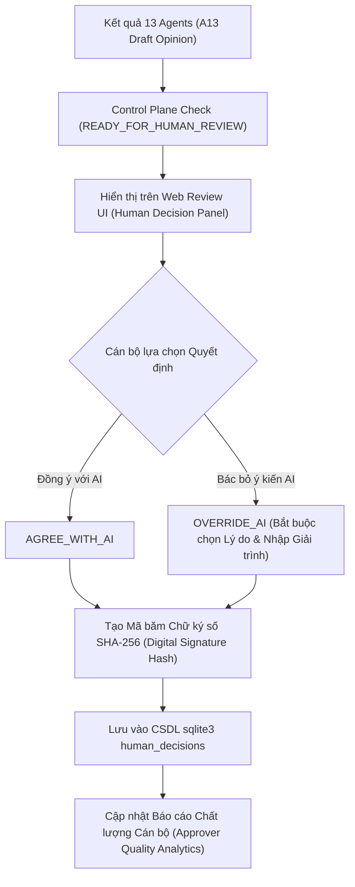

# 06. Quy Trình Phê Duyệt Con Người & Đánh Giá Chất Lượng Cán Bộ (Approver Quality System)

---

## 1. Mục Tiêu Nghiệp Vụ và Quy Tắc Thẩm Quyền Con Người

Trong quy trình thẩm định tín dụng ngân hàng, **các AI Agent không giữ thẩm quyền pháp lý**. AI chỉ tạo các bản thảo tham mưu (`DRAFT`). Quyết định pháp lý cuối cùng và trách nhiệm giải ngân thuộc về Cán bộ Phê duyệt / Giám đốc Chi nhánh / CRO con người.

### Quy tắc kiểm soát an toàn (Safety Rules):
1. **Lưu vết Danh tính Người duyệt (Full User Identification):** Mọi quyết định phê duyệt đều bắt buộc ghi nhận `user_id`, `username`, `full_name`, `role` và `branch_id`.
2. **Cơ chế Phủ quyết AI (AI Override Protocol):** Khi Cán bộ đưa ra quyết định khác với ý kiến đề xuất của AI (`OVERRIDE_AI`), hệ thống **bắt buộc Cán bộ phải chọn Hạng mục Lý do Phủ quyết** và **nhập Lời giải trình chi tiết (> 10 ký tự)**.
3. **Ký số & Chống chối bỏ (Non-repudiation Digital Signature):** Mỗi quyết định được tạo mã băm chữ ký số bảo mật SHA-256 (`digital_signature_hash`) kết hợp từ danh tính, thời gian, case ID và nội dung quyết định.
4. **Đánh giá Chất lượng Phê duyệt (Approver Performance Audit):** Hệ thống theo dõi chỉ số Tỷ lệ Override AI và kết quả tín dụng về sau để làm tiền đề kiểm toán và đánh giá năng lực cán bộ phê duyệt.

---

## 2. Sơ Đồ Luồng Quyết Định Con Người (Human Decision Flow)



---

## 3. Cấu Trúc Bảng Cơ Sở Dữ Liệu (`human_decisions`)

```sql
CREATE TABLE IF NOT EXISTS human_decisions (
    decision_id TEXT PRIMARY KEY,          -- Mã quyết định (vd: DECISION-8a12f3b9)
    case_id TEXT NOT NULL,                 -- Mã hồ sơ tín dụng (vd: CASE-APPROVE_CONDITIONS)
    run_id TEXT NOT NULL,                  -- Mã phiên thực thi workflow
    user_id TEXT NOT NULL,                 -- Mã cán bộ phê duyệt (vd: USR-8821)
    username TEXT NOT NULL,                -- Username cán bộ
    full_name TEXT NOT NULL,               -- Họ và tên đầy đủ
    role TEXT NOT NULL,                    -- Chức danh (CRO / Giám đốc CN / Trưởng phòng)
    branch_id TEXT NOT NULL,               -- Chi nhánh / Đơn vị quản lý
    ai_decision TEXT NOT NULL,             -- Ý kiến đề xuất của AI (vd: APPROVE_WITH_CONDITIONS)
    human_decision TEXT NOT NULL,          -- Quyết định cuối của con người (APPROVED / REJECTED / ...)
    decision_type TEXT NOT NULL,           -- AGREE_WITH_AI hoặc OVERRIDE_AI
    override_reason_category TEXT,         -- Hạng mục lý do phủ quyết AI
    override_justification TEXT,           -- Lời giải trình chi tiết của Cán bộ (Bắt buộc nếu OVERRIDE)
    approved_amount INTEGER,               -- Hạn mức được duyệt thực tế
    approved_tenor_months INTEGER,         -- Thời hạn vay được duyệt thực tế
    approved_interest_rate REAL,           -- Lãi suất được duyệt thực tế
    digital_signature_hash TEXT NOT NULL,  -- Mã băm chữ ký số SHA-256 chống sửa đổi
    created_at TEXT NOT NULL DEFAULT CURRENT_TIMESTAMP
);
```

---

## 4. Bộ Chỉ Số Đánh Giá Chất Lượng Cán Bộ Phê Duyệt (Approver Quality KPIs)

Hệ thống tính toán báo cáo chỉ số kiểm toán cho từng Cán bộ qua API `/api/approver-quality-report`:

1. **Tổng số hồ sơ đã xử lý (`total_decisions`):** Khối lượng công việc đã hoàn thành.
2. **Tỷ lệ Phủ quyết AI (`override_rate_pct`):** 
   $$\text{Override Rate} = \frac{\text{Số lần OVERRIDE AI}}{\text{Tổng số hồ sơ}} \times 100\%$$
3. **Chỉ số Tuân thủ Phê duyệt (`quality_index`):**
   - `HIGH_COMPLIANCE` (Tỷ lệ Override $\le 15\%$): Cán bộ tuân thủ cao với các đánh giá rủi ro của AI.
   - `BALANCED_AUDITED` (Tỷ lệ Override $15\% - 35\%$): Cán bộ cân bằng, có kiểm tra xem xét ngoại lệ kinh doanh thực tế.
   - `HIGH_OVERRIDE_RISK` (Tỷ lệ Override $> 35\%$): Cảnh báo Cán bộ phủ quyết AI quá nhiều, đưa vào danh sách kiểm toán chuyên sâu.

---

## 5. Hướng Dẫn Sử Dụng API Endpoints

### 1. Ký duyệt hồ sơ con người (`POST /api/human-decision`)
**Request Payload:**
```json
{
  "case_id": "CASE-APPROVE_CONDITIONS",
  "user_id": "USR-8821",
  "username": "nguyenvana",
  "full_name": "Nguyễn Văn A",
  "role": "CRO / Giám đốc Rủi ro",
  "branch_id": "HO_RISK_CENTER",
  "ai_decision": "APPROVE_WITH_CONDITIONS",
  "human_decision": "REJECT_INSUFFICIENT_EVIDENCE",
  "decision_type": "OVERRIDE_AI",
  "override_reason_category": "ADDITIONAL_COLLATERAL_RECORDED",
  "override_justification": "Đã kiểm tra dòng tiền thực tế quá yếu, tài sản bảo đảm không bù đắp được nguồn thu trả nợ chính."
}
```

**Response (201 Created):**
```json
{
  "decision_id": "DECISION-f12a99c4",
  "case_id": "CASE-APPROVE_CONDITIONS",
  "user_id": "USR-8821",
  "human_decision": "REJECT_INSUFFICIENT_EVIDENCE",
  "decision_type": "OVERRIDE_AI",
  "digital_signature_hash": "e3b0c44298fc1c149afbf4c8996fb92427ae41e4649b934ca495991b7852b855",
  "status": "SUCCESS"
}
```

### 2. Tra cứu Báo cáo Chất lượng Cán bộ (`GET /api/approver-quality-report?user_id=USR-8821`)
**Response:**
```json
{
  "user_id": "USR-8821",
  "total_decisions": 5,
  "agreed_with_ai_count": 4,
  "override_ai_count": 1,
  "agreement_rate_pct": 80.0,
  "override_rate_pct": 20.0,
  "quality_index": "BALANCED_AUDITED",
  "decisions": [...]
}
```
