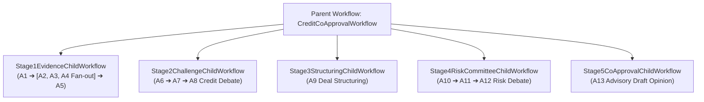

# 09. Sổ Tay Kỹ Thuật & Tổng Hợp Giải Pháp Kiến Trúc (Living Technical Playbook)

> **Mục đích tài liệu**: Đây là tài liệu sống (Living Document) lưu trữ toàn bộ các trao đổi chuyên sâu, phân tích kỹ thuật, quyết định thiết kế (ADR - Architecture Decision Records) và giải pháp kiến trúc đã được thảo luận và thống nhất. Tài liệu sẽ liên tục được cập nhật khi có các câu hỏi, yêu cầu hoặc giải pháp mới.

---

## 📑 Mục Lục Các Chuyên Đề Kỹ Thuật

1. [Chuyên đề 1: Động Cơ Điều Phối Temporal.io & Lý Do Phù Hợp](#chuyên-đề-1-động-cơ-điều-phối-temporalio--lý-do-phù-hợp)
2. [Chuyên đề 2: Tái Cấu Trúc Temporal Thành 5 Stage Child Workflows](#chuyên-đề-2-tái-cấu-trúc-temporal-thành-5-stage-child-workflows)
3. [Chuyên đề 3: Kiến Trúc Thư Mục Chuẩn Hóa Enterprise (Clean/Hexagonal)](#chuyên-đề-3-kiến-trúc-thư-mục-chuẩn-hóa-enterprise-cleanhexagonal)
4. [Chuyên đề 4: Hệ Thống Prompt Templates Chuẩn Hóa Theo Stage](#chuyên-đề-4-hệ-thống-prompt-templates-chuẩn-hóa-theo-stage)
5. [Chuyên đề 5: Phân Quyền Tool Allowlist & Rate Limiter Tại Gateway](#chuyên-đề-5-phân-quyền-tool-allowlist--rate-limiter-tại-gateway)
6. [Chuyên đề 6: Đánh Giá Hiệu Năng & Quy Hoạch Năng Lực (Sizing 10.000 hồ sơ/ngày)](#chuyên-đề-6-đánh-giá-hiệu-năng--quy-hoạch-năng-lực-sizing-10000-hồ-sơngày)
7. [Chuyên đề 7: Cơ Chế Circuit Breaker & Fallback Cho Tool API Ngân Hàng](#chuyên-đề-7-cơ-chế-circuit-breaker--fallback-cho-tool-api-ngân-hàng)
8. [Chuyên đề 8: Enterprise Audit Logging Với Global Trace ID (End-to-End Traceability)](#chuyên-đề-8-enterprise-audit-logging-với-global-trace-id-end-to-end-traceability)
9. [Chuyên đề 9: Phân Tích Chuyên Sâu Agent 1 (A1) & IDP/OCR Cho BCTC & Sao Kê](#chuyên-đề-9-phân-tích-chuyên-sâu-agent-1-a1--idpocr-cho-bctc--sao-kê)
10. [Chuyên đề 10: Thiết Kế Chống Timeout Cho Tác Vụ OCR Tài Liệu Lớn](#chuyên-đề-10-thiết-kế-chống-timeout-cho-tác-vụ-ocr-tài-liệu-lớn)
11. [Chuyên đề 11: Thiết Kế Thực Chiến Cho Cụm Stage 2 (A6 - A7 - A8) Theo Mô Hình Phản Biện Biện Chứng](#chuyên-đề-11-thiết-kế-thực-chiến-cho-cụm-stage-2-a6---a7---a8-theo-mô-hình-phản-biện-biện-chứng)
12. [Chuyên đề 12: Chuẩn Hóa Bộ Prompt Templates Stage 1 (A1 - A5) Cung Cấp Bằng Chứng Định Lượng Cho Stage 2](#chuyên-đề-12-chuẩn-hóa-bộ-prompt-templates-stage-1-a1---a5-cung-cấp-bằng-chứng-định-lượng-cho-stage-2)

---

## Chuyên đề 1: Động Cơ Điều Phối Temporal.io & Lý Do Phù Hợp

### ❓ Câu hỏi đặt ra:
*Ưu điểm khi sử dụng Temporal là gì, tại sao lại phù hợp với bài toán Multi-Agent Thẩm định Tín dụng SME? Các ngân hàng lớn có dùng Temporal không?*

### 💡 Giải đáp & Quyết định kỹ thuật:
1. **Durable Execution (Thực thi bền vững)**:
   - Các luồng phê duyệt tín dụng kéo dài nhiều ngày (Human-in-the-loop). Temporal tự động đóng băng trạng thái (Freeze state) và đánh thức khi có tín hiệu duyệt mà không cần giữ connection/thread.
   - Nếu server hoặc Worker bị crash giữa chừng, Temporal tự động Replay lại chính xác bước bị gián đoạn mà **không phải gọi lại các API LLM đắt đỏ** đã chạy trước đó.
2. **Deterministic State Machine & Event Sourcing**:
   - Mọi bước chuyển State được ghi thành Event History bất biến, đáp ứng 100% yêu cầu thanh tra/kiểm toán của Ngân hàng Nhà nước.
3. **Phổ biến tại các Tổ chức Tài chính Lớn**:
   - **Stripe** sử dụng Temporal điều phối toàn bộ luồng chuyển tiền và thanh toán toàn cầu.
   - **Coinbase, Brex, Deserve** dùng Temporal quản lý phát hành thẻ tín dụng và thẩm định KYC/AML.

---

## Chuyên đề 2: Tái Cấu Trúc Temporal Thành 5 Stage Child Workflows

### ❓ Câu hỏi đặt ra:
*Làm thế nào để tối ưu hóa Temporal Workflow, tránh việc Event History phình to (vượt ngưỡng 50.000 events) khi chạy 13 Agents và hàng chục tool calls?*

### 💡 Giải đáp & Quyết định kỹ thuật:
Chuyển đổi từ Monolithic Workflow sang kiến trúc **Parent Workflow + 5 Child Workflows độc lập** theo 5 Stage nghiệp vụ:

**Lợi ích**:
- Mỗi Stage có Event History riêng biệt, luôn dưới 1.000 events (an toàn tuyệt đối).
- Cho phép Replay/Retry độc lập từng Stage khi gặp lỗi mà không phải chạy lại từ đầu.

---

## Chuyên đề 3: Kiến Trúc Thư Mục Chuẩn Hóa Enterprise (Clean/Hexagonal)

### ❓ Câu hỏi đặt ra:
*Đề xuất cấu trúc thư mục chuẩn hóa Enterprise phân tách rõ ràng để mở rộng sau này.*

### 💡 Giải đáp & Quyết định kỹ thuật:
Phân rã dự án theo mô hình **Clean / Hexagonal Architecture**:
- `src/credit_agent_poc/agents/`: Tách 13 logical agents thành các module riêng biệt theo 5 Stage.
- `src/credit_agent_poc/agents/prompts/`: Thư mục chứa 14 template prompt `.md`.
- `src/credit_agent_poc/tools/`:
  - `gateway.py`: Cổng an toàn, phân quyền allowlist & rate limit.
  - `simulated/`: 4 mixins và simulated backend phục vụ testing.
  - `adapters/`: Các adapter kết nối hệ thống thật (CIC, CoreBanking, IDPOCR, Collateral).
- `control_gate.py`: Thẩm định độc lập, Deterministic Hard-blocks & Chữ ký số HMAC-SHA256.
- `workflow.py`: Điều phối Temporal Parent & Child Workflows.
- `logger.py`: Hệ thống Enterprise Audit Logger với Global Trace ID.

---

## Chuyên đề 4: Hệ Thống Prompt Templates Chuẩn Hóa Theo Stage

### ❓ Câu hỏi đặt ra:
*Các agent hiện tại có dùng prompt nào không? Lưu prompt thành các template riêng theo kiến trúc Enterprise như thế nào?*

### 💡 Giải đáp & Quyết định kỹ thuật:
- Tạo 14 tệp template Markdown riêng biệt tại thư mục `src/credit_agent_poc/agents/prompts/`:
  - `base_system.md`: Quy tắc an toàn nền tảng (AI không có quyền phê duyệt/giải ngân, chống ảo giác).
  - `a1_intake.md` đến `a13_coapproval_manager.md`: Prompt nghiệp vụ chuyên biệt cho từng Agent.
- Cập nhật `prompts.py` tự động đọc file Markdown động và nội suy tham số, có cơ chế fallback sẵn sàng nếu file bị thiếu.

---

## Chuyên đề 5: Phân Quyền Tool Allowlist & Rate Limiter Tại Gateway

### ❓ Câu hỏi đặt ra:
*Làm sao kiểm soát AI Agent nào được gọi Tool nào và kiểm soát tần suất (Rate Limit) ở Gateway?*

### 💡 Giải đáp & Quyết định kỹ thuật:
1. **Phân quyền Agent Tool Allowlist (`is_tool_allowed`)**:
   - Đối chiếu với ma trận `TOOL_ALLOWLIST`. Các Agent phản biện (A6, A7, A8, A10, A11, A12, A13) là **Tool-Free Agents** (Allowlist rỗng).
   - Nếu Agent gọi trái phép: ghi vết `tool_call_denied` và ném ngoại lệ `ToolAccessError`.
2. **Kiểm soát Tần suất (`RateLimiter`)**:
   - Thuật toán Sliding Window đếm số cuộc gọi/giây.
   - Nếu vượt ngưỡng: ghi vết `tool_call_rate_limited` và ném ngoại lệ `ToolRateLimitError`.

---

## Chuyên đề 6: Đánh Giá Hiệu Năng & Quy Hoạch Năng Lực (Sizing 10.000 hồ sơ/ngày)

### ❓ Câu hỏi đặt ra:
*Đánh giá hiệu năng và quy hoạch sizing hạ tầng cho 10.000 giao dịch/hồ sơ thẩm định một ngày.*

### 💡 Giải đáp & Quyết định kỹ thuật:
1. **Bài toán tải**:
   - Tải trung bình: **0.35 – 0.5 TPS**. Peak TPS giờ cao điểm: **1.5 – 2.5 TPS**.
   - Tổng lượt gọi LLM: **130.000 calls/ngày** (15 – 30 calls/s giờ cao điểm).
   - Tổng lượt gọi Tool API: **320.000 calls/ngày** (40 – 80 calls/s giờ cao điểm).
2. **Quy hoạch Hạ tầng (Sizing Guide)**:
   - **Temporal Cluster**: 3 Nodes (4 vCPU, 8GB RAM) + Postgres DB (4 vCPU, 16GB RAM).
   - **K8s Workers**: 3 – 10 Pods (4 vCPU, 8GB RAM).
   - **PostgreSQL Database**: Primary 8 vCPU, 32GB RAM (NVMe 500GB) + Read Replica.
   - **Redis Cluster**: 6 Nodes (Semantic LLM Cache).
   - **LLM Serving**: Cloud Azure OpenAI (PTU 400–600 TPM) hoặc On-Premise (4x GPU NVIDIA A100 80GB / 2x H100 chạy vLLM).

---

## Chuyên đề 7: Cơ Chế Circuit Breaker & Fallback Cho Tool API Ngân Hàng

### ❓ Câu hỏi đặt ra:
*Làm sao để hệ thống không bị treo hoặc ngắt đột ngột khi API Ngân hàng (CIC, Core Banking, IDP) gặp sự cố mạng hoặc timeout?*

### 💡 Giải đáp & Quyết định kỹ thuật:
Triển khai mô hình **Circuit Breaker 3 Trạng thái** tại `tools/circuit_breaker.py`:
1. `CLOSED`: Hoạt động bình thường.
2. `OPEN`: Lỗi liên tiếp 3 lần (`failure_threshold=3`) ➔ Ngắt mạch trong 5.0 giây (`cooldown_seconds=5.0`).
3. `HALF_OPEN`: Hết thời gian chờ, cho phép 1 request thử nghiệm phục hồi.
4. **Fallback Gián Cấp (`DEGRADED_MODE`)**: Khi mạch `OPEN`, Gateway trả về payload an toàn kèm `partial_data=True` để Agent A1/A2 thực thi quy tắc **Fail-Closed** mà không làm đứt luồng Workflow.

---

## Chuyên đề 8: Enterprise Audit Logging Với Global Trace ID (End-to-End Traceability)

### ❓ Câu hỏi đặt ra:
*Cần ghi log toàn bộ luồng từ API call, Temporal, Agent, LLM inference đến Tool call với 1 Global UUID chung để tra cứu trên hệ thống tập trung (Logstash, Kafka, Datadog).*

### 💡 Giải đáp & Quyết định kỹ thuật:
1. **Module `EnterpriseAuditLogger` (`src/credit_agent_poc/logger.py`)**:
   - Ghi log định dạng JSON Lines ra file `logs/credit_agent_audit.jsonl` và stdout.
2. **Gắn kết Global Trace ID (`trace_id`)**:
   - `trace_id` (định dạng `tr-<uuid>`) được khởi tạo tại REST API hoặc Workflow và truyền xuyên suốt qua tất cả các tầng:
     - `WEB_SERVER` (API Request/Response)
     - `WORKFLOW` (Temporal Stage Lifecycle)
     - `AGENT_RUNTIME` (Agent Execution Start/Complete)
     - `LLM_ADAPTER` (LLM Inference Prompt Call)
     - `TOOL_GATEWAY` (Tool Execution, Fallback, Circuit Breaker)
     - `CONTROL_GATE` (Human Signing & HMAC-SHA256 Digital Seal)

---

## Chuyên đề 9: Phân Tích Chuyên Sâu Agent 1 (A1) & IDP/OCR Cho BCTC & Sao Kê

### ❓ Câu hỏi đặt ra:
*Agent 1 hoạt động như thế nào? Việc bóc tách OCR Báo cáo tài chính và Sao kê ngân hàng nên triển khai ra sao?*

### 💡 Giải đáp & Quyết định kỹ thuật:
1. **Vai trò A1**: Gatekeeper kiểm tra tính đầy đủ/toàn vẹn của hồ sơ, khởi tạo `CreditState`.
2. **Pipeline IDP 4 Bước**:
   - **Bước 1 (Tiền xử lý & Layout Analysis)**: De-skew, Rotation, Table Detection qua PP-Structure / LayoutLMv3.
   - **Bước 2 (Hybrid OCR + VLM)**: PaddleOCR v4 bóc Text nhanh + Qwen2.5-VL-7B hiểu ngữ cảnh kế toán và số âm trong ngoặc.
   - **Bước 3 (Kiểm tra Cân đối Kế toán)**:
     - $\text{Tổng Tài Sản} = \text{Tổng Nguồn Vốn} = \text{Nợ Phải Trả} + \text{Vốn CSH}$.
     - Khớp số dư tịnh tiến của Sao kê ngân hàng.
   - **Bước 4 (Chuẩn hóa JSON Schema)**: Trả về Schema JSON chuẩn cho Agent A1.

---

## Chuyên đề 10: Thiết Kế Chống Timeout Cho Tác Vụ OCR Tài Liệu Lớn

### ❓ Câu hỏi đặt ra:
*Việc bóc tách OCR tài liệu lớn (BCTC 50 trang, Sao kê 200 trang) có thể mất vài phút. Thiết kế như thế nào để hệ thống không bị timeout?*

### 💡 Giải đáp & Quyết định kỹ thuật:
1. **Pre-Ingestion (Xử lý sớm khi RM upload)**: Kích hoạt OCR ngầm ngay khi RM tải file lên Portal/DMS. Khi Agent A1 chạy thì kết quả đã có sẵn trong S3/DB (`< 50ms`).
2. **Parallel Page Chunking**: Cắt PDF 100 trang thành 10 chunks x 10 trang và xử lý song song trên cụm GPU (giảm từ 150s xuống 15s).
3. **Temporal Long-Running Activity & Heartbeat**: Cấu hình `start_to_close_timeout=10 minutes` và gửi nhịp tim `activity.heartbeat()` định kỳ mỗi khi xong 1 trang.
4. **Async Task Token (Webhook)**: Activity gửi `task_token` sang dịch vụ OCR ngoài và nhả thread; khi OCR xong thì gọi `CompleteActivity` để đánh thức Workflow.
5. **SHA-256 Content Deduplication**: Băm mã SHA-256 của file PDF, trả về kết quả cache tức thì trong `< 5ms` nếu file đã từng được bóc tách trước đó.

---

## Chuyên đề 11: Thiết Kế Thực Chiến Cho Cụm Stage 2 (A6 - A7 - A8) Theo Mô Hình Phản Biện Biện Chứng

### ❓ Câu hỏi đặt ra:
*A6, A7, A8 liệu có mang nhiều ý nghĩa trong thực tế không? Việc các Agent cùng truy cập một nguồn dữ liệu thì tranh luận có ý nghĩa không? Nên thiết kế như thế nào để có giá trị tham khảo cao nhất cho Cán bộ Phê duyệt ra quyết định?*

### 💡 Giải đáp & Quyết định kỹ thuật:
1. **Bản chất nghiệp vụ**: Phê duyệt tín dụng là cuộc đối thoại biện chứng giữa **Khối Kinh doanh (RM - Tăng trưởng, Upside)** và **Khối Quản trị Rủi ro (Risk - Thận trọng, Downside)**. Cán bộ Phê duyệt không cần AI trả lời ĐỒNG Ý/TỪ CHỐI đơn thuần, mà cần **bảng so sánh đa chiều** và **các điều kiện ràng buộc (Covenants)** để kiểm soát rủi ro.
2. **4 Nguyên tắc Thiết kế Thực chiến**:
   - **Lăng kính Phân tích Bất đối xứng**: A6 dùng lăng kính *Going-Concern (Hoạt động liên tục, DSCR, tăng trưởng)*; A7 dùng lăng kính *Downside Stress-Test (Kịch bản xấu, điểm gãy dòng tiền, chiết khấu TSBĐ)*.
   - **Ràng buộc Dẫn chứng Số liệu Tuyệt đối**: Cấm nhận định cảm tính; mọi luận điểm bắt buộc trích xuất chỉ số định lượng từ Stage 1.
   - **Quy trình Phản biện 3 Bước**: A6 đưa ra 3 luận điểm bảo vệ ➔ A7 tấn công trực diện các điểm gãy ➔ A8 đóng vai trò Trọng tài độc lập.
   - **Đầu ra Biện chứng (Synthesis Table & Actionable Covenants)**: A8 tổng hợp `synthesis_matrix` và đề xuất danh mục `required_covenants` (ví dụ: cam kết chuyển 80% dòng tiền về tài khoản, duy trì DSCR tối thiểu 1.20x) và `conditions_precedent` phục vụ Cán bộ đưa vào Hợp đồng tín dụng.

---

## Chuyên đề 12: Chuẩn Hóa Bộ Prompt Templates Stage 1 (A1 - A5) Cung Cấp Bằng Chứng Định Lượng Cho Stage 2

### ❓ Câu hỏi đặt ra:
*Làm thế nào để nâng cấp bộ Prompt Templates cho các Agent từ A1 đến A5 nhằm cung cấp bằng chứng định lượng, nhất quán và có cấu trúc sâu cho cuộc tranh luận Stage 2 (A6 – A8)?*

### 💡 Giải đáp & Quyết định kỹ thuật:
1. **A1 (Intake & Normalization)**: Tập trung vào kiểm kê chứng từ, tính toàn vẹn OCR, kiểm tra cửa sổ sao kê (>=12 tháng) và cấm tuyệt đối việc đưa ra phán đoán tín dụng.
2. **A2 (Cashflow & Turnover)**: Đo lường hệ số biến động dòng tiền, phát hiện bất thường cuối tháng (Window Dressing) và tính tỷ lệ tập trung đối tác (>40%) cung cấp cho A6 (Tăng trưởng) và A7 (Rủi ro tập trung).
3. **A3 (Transaction Integrity & Graph)**: Phân tích đồ thị mạng lưới bên liên quan, phát hiện dòng tiền vòng quanh đảo nợ ($A \rightarrow B \rightarrow C \rightarrow A$) và gán nhãn `cycle_score` làm bằng chứng chặn rủi ro cho A7 và A8.
4. **A4 (Financial Capacity & DSCR)**: Tính toán hệ số trả nợ gốc $\text{DSCR} \ge 1.20$, thực hiện thử nghiệm độ nhạy `stressed_dscr` (-20% doanh thu, +200 bps lãi suất) và khẳng định nguyên tắc *TSBĐ không thể chữa lỗi dòng tiền chính*.
5. **A5 (Policy & Authority)**: Ánh xạ quy tắc cứng (Tenor tối đa, LTV), trích dẫn điều khoản chính sách chuẩn xác (`policy_citation_id`) và xác định cấp thẩm quyền phê duyệt bắt buộc (`BRANCH_DIRECTOR`, `CREDIT_COMMITTEE`, `CRO_RISK`).

## Chuyên đề 13: Kiến Trúc Multi-Tier Claim Check Store & Multi-Worker Pool Scaling

### ❓ Câu hỏi đặt ra:
*1. Bộ nhớ Shared State trong Claim Check Store chạy trên RAM in-memory có nguy cơ tràn bộ nhớ và không chia sẻ được giữa nhiều tiến trình/pod. Làm sao để nâng cấp lên Redis phân tán?*
*2. Temporal Worker hiển thị chỉ có 1 Poller trên Web UI dù bật nhiều thread. Làm sao để scale nhiều Worker độc lập?*

### 💡 Giải đáp & Quyết định kỹ thuật:
1. **Kiến trúc Multi-Tier Claim Check Store (`claim_check.py`)**:
   - **L1 In-Memory Cache**: LRU Cache nội tại tiến trình với cơ chế deepcopy bảo vệ cách ly đột biến dữ liệu giữa các luồng.
   - **L2 Distributed Redis Cache**: Quản lý State phân tán qua Redis JSON serialization với TTL tự động (mặc định 7 ngày).
   - **L3 Database Fallback**: Write-through và phục hồi dữ liệu từ SQLite/PostgreSQL khi cache miss hoặc restart pod.
   - Cho phép cấu hình linh hoạt qua biến môi trường `CLAIM_CHECK_STORE_TYPE=tiered` và `REDIS_URL`.
2. **Multi-Worker Pool với Unique Poller Identity**:
   - Temporal SDK yêu cầu mỗi `Worker` instance gắn với một `Client` có `identity` duy nhất (`credit-worker-{queue}-{index}`).
   - Khởi chạy đồng thời trên 4 Task Queues chuyên biệt: `credit-approval-queue`, `fast-tools-queue`, `idp-ocr-queue`, `heavy-llm-queue`.
   - Bổ sung tham số `--count N` trong lệnh CLI `python3 -m credit_agent_poc worker --count 4`.

---

## Chuyên đề 14: Kiểm Thử Tải (Load Testing) & Giả Lập Hồ Sơ Động (Synthetic Dossiers)

### ❓ Câu hỏi đặt ra:
*Làm thế nào để kiểm thử tải (stress-test) toàn diện hệ thống với hàng trăm hồ sơ doanh nghiệp đa dạng, đo đạc P50/P90/P99 latency và TPS thay vì chỉ chạy 6 kịch bản tĩnh?*

### 💡 Giải đáp & Quyết định kỹ thuật:
1. **Công cụ Benchmark & Stress Tester (`scripts/load_test.py`)**:
   - Hỗ trợ 2 chế độ: `--mode api` (bắn đồng thời HTTP POST qua Web Server) và `--mode temporal` (bắn trực tiếp vào Temporal Engine).
   - Tính toán đầy đủ: Throughput (TPS), phân vị độ trễ (P50, P90, P95, P99, Min, Mean, Max), phân bổ kết quả tín dụng và phán quyết Control Gate.
   - Kiểm tra tính toàn vẹn dữ liệu: sinh `case_id` độc nhất cho từng ca và ghi vết tự động vào `credit_cases` cùng `audit_events`.
2. **Bộ Sinh Hồ Sơ Động (`SyntheticDossierGenerator`)**:
   - Tự động sinh ngẫu nhiên hồ sơ doanh nghiệp Việt Nam theo 5 nhóm rủi ro đặc trưng (`HEALTHY_PRIME`, `POLICY_EXCEPTION_TENOR`, `SUSPICIOUS_AML`, `WEAK_CASHFLOW`, `INCOMPLETE_DOCS`).
   - Mở rộng API `POST /api/run-custom` cho phép hệ thống LOS/Core Banking bên ngoài gửi trực tiếp hồ sơ JSON vào thẩm định.

---

*Tài liệu này là Living Technical Playbook được cập nhật liên tục sau mỗi phiên tối ưu kiến trúc.*
