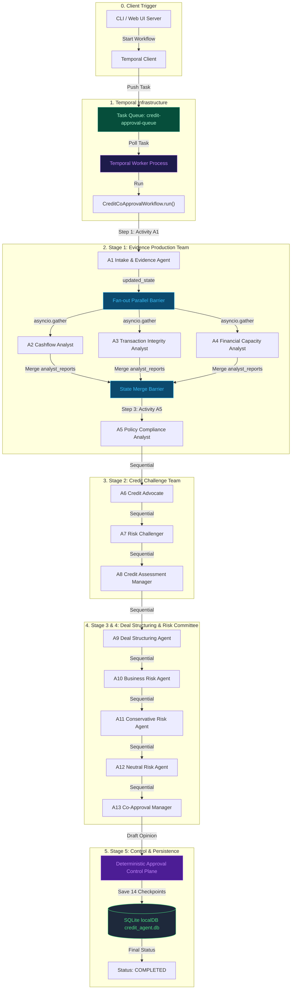

# 10. Luồng Thực Thi Temporal.io Workflow (Mermaid Sequence & Flowchart)

---

## 1. Sơ Đồ Tuần Tự Chi Tiết (Mermaid Sequence Diagram)

Sơ đồ thể hiện sự tương tác theo thời gian giữa Client, Temporal Server Cluster (`127.0.0.1:7233`), Task Queue `credit-approval-queue`, Worker Process, Workflow DAG 13 Agent và Cơ sở dữ liệu `sqlite3 credit_agent.db`.

```mermaid
sequenceDiagram
    autonumber
    actor Client as 🌐 Client / CLI / Web UI
    participant Server as ⚡ Temporal Server (127.0.0.1:7233)
    participant Worker as 👷 Temporal Worker Process
    participant Workflow as 🔄 CreditCoApprovalWorkflow (@workflow.defn)
    participant Activity as ⚙️ execute_agent_activity (@activity.defn)
    participant DB as 🗄️ SQLite localDB (credit_agent.db)

    %% 1. Start Workflow
    Client->>Server: 1. start_workflow(CreditCoApprovalWorkflow.run, scenario_id)
    Note over Client,Server: Task Queue: "credit-approval-queue"<br/>Workflow ID: credit-workflow-{scenario_id}-{uuid}
    Server->>Server: 2. Lưu Event History & đẩy Workflow Task vào Queue
    
    %% 2. Worker Polling
    Worker->>Server: 3. Poll lấy Task từ Task Queue "credit-approval-queue"
    Server-->>Worker: Trả về Workflow Task
    Worker->>Workflow: 4. Khởi chạy CreditCoApprovalWorkflow.run(scenario_id)

    %% 3. Activity Execution Loop (13 Nodes)
    rect rgb(15, 23, 42)
        note over Workflow,Activity: Step 1: A1 Intake Activity
        Workflow->>Server: Schedule Activity "A1" (schedule_to_close_timeout = 30s)
        Server->>Worker: Dispatch Activity Task "A1"
        Worker->>Activity: execute_agent_activity("A1", {}, scenario_id)
        Activity->>Activity: Tái tạo CreditState & chạy AgentRuntime
        Activity->>Activity: Áp dụng StatePatch vào CreditState
        Activity-->>Workflow: Trả về {updated_state} (A1)
    end

    rect rgb(30, 41, 59)
        note over Workflow,Activity: Step 2: Parallel Fan-out Barrier (asyncio.gather)
        Workflow->>Server: Schedule 3 Activities song song: "A2", "A3", "A4"
        Server->>Worker: Dispatch Activity Tasks "A2", "A3", "A4"
        par Run A2 Cashflow Analyst
            Worker->>Activity: execute_agent_activity("A2", current_state, scenario_id)
            Activity-->>Workflow: Trả về updated_state (A2)
        and Run A3 Transaction Integrity
            Worker->>Activity: execute_agent_activity("A3", current_state, scenario_id)
            Activity-->>Workflow: Trả về updated_state (A3)
        and Run A4 Financial Capacity
            Worker->>Activity: execute_agent_activity("A4", current_state, scenario_id)
            Activity-->>Workflow: Trả về updated_state (A4)
        end
        Workflow->>Workflow: Gộp analyst_reports từ 3 nhánh vào current_state
    end

    rect rgb(15, 23, 42)
        note over Workflow,Activity: Step 3: Sequential Loop (A5 .. A13)
        loop Lặp tuần tự từ Node A5 đến A13
            Workflow->>Server: Schedule Activity node (A5, A6, ..., A13)
            Server->>Worker: Dispatch Activity Task
            Worker->>Activity: execute_agent_activity(node, current_state, scenario_id)
            Activity-->>Workflow: Trả về updated_state của node
            Workflow->>Workflow: Cập nhật current_state
        end
    end

    %% 4. Persistence & Completion
    Workflow->>DB: 5. Ghi nhận 14 State Checkpoints (SHA-256) & Audit Trail
    Workflow-->>Server: 6. Trả về {"status": "COMPLETED", "final_state": current_state}
    Server-->>Client: 7. Hoàn tất Workflow & trả kết quả cho Client
```

---

## 2. Sơ Đồ Luồng Logic Workflow DAG (Mermaid Flowchart)

Sơ đồ mô tả cấu trúc luồng dữ liệu (Data Flow) và các bước xử lý chuyển giao giữa 13 AI Agents trong Temporal Workflow.

---

## 3. Bảng Chi Tiết Cấu Hình & Code Mapping Trong Dự Án

| Thành phần | Code Reference | Cấu hình & Tham số | Chức năng nghiệp vụ |
| :--- | :--- | :--- | :--- |
| **Temporal Client** | [`orchestrator.py`](file:///Users/giangbh/Documents/Codex/2026-08-12/co/CreditAgent/src/credit_agent_poc/orchestrator.py) | `127.0.0.1:7233` | Kết nối cluster và đăng ký Workflow ID `credit-workflow-{scenario_id}-{uuid}`. |
| **Task Queue** | [`workflow.py`](file:///Users/giangbh/Documents/Codex/2026-08-12/co/CreditAgent/src/credit_agent_poc/workflow.py) | `credit-approval-queue` | Hàng đợi công việc chứa các Workflow Tasks & Activity Tasks. |
| **Temporal Worker** | [`workflow.py`](file:///Users/giangbh/Documents/Codex/2026-08-12/co/CreditAgent/src/credit_agent_poc/workflow.py) | `Worker(client, task_queue=...)` | Tiến trình background poll lấy task và thực thi code Python. |
| **Workflow Defn** | [`workflow.py`](file:///Users/giangbh/Documents/Codex/2026-08-12/co/CreditAgent/src/credit_agent_poc/workflow.py) | `@workflow.defn(name="CreditCoApprovalWorkflow")` | Định nghĩa luồng DAG 13 Agent, quản lý Fan-out barrier & State accumulation. |
| **Activity Defn** | [`workflow.py`](file:///Users/giangbh/Documents/Codex/2026-08-12/co/CreditAgent/src/credit_agent_poc/workflow.py) | `@activity.defn(name="execute_agent_node")` | Đóng gói execution của 1 Node Agent, áp dụng `StatePatch` và trả về snapshot. |
| **Timeout Policy** | [`workflow.py`](file:///Users/giangbh/Documents/Codex/2026-08-12/co/CreditAgent/src/credit_agent_poc/workflow.py) | `schedule_to_close_timeout=timedelta(seconds=30)` | Giới hạn thời gian chạy tối đa cho mỗi Activity. |
| **Persistence** | [`db.py`](file:///Users/giangbh/Documents/Codex/2026-08-12/co/CreditAgent/src/credit_agent_poc/db.py) | `StateRepository(credit_agent.db)` | Ghi 14 Explainable Checkpoints (mã băm SHA-256) & Audit Trail. |
