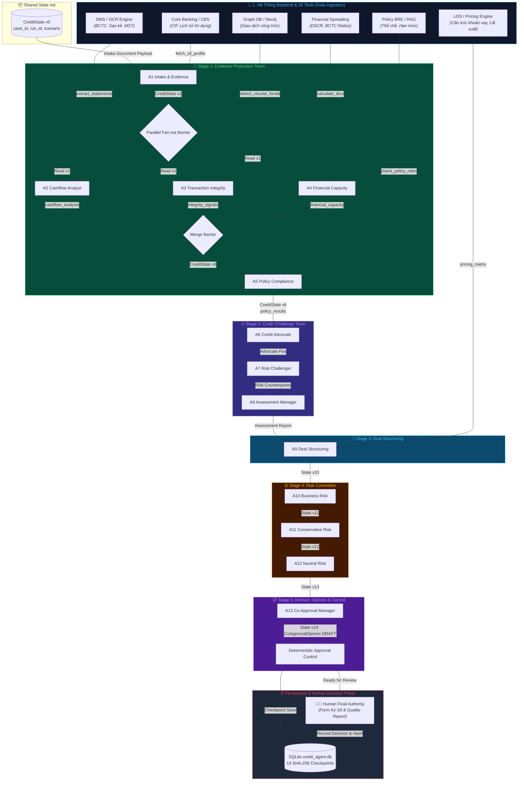

# 11. Sơ Đồ & Luồng Dữ Liệu Toàn Bộ Hành Trình (End-to-End Data Flow Architecture)

---

## 1. Tổng Quan Luồng Dữ Liệu Hành Trình (Data Flow Overview)

Luồng dữ liệu của **CreditAgent** trải qua 4 lớp tương tác chính:
1. **Backend Core Systems (Input Data Sources):** 6 hệ thống backend ngân hàng cung cấp dữ liệu qua 25 Tools.
2. **Shared State Engine (`CreditState` Pipeline):** Trạng thái tập trung lan truyền qua 13 AI Agents (5 Stages), được biến đổi bất biến (Immutable State Versioning) qua `StatePatch`.
3. **Control & Governance Engine (Deterministic Rules):** Khóa an toàn 0-LLM tự động kiểm tra vi phạm chính sách & rủi ro.
4. **Human Authority & Audit Persistence:** Lưu trữ 14 Checkpoints SHA-256 vào SQLite localDB và giao diện Ký số duyệt vay con người.

---

## 2. Sơ Đồ Luồng Dữ Liệu Tổng Thể (Mermaid Data Flow Diagram)



---

## 3. Bảng Ma Trận Luồng Dữ Liệu Giữa Các Agent (Agent Data Pipeline Matrix)

| Agent Node | Dữ liệu Đầu Vào (Input Payload) | Backend Tool Sử Dụng | Dữ liệu Đầu Ra (Output State Patch) | Trạng thái State Version |
| :--- | :--- | :--- | :--- | :--- |
| **A1 Intake** | Hồ sơ doanh nghiệp đầu vào, thông tin khoản vay | `fetch_borrower_profile`, `extract_tax_records` | Danh sách hồ sơ pháp lý, danh mục chứng từ | `State v1` |
| **A2 Cashflow** | Snapshot `CreditState v1` (Sao kê ngân hàng) | `extract_bank_statements`, `analyze_cashflow` | Báo cáo dòng tiền (`cashflow_analysis`), DSCR dòng tiền | `State v2` (Nhánh A2) |
| **A3 Integrity** | Snapshot `CreditState v1` (Nhật ký giao dịch) | `detect_circular_counterparties`, `analyze_transaction_graph` | Tỷ lệ rủi ro vòng tròn (`circular_funds_score`), danh sách đối tác ảo | `State v3` (Nhánh A3) |
| **A4 Capacity** | Snapshot `CreditState v1` (BCTC 3 năm) | `extract_financial_statements`, `calculate_dscr` | Chỉ số DSCR, khả năng trả nợ, đòn bẩy tài chính | `State v4` (Nhánh A4) |
| **Barrier Join** | Gộp kết quả 3 nhánh A2, A3, A4 | Không sử dụng | Báo cáo tổng hợp `analyst_reports` | `State v5` |
| **A5 Policy** | `analyst_reports` từ v5 | `query_credit_policy_rules`, `check_regulatory_limits` | Kết quả kiểm tra thể chế (`policy_check_results`) | `State v6` |
| **A6 Advocate** | `analyst_reports` & `policy_results` | Không sử dụng | Lập luận ủng hộ vay (`advocate_position`) | `State v7` |
| **A7 Challenger** | `integrity_signals` (Circular Funds) & policy gaps | Không sử dụng | Lập luận phản biện rủi ro (`challenger_counterpoints`) | `State v8` |
| **A8 Assessment** | Tranh luận A6 vs A7 | Không sử dụng | Báo cáo thẩm định có trọng số (`assessment_summary`) | `State v9` |
| **A9 Structuring** | `assessment_summary` | `calculate_risk_adjusted_rate`, `generate_loan_structure` | Cấu trúc khoản vay, Tenor, Lãi suất, Tài sản đảm bảo | `State v10` |
| **A10 Business** | Cấu trúc khoản vay từ A9 | Không sử dụng | Đánh giá tiềm năng thị trường (`business_risk_opinion`) | `State v11` |
| **A11 Conservative**| Cấu trúc khoản vay từ A9 | Không sử dụng | Kịch bản stress-test rủi ro xấu nhất (`conservative_risk_opinion`) | `State v12` |
| **A12 Neutral** | Tổng hợp A10 & A11 | Không sử dụng | Quan điểm rủi ro trung lập (`neutral_risk_opinion`) | `State v13` |
| **A13 Co-Approval**| Tổng hợp toàn bộ 12 Agent trước | Không sử dụng | Dự thảo `CoApprovalOpinion` (`DRAFT`) | `State v14` |
| **Control Plane** | State v14 | Khóa an toàn Code xác định | Kết quả kiểm soát: `control` status & Hard blocks | Final Gate |

---

## 4. Chi Tiết Cấu Trúc Dữ Liệu `CreditState` Khi Truyền Qua Pipeline

```json
{
  "case_id": "CASE-APPROVE_CONDITIONS",
  "scenario_id": "approve_conditions",
  "run_id": "run-f47a9b1c",
  "state_version": 14,
  "financial_metrics": {
    "dscr": 1.35,
    "leverage_ratio": 2.1,
    "revenue_growth_pct": 14.5
  },
  "integrity_signals": {
    "circular_funds_score": 0.05,
    "suspicious_counterparties": []
  },
  "policy_check_results": {
    "sector_cap_ok": true,
    "policy_exceptions": []
  },
  "analyst_reports": {
    "A2_cashflow": "Dòng tiền sao kê ổn định 1.2 tỷ/tháng",
    "A3_integrity": "Không phát hiện dòng tiền vòng tròn",
    "A4_capacity": "DSCR 1.35 đạt yêu cầu tối thiểu 1.2"
  },
  "credit_debate": {
    "advocate_position": "Doanh nghiệp có dòng tiền thực và DSCR an toàn",
    "challenger_position": "Cần thắt chặt điều kiện bổ sung BCTC kiểm toán",
    "assessment_summary": "Đề xuất chấp thuận cho vay kèm điều kiện BCTC"
  },
  "proposed_facility": {
    "approved_amount": 5000000000,
    "approved_tenor_months": 12,
    "approved_interest_rate": 8.5
  },
  "draft_opinion": {
    "decision": "APPROVE_WITH_CONDITIONS",
    "rationale": "DSCR đạt 1.35, không rủi ro vòng tròn, đồng ý cho vay kèm điều kiện bổ sung BCTC"
  },
  "control": {
    "status": "READY_FOR_HUMAN_REVIEW",
    "hard_blocks": []
  }
}
```
