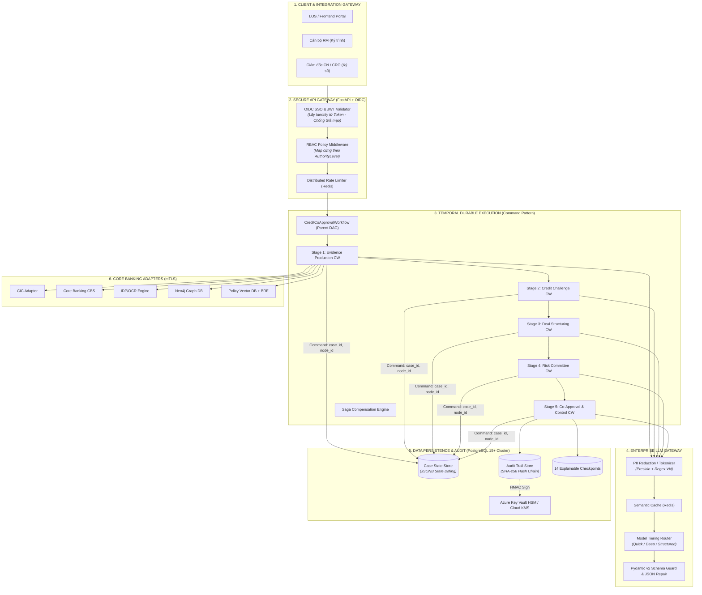
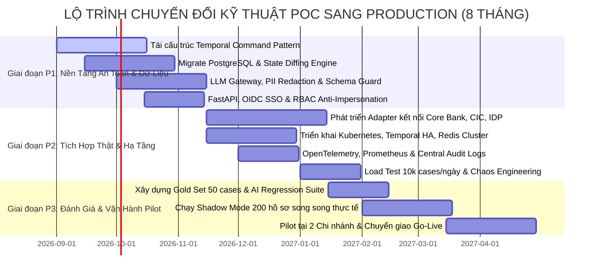

# 12. Tài Liệu Định Hướng Kỹ Thuật Chuyển Đổi Từ POC Sang Enterprise Production

---

## 1. Mục Đích & Bối Cảnh Chuyển Đổi (Executive Overview)

Hệ thống **CreditAgent** đã hoàn thành xuất sắc giai đoạn **Proof of Concept (POC)**, chứng minh tính khả thi của mô hình **Multi-Agent đồng phê duyệt tín dụng SME** với 13 Logical AI Agents, 5 Tầng xử lý, cơ chế Shared State & Ownership Matrix, cùng lớp kiểm soát xác định **Fail-Closed 0-LLM Control Plane**.

Tuy nhiên, phiên bản POC hiện tại được thiết kế chạy đơn tiến trình (in-memory simulation, SQLite, stdlib HTTP server, simulated adapters). Để đưa hệ thống vào vận hành tại **Ngân hàng Cấp 1 (Tier-1 Enterprise Banking)**, hệ thống phải đáp ứng các tiêu chuẩn công nghệ, an toàn thông tin và khối lượng giao dịch quy mô lớn:

### Mục tiêu Vận hành Cấp Doanh nghiệp (Target Operating Scale)
- **Thông lượng (Throughput):** Phục vụ **10.000 hồ sơ/ngày** (giờ cao điểm: 1.5 – 2.5 TPS).
- **Tải AI & Công cụ:** Xử lý **~130.000 LLM calls/ngày** và **~320.000 Tool invocations/ngày**.
- **Độ sẵn sàng (High Availability):** Đạt **99.95% SLA**, cơ chế khôi phục thảm họa RPO < 1 phút, RTO < 15 phút.
- **Tuân thủ Pháp lý & Bảo mật:** Đáp ứng 100% quy định Ngân hàng Nhà nước (SBV), Luật Các TCTD 2024, Nghị định 13/2023/NĐ-CP (Bảo vệ dữ liệu cá nhân) và tiêu chuẩn an toàn thông tin ISO 27001 / PCI-DSS.

---

## 2. Bảng Đối Chiếu Hiện Trạng (POC) vs Kiến Trúc Đích (Production Target)

| Hạng mục Kiến trúc | Hiện trạng POC (`src/credit_agent_poc`) | Kiến trúc Đích Production Enterprise |
| :--- | :--- | :--- |
| **1. Điều phối (Temporal Orchestration)** | Truyền full `state_dict` qua activity args/result; chạy simulation in-memory; timeout cào bằng 30s. | **Command Pattern:** Activity chỉ nhận `(case_id, node_id, run_id)`; 3 Task Queues riêng biệt; timeout/heartbeat theo loại tác vụ. |
| **2. Lưu trữ (Persistence & State)** | SQLite 1 connection; lưu full `CreditState` JSON blob (`state_data TEXT`); ghi đè toàn bộ mỗi checkpoint. | **PostgreSQL 15+ Partitioned:** State Diffing Engine; Audit Hash-Chain (`prev_hash`, `entry_hash`); PgBouncer; WAL PITR. |
| **3. Tầng AI / LLM Gateway** | `OpenAICompatibleModel` đồng bộ; không retry/backoff; **không PII redaction**; JSON schema không enforced. | **LLM Gateway:** PII Anonymization/Redaction (Presidio); Structured Output (Pydantic v2); Semantic Cache (Redis); Model Tiering. |
| **4. Cổng API / Web Service** | `http.server` stdlib; **không auth**; nhận identity từ `body`; lưu `runs` in-memory. | **FastAPI (ASGI) + Uvicorn:** Enterprise OIDC/SAML SSO; Identity từ JWT Token; RBAC Matrix; Session lưu Redis/DB. |
| **5. An toàn & Chữ ký số** | `KeyStore` hardcode dev key; Audit table chưa hash-chain; `human_decisions` dùng `DO UPDATE`. | **Azure Key Vault HSM / Cloud KMS;** Audit WORM storage; Append-only audit trail (REVOKE UPDATE/DELETE); mTLS nội bộ. |
| **6. Quan sát (Observability)** | Ghi log JSONL vào 1 file cục bộ `logs/credit_agent_audit.jsonl`; không metrics. | **OpenTelemetry Tracing;** Prometheus Metrics; Grafana Dashboards; Kafka/Logstash shipping; PagerDuty Alerting. |
| **7. Tích hợp Backends (Tools)** | 25 Tools chạy qua `SimulatedBackend`; `adapters/` là mock stubs. | **Production Adapters:** CIC API, Core Banking CBS (ISO8583/gRPC), IDP/OCR 4-step, Neo4j Graph DB, Policy Vector RAG + BRE. |
| **8. Hạ tầng & Triển khai** | Chạy local terminal; không container; không CI/CD; không IaC. | **Kubernetes (AKS/EKS/OpenShift):** HPA, PDB, Multi-AZ; Temporal HA Cluster; Redis Cluster; Terraform/Bicep IaC; GitOps CI/CD. |
| **9. Đánh giá Chất lượng (QA)** | 79 unit tests kiểm thử logic deterministic; báo cáo chất lượng v1.0. | **Quality Analytics v2.0 (3 lớp vintage outcome);** Gold Set 50 case do CRO duyệt; Automated LLM Regression Suite; Chaos Testing. |

---

## 3. Chi Tiết Thiết Kế Kỹ Thuật 4 Trụ Cột Cốt Lõi (Deep-Dive Specifications)



---

### Trụ Cột 1: Tái Cấu Trúc Temporal Command Pattern & Tách Task Queues

#### 1.1 Khắc phục triệt để "Temporal History Bloat"
- **Vấn đề trong POC:** Hàm `execute_agent_activity(node_id, state_dict)` truyền toàn bộ object `CreditState` (hàng trăm KB) qua tham số và kết quả activity. Temporal lưu toàn bộ dữ liệu này vào Event History, khiến kích thước lịch sử bùng nổ theo cấp số nhân, chạm giới hạn 50.000 events / 50MB.
- **Giải pháp Production (Command Pattern):**
  1. Activity **chỉ nhận định danh tối thiểu:**
     ```python
     @activity.defn
     async def execute_agent_command(command: AgentExecutionCommand) -> AgentExecutionResult:
         # command: {case_id: "...", node_id: "A1", run_id: "...", expected_version: 0}
         # 1. Activity nạp state từ Database theo case_id
         current_state = await state_repo.load_case_async(command.case_id)
         # 2. Thực thi Agent logic & thu thập tool data
         state_patch = await agent_runtime.execute_node(command.node_id, current_state)
         # 3. Áp dụng patch và ghi trực tiếp vào Database
         new_version, state_hash = await state_repo.apply_patch_async(
             command.case_id, state_patch, expected_version=command.expected_version
         )
         # 4. Chỉ trả về kết quả payload siêu nhỏ cho Temporal Event History
         return AgentExecutionResult(
             node_id=command.node_id,
             new_state_version=new_version,
             state_hash=state_hash,
             changed_paths=list(state_patch.updates.keys()),
             status="SUCCESS"
         )
     ```
  2. Kích thước Event History giảm từ **~45MB/case** xuống **< 250KB/case**, đảm bảo workflow vận hành trơn tru hàng triệu phiên.

#### 1.2 Phân tách 3 Task Queues chuyên biệt
1. `fast-tools-queue`: Xử lý các tool tra cứu Core Banking, CIC, hạn mức (`schedule_to_close_timeout = 30s`, `start_to_close = 10s`).
2. `heavy-llm-queue`: Xử lý các tác vụ suy luận phân tích, tranh biện A6–A8, rủi ro A10–A13 (`schedule_to_close = 180s`, `start_to_close = 120s`, retry policy exponential backoff 3 lần).
3. `idp-ocr-queue`: Xử lý OCR/bóc tách BCTC và sao kê nhiều trang (`schedule_to_close = 15m`, `heartbeat_timeout = 30s`).

#### 1.3 Saga Pattern & Compensation Workflows
- Nếu hồ sơ bị **Fail-Closed Hard Block** ở Stage 4 hoặc crash kỹ thuật, Temporal kích hoạt luồng đền bù:
  - Giải phóng mã khóa hạn mức tạm thời trên LOS.
  - Hủy phong tỏa tài khoản / TSBĐ tạm thời.
  - Ghi nhận trạng thái `FAILED_COMPENSATED` vào Audit Trail.

---

### Trụ Cột 2: Tầng Lưu Trữ Phân Tán PostgreSQL & State Diffing Engine

#### 2.1 Schema Thiết Kế Chuẩn Enterprise
Hệ thống chuyển từ SQLite đơn lẻ sang **PostgreSQL 15+ cụm HA (Primary + Read Replicas)** với cấu trúc bảng chuẩn hóa:

```sql
-- 1. Bảng hồ sơ tín dụng lõi (Trạng thái hiện hành)
CREATE TABLE credit_cases (
    case_id VARCHAR(64) PRIMARY KEY,
    scenario_id VARCHAR(64) NOT NULL,
    current_run_id VARCHAR(64) NOT NULL,
    state_version INT NOT NULL DEFAULT 0,
    case_status VARCHAR(32) NOT NULL, -- INTAKE, DEBATING, CONTROL_REVIEW, APPROVED, REJECTED
    state_data JSONB NOT NULL,        -- Dữ liệu state hiện hành dạng JSONB (có GIN index)
    created_at TIMESTAMPTZ NOT NULL DEFAULT NOW(),
    updated_at TIMESTAMPTZ NOT NULL DEFAULT NOW()
);
CREATE INDEX idx_credit_cases_status ON credit_cases(case_status);
CREATE INDEX idx_credit_cases_state_gin ON credit_cases USING gin (state_data);

-- 2. Bảng State Diff Patches (Lưu vết biến đổi bất biến)
CREATE TABLE state_diff_patches (
    patch_id BIGSERIAL PRIMARY KEY,
    case_id VARCHAR(64) NOT NULL REFERENCES credit_cases(case_id),
    run_id VARCHAR(64) NOT NULL,
    node_id VARCHAR(16) NOT NULL,
    base_version INT NOT NULL,
    resulting_version INT NOT NULL,
    diff_payload JSONB NOT NULL,      -- Chỉ lưu các trường bị thay đổi (RFC 6902 JSON Patch)
    patch_hash VARCHAR(64) NOT NULL,  -- SHA-256 của diff_payload
    created_at TIMESTAMPTZ NOT NULL DEFAULT NOW()
);
CREATE INDEX idx_state_patches_case_ver ON state_diff_patches(case_id, resulting_version);

-- 3. Bảng Audit Trail Hash-Chain Bất Biến (Partitioned by Month)
CREATE TABLE audit_events (
    event_id BIGSERIAL,
    run_id VARCHAR(64) NOT NULL,
    seq_num INT NOT NULL,
    event_type VARCHAR(64) NOT NULL,
    node_id VARCHAR(16) NOT NULL,
    actor_id VARCHAR(64) NOT NULL,
    details JSONB NOT NULL,
    prev_hash VARCHAR(64) NOT NULL,   -- Mã băm của bản ghi trước đó
    entry_hash VARCHAR(64) NOT NULL,  -- SHA-256(prev_hash + seq_num + event_type + details)
    hmac_signature VARCHAR(128),      -- Chữ ký HMAC từ HSM/KMS
    created_at TIMESTAMPTZ NOT NULL DEFAULT NOW(),
    PRIMARY KEY (event_id, created_at)
) PARTITION BY RANGE (created_at);

-- Phân quyền bảo mật: Ứng dụng chỉ có quyền INSERT và SELECT, cấm tuyệt đối UPDATE/DELETE
REVOKE UPDATE, DELETE ON audit_events FROM app_user;
```

#### 2.2 Giảm tải Write Amplification qua State Diffing
- Thay vì ghi đè 100% dung lượng `CreditState` 14 lần cho mỗi hồ sơ, hệ thống áp dụng chuẩn **RFC 6902 JSON Patch / Partial Updates**.
- Mỗi checkpoint chỉ ghi nhận trường dữ liệu mới (ví dụ `analyst_reports.cashflow` ~2KB). Giảm **92% dung lượng I/O** trên Storage Engine.

---

### Trụ Cột 3: Tầng AI / LLM Gateway Doanh Nghiệp & Bảo Vệ PII

#### 3.1 Quy trình Làm sạch Dữ liệu Nhạy cảm (PII Anonymization / Tokenization)
Bắt buộc thực thi trước khi bất kỳ payload nào được gửi ra ngoài biên giới tin cậy (qua OpenAI, Gemini, Claude, hoặc LLM nội bộ):

```
[Dữ liệu Hồ sơ Gốc] (Tên, CCCD, MST, STK, Số tiền)
         │
         ▼
[PII Redaction Engine] (Presidio + Vietnam Custom Regex Rules)
   - "Nguyễn Văn A"      ──> "{{BORROWER_NAME_1}}"
   - "001092001234"      ──> "{{CCCD_TOKEN_1}}"
   - "0101234567"        ──> "{{TAX_ID_TOKEN_1}}"
   - "19034567890012"    ──> "{{ACCOUNT_NUM_1}}"
         │
         ▼
[Prompt Trừu Tượng] ──> [LLM Gateway / Model Inference] ──> [Raw Output]
                                                                  │
                                                                  ▼
[De-anonymization Resolver] <── (Ánh xạ lại dữ liệu thật trước khi lưu vào DB)
```

#### 3.2 Structured Output Enforcement & JSON Repair
- **Pydantic v2 Strict Mode:** Mọi phản hồi của 13 Agent được ép kiểu qua JSON Schema nghiêm ngặt (`BaseModel`).
- **Tự động sửa lỗi JSON (Auto-repair):** Tích hợp thư viện `json-repair` / `outlines` tự động vá các lỗi thiếu dấu ngoặc hoặc định dạng sai trước khi ném ngoại lệ, giảm 98% lỗi Parse Error.

#### 3.3 Phân Tầng Mô Hình (Model Tiering & Semantic Routing)
- **Tier 1 - Quick Models (Latency < 1.5s, Tiết kiệm 70% chi phí):** Dùng cho Agent A1, A2, A3, A4, A6, A7, A10, A11, A12 (Gemini 1.5 Flash / GPT-4o-mini / Qwen-2.5-72B).
- **Tier 2 - Deep Reasoning Models (Khả năng suy luận phức tạp):** Dùng cho Agent A5 (Policy Compliance), A8 (Assessment Arbiter), A13 (Co-Approval Opinion) (GPT-4o / Claude 3.5 Sonnet / Gemini 1.5 Pro).
- **Tier 3 - Deterministic Structuring Engine:** Dùng cho Agent A9 tính toán kỳ hạn, lịch trả nợ (Deterministic Code + Solver, không phụ thuộc LLM).

#### 3.4 Semantic Caching qua Redis
- Lưu cache các kết quả trích xuất văn bản thể chế của Agent A5 và kết quả phân loại ngành nghề. Giảm **25–35% tổng số LLM calls/ngày**.

---

### Trụ Cột 4: Cổng Web/API Bảo Mật, OIDC SSO & RBAC Chống Giả Mạo

#### 4.1 Chuyển đổi sang FastAPI (ASGI) + Dependency Injection
Thay thế hoàn toàn `http.server` bằng framework chuẩn doanh nghiệp:
- Hỗ trợ xử lý bất đồng bộ `async/await` với hàng nghìn kết nối đồng thời.
- Tự động sinh tài liệu chuẩn OpenAPI / Swagger UI.
- Tích hợp chuẩn Middleware: CORS, Security Headers, Gzip, Request ID Tracing.

#### 4.2 Triệt tiêu Lỗ hổng Impersonation (Xác thực Danh tính Tập trung)
- **Tuyệt đối cấm** nhận thông tin người dùng (`user_id`, `role`, `branch_id`) từ `request.body`.
- **Quy trình Xác thực Chuẩn:**
  1. Người dùng (Cán bộ RM / Giám đốc CN / CRO) đăng nhập qua **Enterprise OIDC SSO (Azure AD / Keycloak / Ping Identity)**.
  2. Frontend gửi kèm `Authorization: Bearer <JWT>` trong mọi API call.
  3. API Gateway giải mã JWT, kiểm tra chữ ký số công khai từ Identity Provider, trích xuất `sub`, `roles`, `branch_id`, `entitlements` gán vào `request.state.user`.
  4. Middleware RBAC đối soát quyền hạn thực tế với ma trận `AuthorityLevel` trước khi cho phép ký phê duyệt:
     ```python
     @router.post("/api/v2/cases/{case_id}/decision")
     async def submit_human_decision(
         case_id: str,
         decision_payload: DecisionSubmitRequest,
         current_user: AuthenticatedUser = Depends(get_current_user),
         decision_service: DecisionService = Depends(get_decision_service)
     ):
         # Identity được bảo đảm 100% từ JWT, không thể giả mạo
         return await decision_service.record_decision(
             case_id=case_id,
             actor_id=current_user.user_id,
             role=current_user.role,
             authority_level=current_user.authority_level,
             decision=decision_payload.decision,
             narrative=decision_payload.narrative
         )
     ```

#### 4.3 Quản lý Trạng thái Phiên (Distributed State Store)
- Xóa bỏ biến `self.runs = {}` lưu in-memory.
- Toàn bộ trạng thái phiên chạy workflow, token blacklist và rate limit được lưu trữ phân tán trên **Redis Cluster**, cho phép scale-out nhiều pod API Gateway phía sau Load Balancer.

---

## 4. Kế Hoạch Triển Khai Hạ Tầng & Sizing Enterprise (Infrastructure & IaC)

### 4.1 Cấu Hình Cụm Hạ Tầng Mục Tiêu (Production Cluster Sizing)

| Thành phần Hạ tầng | Cấu hình Đề xuất (Production) | Vai trò Vận hành |
| :--- | :--- | :--- |
| **Kubernetes Cluster (EKS/AKS/OpenShift)** | 6 Nodes (16 vCPU, 64 GB RAM/node) Multi-AZ | Chạy API Pods (3-10 HPA), Worker Pods (5-20 HPA). |
| **Temporal Cluster HA** | 3 Frontend, 3 History, 3 Matching Pods | Điều phối Durable Execution và hàng đợi Task Queues. |
| **PostgreSQL 15+ Managed Cluster** | Primary (16 vCPU, 64 GB RAM, SSD NVMe) + 2 Read Replicas | Lưu trữ Credit Cases, State Diffs, 14 Checkpoints & Audit Trail. |
| **Redis Enterprise Cluster** | 6 Nodes (3 Master + 3 Replica), 32 GB RAM | Semantic Cache, Rate Limiting, Session State & Circuit Breakers. |
| **Object Storage (S3 / Azure Blob / MinIO)** | Chuẩn lưu trữ mã hóa WORM (Write Once, Read Many) | Lưu tài liệu PDF gốc, ảnh chứng từ, BCTC và kết quả OCR thô. |
| **HSM / KMS Gateway** | Azure Key Vault Managed HSM / AWS CloudHSM | Bảo vệ khóa bí mật ký số Audit HMAC-SHA256 & mã hóa Data-at-Rest. |

### 4.2 Tự Động Hóa Triển Khai (CI/CD & GitOps)
- **Infrastructure as Code (IaC):** Quản lý toàn bộ hạ tầng qua **Terraform / Bicep**.
- **Quy trình CI/CD (GitHub Actions / GitLab CI):**
  1. *Linter & Static Analysis:* `ruff`, `mypy --strict`, `bandit` (Security scanner).
  2. *Automated Testing:* Chạy 100% Unit Tests & Integration Tests qua Testcontainers.
  3. *Security Gate:* Quét lỗ hổng Container Image (Trivy) và Dependency Check.
  4. *GitOps CD:* Triển khai tự động qua **ArgoCD** lên môi trường Dev -> Staging -> UAT -> Prod.

---

## 5. Chiến Lược Đánh Giá Chất Lượng AI & Khung Đo Lường (AI Quality Assurance)

### 5.1 Xây dựng Bộ Gold Set 50 Hồ Sơ Chuẩn Hóa
- Phối hợp với **Khối Quản Trị Rủi Ro & Hội Đồng Tín Dụng** xây dựng bộ dữ liệu kiểm định gồm 50 bộ hồ sơ doanh nghiệp thực tế ẩn danh:
  - 20 hồ sơ đạt chuẩn cấp tín dụng hoàn hảo (Clean Cases).
  - 15 hồ sơ có rủi ro dòng tiền vòng tròn / giao dịch pass-through (Circular Funds Cases).
  - 10 hồ sơ vi phạm chính sách ngành / đòn bẩy vượt trần (Policy Violation Cases).
  - 5 hồ sơ mâu thuẫn giữa BCTC khai báo và dữ liệu dòng tiền thực tế qua sao kê.
- Bộ Gold Set được dùng làm **chốt chặn kiểm thử hồi quy (Regression Gate)**: Bất kỳ thay đổi nào trong Prompt, Model version, hay Tool logic đều phải đạt **100% độ chính xác** trên Gold Set trước khi được merge vào nhánh chính.

### 5.2 Khung Đo Lường Chất Lượng Phê Duyệt Con Người (Quality Analytics v2.0)
Nâng cấp từ công thức v1.0 (chỉ đo override rate) sang **Mô hình 3 Lớp Toàn Diện**:
1. **Lớp 1: Chất Lượng Giải Trình (Justification Rigor):** Phân tích ngữ nghĩa lý do phê duyệt của con người khi đi ngược khuyến nghị của AI (tối thiểu 100 từ, có dẫn chứng định lượng, có giải pháp giảm thiểu rủi ro).
2. **Lớp 2: Phát Hiện Lách Rào (Behavioral Evasion Detection):** Quét các hành vi phê duyệt bất thường (ví dụ: duyệt dưới 30 giây mà không đọc báo cáo chi tiết, chia nhỏ khoản vay để lách hạn mức phê duyệt).
3. **Lớp 3: Chất Lượng Tín Dụng Thực Tế (Vintage Credit Performance):** Theo dõi tỷ lệ nợ quá hạn (Nợ nhóm 2, NPL nhóm 3–5) của các hồ sơ sau 6, 12, 24 tháng đối chiếu với dự báo ban đầu của Agent A7 (Risk Challenger) và Agent A11 (Conservative Risk).

---

## 6. Lộ Trình Chuyển Đổi Kỹ Thuật 3 Giai Đoạn (Phased Roadmap)



### 🔴 Giai Đoạn P1: Nền Tảng An Toàn, Dữ Liệu & Core Hardening (Tháng 1 – 2.5)
- [ ] Chuyển đổi Activity sang **Command Pattern** (giải quyết triệt để Temporal History Bloat).
- [ ] Thiết kế & Migrate sang **PostgreSQL 15+ Cluster** với cơ chế **State Diffing** và **Audit Hash-Chain**.
- [ ] Xây dựng module **LLM Gateway** tích hợp **PII Redaction (Presidio)**, **Pydantic v2 Schema Guard**, và **Semantic Caching**.
- [ ] Viết lại tầng Web API bằng **FastAPI**, tích hợp **Enterprise OIDC SSO** và **RBAC**, xóa bỏ identity trong body.

### 🟡 Giai Đoạn P2: Tích Hợp Hệ Thống Thật, Hạ Tầng & Quan Sát (Tháng 3 – 5.5)
- [ ] Hoàn thiện các **Production Tool Adapters** kết nối CIC, Core Banking CBS, Neo4j, Policy RAG, và IDP/OCR.
- [ ] Thiết lập hạ tầng **Kubernetes (Multi-AZ)**, cụm **Temporal HA**, **Redis Cluster** qua mã nguồn **Terraform / Bicep**.
- [ ] Tích hợp giải pháp Quan sát toàn diện: **OpenTelemetry distributed tracing**, **Prometheus metrics**, **Grafana alerts**.
- [ ] Thực hiện **Load Testing** đạt chuẩn 10.000 hồ sơ/ngày (peak 2.5 TPS) và **Chaos Engineering** (giả lập sự cố mạng/worker crash).

### 🟢 Giai Đoạn P3: Kiểm Thử Nghiệp Vụ, Shadow Mode & Go-Live (Tháng 6 – 8)
- [ ] Nghiệm thu bộ **Gold Set 50 Hồ sơ** cùng Khối Quản trị Rủi ro và Hội đồng Tín dụng.
- [ ] Triển khai chế độ **Shadow Mode** trên 200 hồ sơ vay thực tế (chạy ngầm song song với quy trình truyền thống để đo lường độ chính xác).
- [ ] Vận hành thử nghiệm **Pilot tại 2 Chi nhánh** trọng điểm.
- [ ] Bàn giao quy trình vận hành SOP, hoàn tất hồ sơ an toàn thông tin và chính thức **Go-Live Enterprise**.

---

## 7. Bảng Tiêu Chí Nghiệm Thu Chuyển Đổi Kỹ Thuật (Production Readiness Acceptance Criteria)

| Mã AC | Tiêu chí Nghiệm thu Kỹ thuật | Phương pháp Xác thực | Trạng thái Mục tiêu |
| :--- | :--- | :--- | :--- |
| **AC-ENG-01** | Kích thước Temporal Event History < 500 KB / case | Chạy workflow 14 bước, đo qua Temporal Web UI / CLI | ✅ Bắt buộc |
| **AC-ENG-02** | 100% PII nhạy cảm (CCCD, Tên, STK) được che trước khi ra LLM | Kiểm tra Traffic Capture tại LLM Gateway | ✅ Bắt buộc |
| **AC-ENG-03** | Khóa Fail-Closed 0-LLM tự động phong tỏa khi phát hiện rủi ro | Chạy kịch bản vi phạm thể chế và gian lận dòng tiền | ✅ Bắt buộc (0 bypass) |
| **AC-ENG-04** | Toàn bộ Audit Trail có Hash-Chain & HMAC Seal từ KMS | Chạy script kiểm tra tính toàn vẹn `verify_audit_chain()` | ✅ 100% khớp mã băm |
| **AC-ENG-05** | API từ chối mọi request không có Bearer JWT hợp lệ | Kiểm thử thâm nhập (Penetration Test) & DAST | ✅ 0 lỗ hổng Auth |
| **AC-ENG-06** | Khả năng chịu tải đạt đỉnh 2.5 TPS với p95 Latency < 4 phút | Chạy Locust / k6 Distributed Load Test trong 4 giờ | ✅ Đạt chuẩn SLA |
| **AC-ENG-07** | Hệ thống tự phục hồi khi Worker Pod bị kill đột ngột | Chaos Mesh: Kill 50% Worker Pods trong lúc chạy | ✅ Tự resume thành công |
| **AC-ENG-08** | Độ chính xác trên bộ Gold Set 50 hồ sơ chuẩn hóa | So sánh kết quả của Agent với đánh giá của CRO | ✅ Đạt 100% Rule Compliance |

---

## 8. Kết Luận

Tài liệu định hướng này thiết lập một **lộ trình kỹ thuật rõ ràng, khả thi và chặt chẽ**, giúp chuyển đổi **CreditAgent** từ một sản phẩm POC giàu tiềm năng trở thành một **nền tảng công nghệ ngân hàng lõi cấp Doanh nghiệp**. Bằng việc tập trung xử lý dứt điểm 4 nút thắt hạ tầng (Temporal Payload, PostgreSQL State Diffing, LLM Gateway PII, và OIDC Authentication) ngay trong giai đoạn P1, dự án sẽ đảm bảo tính mở rộng bền vững, an toàn dữ liệu tuyệt đối và sẵn sàng đấu nối vào toàn bộ hệ sinh thái số của Ngân hàng.
