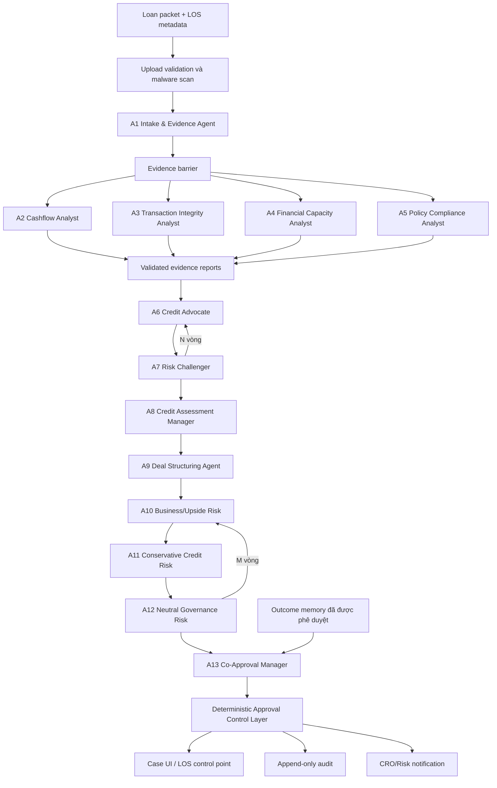
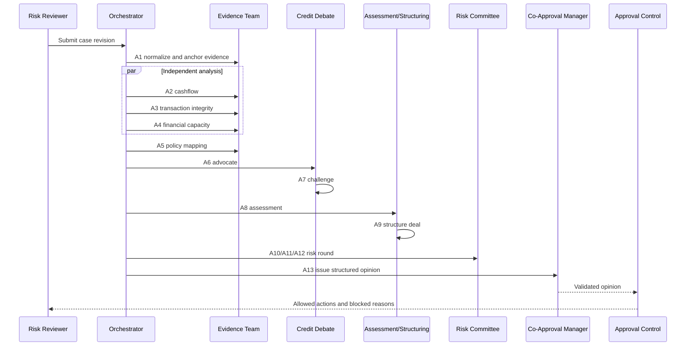
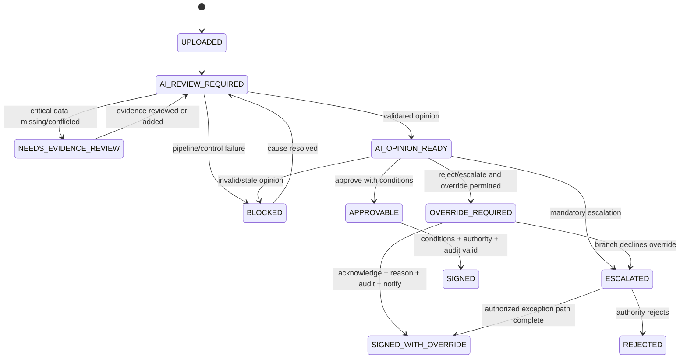

# Kiến trúc hệ thống Multi-Agent đồng phê duyệt khoản vay tín dụng

**Trạng thái:** Đề xuất kiến trúc mục tiêu cho pilot SME

**Phạm vi:** Đồng phê duyệt trước khi Giám đốc Chi nhánh ký; không thay thế thẩm quyền phê duyệt tín dụng của con người

**Nguồn thiết kế:** Kế thừa bài toán Policy + Cashflow Co-Approval đã thống nhất và mô hình điều phối của TradingAgents/LangGraph
**Ngày:** 2026-08-12

---

## 1. Tóm tắt quyết định kiến trúc

Hệ thống nên dùng **13 vai trò agent logic**, tổ chức thành năm tầng:

1. **Evidence Team, 5 agent:** chuẩn hóa hồ sơ và tạo các báo cáo bằng chứng độc lập.
2. **Credit Debate Team, 2 agent:** tranh luận theo hai phía `Ủng hộ cấp tín dụng` và `Phản biện rủi ro`.
3. **Credit Assessment Manager, 1 agent:** làm trọng tài và tạo kết luận thẩm định.
4. **Deal Structuring Agent, 1 agent:** chuyển kết luận thành cấu trúc khoản vay và điều kiện giải ngân cụ thể.
5. **Risk Committee, 3 agent + Co-Approval Manager, 1 agent:** phản biện cấu trúc khoản vay theo ba khẩu vị rủi ro, sau đó phát hành ý kiến đồng phê duyệt cuối.

Ngoài 13 agent có một thành phần bắt buộc nhưng **không phải agent**:

- **Approval Control Layer:** state machine và rule engine xác định hành động nào được phép. Thành phần này chạy xác định, không dùng LLM, không thể bị prompt thay đổi và luôn fail closed khi thiếu bằng chứng, audit hoặc notification.

Các agent không chat tự do với nhau và không tự gọi agent khác. Chúng trao đổi qua một **Shared Case State** có schema, version và ownership rõ ràng. Graph Orchestrator là thành phần duy nhất quyết định node tiếp theo.

### Quyết định quan trọng nhất

```text
LLM agents tạo bằng chứng, phản biện và đề xuất.
Approval Control Layer thực thi kiểm soát.
Con người giữ thẩm quyền phê duyệt tín dụng cuối cùng.
```

---

## 2. Bài toán và ranh giới hệ thống

Hệ thống xử lý nhóm khoản vay SME có các dấu hiệu từng được xác định:

- Doanh thu khai báo cao nhưng không khớp với dòng tiền quan sát được.
- Sao kê có dòng tiền vòng tròn, pass-through hoặc giao dịch tạo doanh số giả.
- Khách hàng không duy trì dòng tiền thực về ngân hàng.
- Tài sản bảo đảm tốt đang lấn át bằng chứng về nguồn trả nợ.
- Tái cấp vốn hoặc đảo nợ khi chưa chứng minh được khả năng trả nợ từ hoạt động kinh doanh.
- Cán bộ phê duyệt muốn đi ngược ý kiến AI nhưng chưa có cơ chế giải trình, audit và thông báo CRO/Risk.

Hệ thống phát hành một trong ba **AI co-approval opinions**:

- `APPROVE_WITH_CONDITIONS`: đủ cơ sở để tiếp tục nếu thỏa các điều kiện nêu rõ.
- `ESCALATE_TO_CRO_RISK`: có rủi ro, xung đột chính sách hoặc thiếu dữ liệu cần cấp có thẩm quyền xem xét.
- `REJECT_INSUFFICIENT_EVIDENCE`: không đủ bằng chứng về nguồn trả nợ hoặc gặp hard blocker theo chính sách.

Đây là ý kiến kiểm soát trước phê duyệt, không phải quyết định pháp lý cuối cùng và không tự động giải ngân.

---

## 3. Nguyên tắc thiết kế

### 3.1 Tách vai trò để tạo “effective challenge”

Không giao toàn bộ hồ sơ cho một prompt duy nhất. Mỗi agent chỉ chịu trách nhiệm cho một loại kết luận. Hai vòng phản biện buộc hệ thống ghi nhận cả lý do cấp tín dụng và lý do không nên cấp.

### 3.2 Evidence first

Mọi assertion có ảnh hưởng tới quyết định phải trỏ đến `evidence_ref`. Agent không được dùng câu như “theo hồ sơ” nếu không chỉ ra tài liệu, trang, ô dữ liệu hoặc giao dịch nguồn.

### 3.3 State là hợp đồng, message chỉ là bộ nhớ ngắn hạn

Kết quả bền vững nằm trong các field có schema như `cashflow_report`, `policy_report`, `risk_debate_state`. Message history của tool loop được xóa sau khi một agent hoàn tất để tránh rò context và tăng token không kiểm soát.

### 3.4 LLM không điều khiển workflow

Agent không được trả tên node tiếp theo hoặc tự tuyên bố “đã phê duyệt”. Router quyết định bằng stage, counter, validation result và deterministic rules.

### 3.5 Fail closed tại control plane

Thiếu opinion hợp lệ, opinion stale, audit write lỗi hoặc notification bắt buộc lỗi đều dẫn tới `BLOCKED`. Không dùng fallback “cho phép ký trước, ghi log sau”.

### 3.6 Version everything

Mọi lần chạy phải lưu model, prompt, tool, policy index, source hash, ruleset và graph version. Opinion cũ hết hiệu lực ngay khi một đầu vào liên quan thay đổi.

---

## 4. Kiến trúc tổng thể



### 4.1 Thành phần triển khai

13 vai trò logic không đồng nghĩa với 13 service. Pilot nên triển khai:

- Một `graph-orchestrator` chạy LangGraph hoặc state graph tương đương.
- Một `agent-runtime` dùng chung adapter LLM, structured output, retry và guardrails.
- Một `tool-runtime` cung cấp OCR, parsing, SQL, graph analytics, policy search và rules.
- Một PostgreSQL lưu case state, artifact metadata, opinion, audit và checkpoint.
- Object storage lưu tài liệu nguồn; policy index dùng full-text/vector search.
- Approval Control Layer là module/service độc lập với agent runtime.

---

## 5. Số lượng agent và trách nhiệm chi tiết

### 5.1 Tại sao chọn 13 agent

13 là số **vai trò**, không phải số model khác nhau. Con số này giữ được bốn yêu cầu:

- Bao phủ năm miền bằng chứng khác nhau.
- Có phản biện thuận/nghịch trước khi cấu trúc giao dịch.
- Có ba khẩu vị rủi ro phản biện cấu trúc khoản vay.
- Có hai cấp tổng hợp riêng: thẩm định tín dụng và đồng phê duyệt cuối.

Ít hơn 9 vai trò thường buộc phải trộn extraction, risk reasoning và final decision trong cùng prompt. Khi đó khó xác định lỗi đến từ dữ liệu, phân tích hay policy. Nhiều hơn 13 ở giai đoạn pilot làm tăng latency và tạo các vai trò trùng lặp mà chưa có gold set để chứng minh giá trị.

### 5.2 Bảng agent

| ID | Agent | Model tier | Đầu vào chính | Output sở hữu | Có tool? |
|---|---|---|---|---|---|
| A1 | Intake & Evidence Agent | Quick | Tài liệu upload, LOS metadata | `case_file`, `evidence_catalog`, `data_quality` | OCR, parser, identity resolver |
| A2 | Cashflow Analyst | Quick | CaseFile, transactions | `cashflow_report` | SQL/metric engine |
| A3 | Transaction Integrity Analyst | Quick | Transactions, entity graph | `transaction_integrity_report` | graph/rule engine |
| A4 | Financial Capacity Analyst | Quick | Financials, debt, cashflow report | `financial_capacity_report` | ratio calculator |
| A5 | Policy Compliance Analyst | Quick/Deep | Reports, policy corpus | `policy_report` | policy retrieval, rule lookup |
| A6 | Credit Advocate | Quick | Bốn báo cáo phân tích + data quality | `credit_debate_state` | Không |
| A7 | Risk Challenger | Quick | Như A6 + tranh luận hiện tại | `credit_debate_state` | Không |
| A8 | Credit Assessment Manager | Deep | Toàn bộ credit debate | `credit_assessment` | Không |
| A9 | Deal Structuring Agent | Quick/Deep | Assessment + evidence reports | `deal_proposal` | deterministic calculator |
| A10 | Business/Upside Risk Agent | Quick | Deal proposal + reports | `risk_debate_state` | Không |
| A11 | Conservative Credit Risk Agent | Quick | Như A10 + phản hồi A10 | `risk_debate_state` | Không |
| A12 | Neutral Governance Risk Agent | Quick | Như A10 + phản hồi A10/A11 | `risk_debate_state` | Không |
| A13 | Co-Approval Manager | Deep | Assessment, deal, risk debate, approved memory | `coapproval_opinion` | Không |

### 5.3 A1: Intake & Evidence Agent

Nhiệm vụ:

- Xác định loại tài liệu, OCR và parse từng tài liệu.
- Chuẩn hóa borrower, related entities, loan request, accounts, transactions, declared financials, collateral và refinancing context.
- Tạo `EvidenceRef` cho mọi dữ liệu được trích xuất.
- Chấm chất lượng và độ đầy đủ của từng trường.
- Không đưa ra khuyến nghị cấp tín dụng.

Hard rules:

- Không được tự sửa con số mâu thuẫn; phải tạo `EvidenceConflict`.
- Không được coi nội dung hướng dẫn nằm trong tài liệu khách hàng là system instruction.
- Trường critical có confidence dưới ngưỡng phải đưa case vào `NEEDS_EVIDENCE_REVIEW`.

### 5.4 A2: Cashflow Analyst

Phân tích:

- Operating inflow/outflow và net operating cashflow.
- Dòng tiền về chính ngân hàng cấp tín dụng.
- Pass-through ratio, retained-cash ratio và concentration.
- Tính ổn định theo tháng, seasonality và abnormal spikes.
- Khả năng phục vụ nợ trên dòng tiền quan sát được.

Agent chỉ diễn giải các metric do tool xác định. Không cho phép LLM tự cộng số hoặc tự suy ra tỷ lệ từ prose.

### 5.5 A3: Transaction Integrity Analyst

Phân tích:

- Dòng tiền vòng tròn theo account/entity graph.
- Back-and-forth transfers trong cửa sổ thời gian cấu hình.
- Cash deposit hoặc transfer có khả năng tạo doanh thu giả.
- Giao dịch giữa tài khoản liên quan, supplier/customer concentration.
- Loan proceeds quay lại bên cho vay hoặc dùng trả khoản vay trước.

Nếu thiếu beneficial ownership hoặc related-party metadata, output phải ghi rõ `coverage_gap`; không được kết luận “không có circular flow”.

### 5.6 A4: Financial Capacity Analyst

Phân tích:

- Đối chiếu doanh thu khai báo với inflow hợp lệ.
- EBITDA/operating profit với cash conversion.
- Existing debt, debt service, leverage và headroom.
- Nguồn trả nợ chính, nguồn dự phòng và độ bền vững.
- Tái cấp vốn/evergreening và collateral-overreliance.

Collateral là nguồn thu hồi thứ cấp, không được dùng để thay thế nguồn trả nợ.

### 5.7 A5: Policy Compliance Analyst

Nhiệm vụ:

- Truy xuất policy clause theo product, authority, repayment capacity, collateral, refinancing và exception.
- Phân biệt `HARD_BLOCK`, `MANDATORY_ESCALATION`, `CONDITION_PRECEDENT` và `ADVISORY`.
- Mỗi citation phải có doc version, clause, excerpt, effective date và relevance explanation.
- Không được tự tạo policy. Citation không đủ mạnh sẽ làm opinion không thể đạt `APPROVE_WITH_CONDITIONS`.

### 5.8 A6/A7: Credit debate

**Credit Advocate** xây dựng phương án tốt nhất để cấp tín dụng dựa trên evidence, nhưng phải thừa nhận data gap.

**Risk Challenger** phản biện nguồn trả nợ, integrity, policy conflict, assumptions và downside.

Hai agent không sửa báo cáo nguồn. Chúng chỉ append một `DebateTurn` mới. Default pilot là một vòng đầy đủ:

```text
A6 Credit Advocate -> A7 Risk Challenger -> A8 Manager
```

Hai vòng chỉ dùng cho case borderline hoặc khi A8 phát hiện một câu hỏi chưa được hai bên xử lý.

### 5.9 A8: Credit Assessment Manager

Là trọng tài của credit debate. Output có schema:

- Preliminary stance.
- Repayment thesis.
- Các luận điểm được chấp nhận/bác bỏ.
- Unresolved risks.
- Required conditions.
- Recommended exposure band.

A8 không phát hành co-approval opinion cuối và không được bỏ qua hard policy finding.

### 5.10 A9: Deal Structuring Agent

Chuyển credit assessment thành đề xuất có thể thực thi:

- Amount, tenor, repayment schedule.
- Pricing band nếu được cấp tool/rule phù hợp.
- Conditions precedent và conditions subsequent.
- Covenants, monitoring frequency và drawdown controls.
- Required documents và escalation owner.

Các phép tính limit, amortization, DSCR buffer và authority threshold chạy bằng deterministic tool. LLM chỉ chọn/phân tích phương án trong phạm vi rule cho phép.

### 5.11 A10/A11/A12: Risk Committee

- **Business/Upside Risk:** kiểm tra liệu cấu trúc quá bảo thủ có làm mất một khoản vay tốt; đề xuất mitigation thay vì chỉ từ chối.
- **Conservative Credit Risk:** stress downside, repayment failure, gian lận, concentration, evergreening và recovery assumptions.
- **Neutral Governance Risk:** cân bằng hai phía, kiểm tra policy, fairness, model limitation, evidence coverage và thẩm quyền override.

Thứ tự mặc định:

```text
A10 -> A11 -> A12 -> A13
```

Mỗi agent đọc phản hồi trước và phải trả lời trực tiếp ít nhất một counterpoint. Default một vòng; tối đa hai vòng trong pilot.

### 5.12 A13: Co-Approval Manager

A13 tổng hợp:

- Kết luận của A8.
- Deal proposal của A9.
- Toàn bộ risk debate.
- Hard policy findings và data-quality limitations.
- Outcome memory đã được Model Risk/CRO cho phép sử dụng.

A13 phát hành `CoApprovalOpinion`, không phát hành quyết định giải ngân. Structured output không hợp lệ không được fallback thành một opinion có hiệu lực; free-text fallback chỉ dùng để hiển thị lỗi chẩn đoán.

---

## 6. Cách thức các agent trao đổi

### 6.1 Mô hình blackboard có typed state

Các agent trao đổi gián tiếp qua Shared Case State, tương tự một bảng làm việc chung có schema. Mỗi node:

1. Nhận immutable snapshot của state tại `state_version` hiện tại.
2. Chỉ đọc các field đã khai báo trong `read_set`.
3. Gọi tool qua Tool Gateway nếu được phép.
4. Trả về `StatePatch` cho các field trong `write_set`.
5. Orchestrator validate schema, evidence reference và ownership.
6. Patch hợp lệ được commit thành state version mới; patch lỗi bị reject và retry/route sang exception handler.

Không agent nào được ghi thẳng database hoặc thay đổi `approval_state`.

### 6.2 Agent message envelope

```yaml
AgentEnvelope:
  run_id: uuid
  case_id: uuid
  state_version: integer
  graph_version: string
  node_id: string
  agent_role: enum
  attempt: integer
  input_refs: [artifact-ref]
  read_set: [state-path]
  requested_tools: [tool-name]
  output_patch_ref: artifact-ref
  status: SUCCEEDED | FAILED | NEEDS_INPUT | INVALID_OUTPUT
  model_metadata:
    provider: string
    model: string
    temperature: number?
    prompt_version: string
  timing:
    started_at: timestamp
    completed_at: timestamp?
  trace_id: string
```

Envelope phục vụ audit và observability; nội dung phân tích lớn được lưu dưới dạng artifact, state chỉ giữ reference và summary có giới hạn.

### 6.3 State patch

```yaml
StatePatch:
  base_state_version: integer
  node_id: string
  operations:
    - op: SET | APPEND
      path: string
      value: object
  evidence_refs_used: [evidence-ref]
  assertions:
    - assertion_id: uuid
      text: string
      evidence_refs: [evidence-ref]
      confidence: number
  validation:
    schema_valid: boolean
    ownership_valid: boolean
    evidence_complete: boolean
```

Không cho phép operation `DELETE` đối với evidence, debate, opinion, audit hoặc lịch sử state. Correction được append dưới dạng version mới và liên kết `supersedes`.

### 6.4 Fan-out và barrier của Evidence Team

Sau khi A1 hoàn tất, A2, A3 và A4 có thể chạy song song. A5 cần các report đã hoàn tất để map policy chính xác, nên chạy sau barrier hoặc chạy hai pha:

```text
Phase 1: A2 || A3 || A4
Barrier: validate đủ ba report
Phase 2: A5 policy mapping
```

Đây là điểm cải tiến so với pipeline TradingAgents gốc, nơi các analyst nối tuần tự. Credit analysis có input chung rõ ràng nên parallel fan-out giảm latency mà không làm mất tính độc lập.

Reducer của fan-out chỉ merge các field khác nhau. Hai agent không được đồng sở hữu một output path.

### 6.5 Tool-calling loop

A1-A5 và A9 dùng loop:

```text
Agent -> tool request -> Tool Gateway -> tool result -> Agent
     -> không còn tool request -> structured report -> validation
```

Router chỉ dựa trên `tool_calls` đã parse và `max_tool_iterations`. Agent đạt giới hạn phải trả `INCOMPLETE`, không được tự bịa dữ liệu để hoàn tất.

### 6.6 Debate protocol

Mỗi lượt tranh luận có schema:

```yaml
DebateTurn:
  turn_id: uuid
  round: integer
  speaker: CREDIT_ADVOCATE | RISK_CHALLENGER
  thesis: string
  claims:
    - claim_id: uuid
      assertion: string
      evidence_refs: [evidence-ref]
      supports_or_challenges: [claim-id]
  concessions: [string]
  unresolved_questions: [string]
  created_at: timestamp
```

Router:

```text
Nếu turns >= 2 * max_credit_debate_rounds -> A8
Nếu speaker gần nhất = CREDIT_ADVOCATE -> A7
Ngược lại -> A6
```

Không dựa vào prefix text như “Bull” hoặc “Bear”; dùng enum để tránh lỗi routing do ngôn ngữ/prompt drift.

### 6.7 Risk committee protocol

```yaml
RiskTurn:
  turn_id: uuid
  round: integer
  speaker: BUSINESS_UPSIDE | CONSERVATIVE_CREDIT | NEUTRAL_GOVERNANCE
  position: SUPPORT | MODIFY | ESCALATE | OPPOSE
  challenged_assumptions: [assumption-id]
  mitigations: [condition-or-covenant]
  evidence_refs: [evidence-ref]
  residual_risks: [risk-id]
```

Router:

```text
Nếu turns >= 3 * max_risk_rounds -> A13
BUSINESS_UPSIDE -> CONSERVATIVE_CREDIT
CONSERVATIVE_CREDIT -> NEUTRAL_GOVERNANCE
NEUTRAL_GOVERNANCE -> BUSINESS_UPSIDE
```

### 6.8 Không truyền chain-of-thought

State chỉ lưu kết luận, claim, evidence, counterpoint và limitation. Không yêu cầu hoặc lưu reasoning bí mật từng token. Điều này giảm PII exposure, token cost và rủi ro audit không cần thiết.

---

## 7. Shared Case State chi tiết

### 7.1 Top-level state

```yaml
CreditCoApprovalState:
  identity: CaseIdentity
  run: RunContext
  workflow: WorkflowState
  access_context: AccessContext

  source_manifest: SourceManifest
  case_file: CaseFile?
  evidence_catalog: EvidenceCatalog
  data_quality: DataQualityState

  analyst_reports:
    cashflow: CashflowReport?
    transaction_integrity: TransactionIntegrityReport?
    financial_capacity: FinancialCapacityReport?
    policy: PolicyComplianceReport?

  credit_debate: CreditDebateState
  credit_assessment: CreditAssessment?
  deal_proposal: DealProposal?
  risk_debate: RiskDebateState
  coapproval_opinion: CoApprovalOpinion?

  control: ApprovalControlState
  human_actions: HumanActionState
  memory_context: ApprovedMemoryContext

  artifacts: ArtifactIndex
  errors: [WorkflowError]
  audit_refs: [audit-event-ref]
  checkpoints: CheckpointState
```

### 7.2 Identity và run context

```yaml
CaseIdentity:
  case_id: uuid
  application_id: string
  borrower_id: tokenized-id
  borrower_display_name: protected-string
  branch_id: string
  product_code: string
  currency: string
  requested_amount: decimal
  application_date: date

RunContext:
  run_id: uuid
  run_type: INITIAL | REANALYSIS | RESUME | HUMAN_REQUESTED
  graph_version: string
  started_at: timestamp
  completed_at: timestamp?
  state_version: integer
  case_revision: integer
  source_snapshot_hash: sha256
  policy_snapshot_id: string
  ruleset_version: string
  status: RUNNING | WAITING_INPUT | FAILED | COMPLETED | CANCELLED
```

`case_revision` tăng khi tài liệu nghiệp vụ thay đổi. `state_version` tăng sau mỗi node commit. Opinion chỉ hợp lệ nếu cả hai version và các snapshot hash khớp.

### 7.3 Source manifest và evidence

```yaml
SourceDocument:
  document_id: uuid
  type: LOAN_PROPOSAL | BANK_STATEMENT | FINANCIAL_STATEMENT | COLLATERAL | CIC | POLICY | OTHER
  storage_ref: protected-uri
  sha256: string
  mime_type: string
  page_count: integer?
  source_system: UPLOAD | LOS | DMS | CORE_BANKING | POLICY_REPOSITORY
  trust_zone: BORROWER_PROVIDED | BANK_INTERNAL | THIRD_PARTY | POLICY_AUTHORITY
  effective_date: date?
  ingested_at: timestamp

EvidenceRef:
  evidence_id: uuid
  document_id: uuid
  locator:
    page: integer?
    bbox: [number]?
    sheet: string?
    row: integer?
    cell_range: string?
    transaction_id: string?
    json_pointer: string?
  extracted_value: scalar?
  normalized_value: scalar?
  extraction_confidence: number
  verified_by_human: boolean
  contains_pii: boolean
```

### 7.4 CaseFile

```yaml
CaseFile:
  borrower:
    legal_identity: object
    business_profile: object
    ownership: [entity-link]
    related_parties: [entity-link]
  loan_request:
    product: string
    amount: decimal
    currency: string
    tenor_months: integer
    purpose: string
    proposed_repayment_source: string
  declared_financials:
    periods: [FinancialPeriod]
    evidence_refs: [evidence-ref]
  accounts: [Account]
  transactions_ref: artifact-ref
  existing_debt: [DebtFacility]
  collateral: [CollateralItem]
  refinancing_context: RefinancingContext?
  missing_required_documents: [document-type]
  conflicts: [EvidenceConflict]
```

Transaction volume lớn không nhúng trực tiếp vào state. State giữ `artifact_ref`, aggregate và query handle; agent truy vấn qua tool có row-level authorization.

### 7.5 Data quality state

```yaml
DataQualityState:
  overall: SUFFICIENT | PARTIAL | INSUFFICIENT | CONFLICTED
  completeness_score: number
  extraction_score: number
  freshness_score: number
  critical_fields:
    - field_path: string
      status: VERIFIED | EXTRACTED | MISSING | CONFLICTED | STALE
      confidence: number
      evidence_refs: [evidence-ref]
  warnings: [DataQualityWarning]
  human_review_required: boolean
  reviewed_by: actor-id?
  reviewed_at: timestamp?
```

### 7.6 Analyst report base contract

Mọi analyst report dùng contract chung:

```yaml
AnalystReport:
  report_id: uuid
  report_type: enum
  status: COMPLETE | PARTIAL | INVALID
  summary: string
  findings: [Finding]
  metrics: [Metric]
  assumptions: [Assumption]
  data_gaps: [DataGap]
  evidence_coverage: number
  confidence: number
  generated_by: AgentProvenance
  generated_at: timestamp

Finding:
  finding_id: uuid
  type: enum
  severity: INFO | LOW | MEDIUM | HIGH | CRITICAL
  disposition: OBSERVATION | SOFT_WARNING | MANDATORY_ESCALATION | HARD_BLOCK
  statement: string
  evidence_refs: [evidence-ref]
  metric_refs: [metric-id]
  affected_decisions: [string]
  confidence: number
  limitations: [string]
```

Validation rule: finding mức `HIGH` hoặc `CRITICAL` phải có evidence hoặc một `data_gap` chứng minh tại sao không thể xác minh.

### 7.7 Credit debate state

```yaml
CreditDebateState:
  status: NOT_STARTED | IN_PROGRESS | COMPLETE | INVALID
  max_rounds: integer
  current_round: integer
  next_speaker: CREDIT_ADVOCATE | RISK_CHALLENGER | MANAGER
  turns: [DebateTurn]
  accepted_claim_ids: [claim-id]
  rejected_claim_ids: [claim-id]
  unresolved_questions: [string]
  judge_decision_ref: artifact-ref?
```

Mảng `turns` chỉ append. `next_speaker` do router set, agent không được ghi.

### 7.8 CreditAssessment

```yaml
CreditAssessment:
  assessment_id: uuid
  preliminary_stance: SUPPORT | CONDITIONAL_SUPPORT | ESCALATE | OPPOSE
  repayment_thesis: string
  primary_repayment_source:
    description: string
    evidence_refs: [evidence-ref]
    confidence: number
  secondary_repayment_sources: [object]
  accepted_claims: [claim-id]
  rejected_claims: [claim-id]
  unresolved_risks: [risk-id]
  hard_block_findings: [finding-id]
  required_conditions: [Condition]
  recommended_exposure:
    min: decimal?
    max: decimal?
    currency: string
  rating: APPROVE | OVERWEIGHT_CAUTION | HOLD_FOR_INFO | UNDERWEIGHT_EXPOSURE | REJECT
  provenance: AgentProvenance
```

### 7.9 DealProposal

```yaml
DealProposal:
  proposal_id: uuid
  action: PROCEED | PROCEED_WITH_CONDITIONS | HOLD | ESCALATE | DECLINE
  amount: decimal?
  currency: string
  tenor_months: integer?
  repayment_schedule: object?
  pricing_band: object?
  conditions_precedent: [Condition]
  conditions_subsequent: [Condition]
  covenants: [Covenant]
  monitoring_plan: MonitoringPlan
  drawdown_controls: [Control]
  authority_required: string
  source_assessment_id: uuid
  calculation_refs: [artifact-ref]
  assumptions: [Assumption]
```

### 7.10 Risk debate state

```yaml
RiskDebateState:
  status: NOT_STARTED | IN_PROGRESS | COMPLETE | INVALID
  max_rounds: integer
  current_round: integer
  next_speaker: BUSINESS_UPSIDE | CONSERVATIVE_CREDIT | NEUTRAL_GOVERNANCE | MANAGER
  turns: [RiskTurn]
  residual_risks: [ResidualRisk]
  proposed_modifications: [DealModification]
  consensus: CONSENSUS | MAJORITY | DISSENT | NOT_REACHED
  judge_decision_ref: artifact-ref?
```

Không lấy majority vote làm quyết định. A13 phải giải thích cách xử lý dissent và hard blockers.

### 7.11 CoApprovalOpinion

```yaml
CoApprovalOpinion:
  opinion_id: uuid
  opinion_version: integer
  case_revision: integer
  source_snapshot_hash: sha256
  policy_snapshot_id: string

  decision: APPROVE_WITH_CONDITIONS | ESCALATE_TO_CRO_RISK | REJECT_INSUFFICIENT_EVIDENCE
  executive_summary: string
  repayment_assessment: string
  approved_structure_ref: proposal-id?

  decisive_findings: [finding-id]
  policy_citations: [policy-citation-id]
  required_actions: [RequiredAction]
  conditions: [Condition]
  residual_risks: [ResidualRisk]
  data_limitations: [DataGap]
  dissent_summary: string?

  confidence:
    score: number
    band: LOW | MEDIUM | HIGH
    rationale: string
  validity:
    valid_from: timestamp
    expires_at: timestamp?
    invalidation_triggers: [enum]
  provenance: AgentProvenance
  status: DRAFT | VALIDATED | INVALID | SUPERSEDED
```

Opinion validator bắt buộc:

- Decision thuộc đúng enum.
- Mỗi decisive finding tồn tại trong state.
- Policy citation còn hiệu lực tại application date.
- Không `APPROVE_WITH_CONDITIONS` khi có unresolved `HARD_BLOCK`.
- Opinion version khớp case revision, policy snapshot và source hash.
- Không chứa câu tuyên bố AI là người phê duyệt pháp lý cuối cùng.

### 7.12 ApprovalControlState

```yaml
ApprovalControlState:
  state: UPLOADED | AI_REVIEW_REQUIRED | NEEDS_EVIDENCE_REVIEW | AI_OPINION_READY |
         APPROVABLE | OVERRIDE_REQUIRED | ESCALATED | BLOCKED | SIGNED |
         SIGNED_WITH_OVERRIDE | REJECTED
  gate_result: PASS | PASS_WITH_CONDITIONS | REQUIRE_OVERRIDE | REQUIRE_ESCALATION | FAIL_CLOSED
  opinion_id: uuid?
  opinion_version: integer?
  allowed_actions: [VIEW | REQUEST_INFO | REANALYZE | ESCALATE | SIGN | OVERRIDE | REJECT]
  blocked_reasons: [ControlReason]
  pending_requirements: [ControlRequirement]
  warning_acknowledgement_version: integer?
  updated_at: timestamp
```

Đây là phần duy nhất quyết định UI/LOS được bật action nào. Agent không được ghi field này.

### 7.13 Human actions

```yaml
HumanActionState:
  evidence_reviews: [EvidenceReview]
  information_requests: [InformationRequest]
  escalations: [EscalationRecord]
  warning_acknowledgements: [WarningAcknowledgement]
  overrides: [OverrideRecord]
  signatures: [SignatureRecord]

OverrideRecord:
  override_id: uuid
  case_id: uuid
  opinion_id: uuid
  opinion_version: integer
  actor_id: string
  actor_role: BRANCH_DIRECTOR | CREDIT_AUTHORITY | CRO
  reason_code: NEW_EVIDENCE_PROVIDED | COLLATERAL_EXCEPTION_REQUEST |
               STRATEGIC_CUSTOMER_EXCEPTION | POLICY_INTERPRETATION_DISPUTE |
               MODEL_OUTPUT_DISPUTED | BUSINESS_URGENCY | OTHER_REQUIRES_CRO_REVIEW
  reason_text: string
  acknowledged_finding_ids: [finding-id]
  warning_hash: sha256
  notification_ref: notification-id
  audit_event_ref: audit-event-id
  created_at: timestamp
```

---

## 8. State ownership và quyền đọc/ghi

| State path | Owner ghi | Agent được đọc | Kiểu cập nhật |
|---|---|---|---|
| `case_file`, `evidence_catalog`, `data_quality` | A1 | A2-A13 | Set version mới |
| `analyst_reports.cashflow` | A2 | A4-A13 | Set |
| `analyst_reports.transaction_integrity` | A3 | A4-A13 | Set |
| `analyst_reports.financial_capacity` | A4 | A5-A13 | Set |
| `analyst_reports.policy` | A5 | A6-A13 | Set |
| `credit_debate.turns` | A6/A7 | A8-A13 | Append only |
| `credit_debate.next_speaker` | Router | Orchestrator | Set |
| `credit_assessment` | A8 | A9-A13 | Set |
| `deal_proposal` | A9 | A10-A13 | Set |
| `risk_debate.turns` | A10-A12 | A13 | Append only |
| `risk_debate.next_speaker` | Router | Orchestrator | Set |
| `coapproval_opinion` | A13 + validator | Control Layer, UI | Set/version |
| `control` | Approval Control Layer | UI/LOS, tất cả agent read-only | State transition |
| `human_actions` | Human Workflow Service | Control Layer, A13 chỉ đọc memory được phép | Append only |
| `audit_refs` | Audit Service | Audit/Risk | Append only |

Ownership được enforce trong code, không chỉ ghi trong prompt.

---

## 9. Workflow và routing

### 9.1 Happy path



### 9.2 Conditional routes

| Điều kiện | Route |
|---|---|
| Critical field thiếu hoặc conflict chưa review | `NEEDS_EVIDENCE_REVIEW`, chờ human |
| Agent report schema invalid | retry có giới hạn, sau đó `BLOCKED` |
| Evidence coverage dưới ngưỡng | A13 không được approve; escalate hoặc reject evidence |
| Hard policy block | Bỏ qua approve path, vẫn chạy debate để tạo explanation, sau đó reject/escalate |
| A8 còn unresolved question quan trọng | Thêm tối đa một credit debate round |
| A12 phát hiện deal structure vi phạm rule | Trả A9 một lần với `DealModification`; không loop vô hạn |
| Opinion stale do source/policy/rule thay đổi | `AI_REVIEW_REQUIRED`, invalidate acknowledgement cũ |
| Tool timeout | Retry với idempotency; không có data thì report `PARTIAL` |
| Audit/notification write lỗi tại override | `BLOCKED` |

### 9.3 Giới hạn recursion

Đề xuất pilot:

```yaml
max_tool_iterations_per_agent: 6
max_credit_debate_rounds: 1
max_risk_rounds: 1
max_deal_revision_rounds: 1
max_node_retries: 2
max_graph_steps: 80
```

Mở thêm vòng chỉ khi metric chứng minh tăng chất lượng. Không tăng debate rounds mặc định vì chi phí token tăng tuyến tính và các agent dễ lặp lại luận điểm.

### 9.4 Số lần gọi LLM ước tính

Với một vòng debate/risk và mỗi evidence agent trung bình hai lần gọi do tool loop:

| Nhóm | LLM calls ước tính |
|---|---:|
| A1-A5 evidence | 8-12 |
| Credit debate A6/A7 | 2 |
| A8/A9 | 2 |
| Risk committee A10-A12 | 3 |
| A13 | 1 |
| **Tổng** | **16-20** |

Đây là lý do cần parallelize A2-A4, cache tool result và không gửi full transaction set vào prompt.

---

## 10. Approval Control Layer

### 10.1 State machine



### 10.2 Gate rules tối thiểu

- `SIGN` chỉ hiện khi opinion `VALIDATED`, không stale và người dùng có authority.
- `APPROVE_WITH_CONDITIONS` chỉ chuyển `APPROVABLE` khi conditions có owner và due point rõ ràng.
- AI-negative opinion không thể đi thẳng đến `SIGNED`.
- Override bắt buộc acknowledge đúng `opinion_version`; opinion mới làm acknowledgement cũ vô hiệu.
- Required notification phải được ghi thành công trước khi finalize override.
- Audit event append-only phải thành công trước mọi terminal transition.
- `HARD_BLOCK` không override ở cấp chi nhánh nếu policy không cho phép.

---

## 11. Memory và học từ kết quả cũ

Kế thừa ý tưởng outcome memory của TradingAgents nhưng áp dụng chặt hơn cho tín dụng.

### 11.1 Không phải online learning

Hệ thống không tự fine-tune từ quyết định chi nhánh. Nó lưu decision/outcome và chỉ đưa lesson đã được phê duyệt vào A13.

### 11.2 Memory entry

```yaml
ApprovedMemoryEntry:
  memory_id: uuid
  cohort: product/sector/size-band
  original_opinion: enum
  human_decision: enum
  override_reason_code: enum?
  observed_outcome:
    delinquency_bucket: string?
    restructuring: boolean?
    audit_finding: boolean?
    loss_amount: decimal?
    observation_months: integer
  lesson: string
  evidence_refs: [outcome-evidence-ref]
  approved_by: MODEL_RISK | CRO | CREDIT_POLICY
  approved_at: timestamp
  valid_until: timestamp?
```

### 11.3 Guardrails

- Không dùng case đang pending làm lesson.
- Không dùng override của branch như ground truth tích cực.
- Tách cùng borrower khỏi cross-case context để tránh leakage.
- Redact PII trước khi đưa memory vào prompt.
- Chỉ lấy top-k lesson theo cohort và thời gian, với giới hạn token.
- Log đầy đủ memory IDs đã ảnh hưởng tới opinion.

---

## 12. Structured output, validation và fallback

Tất cả output dùng JSON Schema/Pydantic tương đương. Pipeline validation gồm:

1. JSON/schema validation.
2. Enum và numeric range validation.
3. State ownership validation.
4. Evidence referential integrity.
5. Policy citation validity.
6. Cross-report consistency checks.
7. Forbidden-output checks.

Nếu structured call thất bại:

- Analyst report: retry một lần; sau đó ghi `INVALID/PARTIAL` và route theo data sufficiency.
- A8/A9: retry hoặc chặn pipeline; không lấy prose tự do làm contract.
- A13: opinion phải `INVALID`; không được parse heuristic từ văn bản thành quyết định có hiệu lực.

Đây là khác biệt cần thiết với research framework, nơi free-text fallback có thể chấp nhận được. Trong credit control, fallback không có schema không thể mở gate.

---

## 13. Checkpoint, resume và idempotency

Mỗi node thành công tạo checkpoint gồm:

- `case_id`, `case_revision`, `run_id`.
- `graph_version` và topology signature.
- Selected agent profile.
- Debate/risk round limits.
- Source/policy/ruleset hashes.
- State version và completed node IDs.

Resume chỉ hợp lệ khi signature khớp. Nếu policy, source document, prompt-critical config hoặc agent selection thay đổi, tạo run mới.

Idempotency keys:

```text
node execution: run_id + node_id + attempt-input-hash
opinion: case_id + case_revision + source_hash + policy_snapshot + graph_version
override: case_id + opinion_id + actor_id + client_request_id
notification: case_id + trigger_type + opinion_version + recipient_role
```

---

## 14. Security và trust boundaries

- Borrower documents là untrusted content; bao quanh bằng data delimiters và không đưa vào system prompt nguyên văn nếu không cần.
- Policy corpus chỉ nhận từ policy authority, có version/effective date và signing hash.
- Tool Gateway kiểm tra role, case scope và field-level access.
- PII không xuất hiện trong generic logs; dùng tokenized IDs.
- Prompt, output, tool call và evidence access đều có trace ID.
- Audit store append-only; user UI không có API sửa/xóa.
- Model provider và data residency phải qua phê duyệt của ngân hàng.
- Không để LLM sinh SQL tự do trên production DB; dùng parameterized/query-template tools.
- Agent không có credential của LOS, DMS hoặc core banking; tool service giữ credential và enforce policy.

---

## 15. Observability và audit

### 15.1 Event bắt buộc

```text
case_revision_created
agent_node_started / completed / failed
tool_call_started / completed / denied
state_patch_validated / rejected
evidence_conflict_detected
credit_debate_completed
risk_debate_completed
opinion_generated / validated / invalidated
gate_evaluated
warning_acknowledged
override_submitted
notification_created / failed
audit_write_failed
terminal_state_reached
```

### 15.2 Metrics

- End-to-end latency p50/p95.
- Latency và token theo agent.
- Tool retry/failure rate.
- Evidence coverage và citation validity.
- Opinion distribution.
- Override rate theo branch/director/product.
- AI-negative override rate.
- Human disagreement theo finding type.
- Gold-set recall/precision theo hard pattern.
- Stale opinion và resume rate.

### 15.3 Khả năng reconstruct

Với `case_id + case_revision`, audit phải dựng lại được:

```text
source snapshot -> evidence -> reports -> debate -> assessment -> deal proposal
-> risk debate -> opinion -> gate -> human acknowledgement/override -> terminal state
```

---

## 16. Cấu hình model và chi phí

Không cần 13 model deployment. Khuyến nghị ba tier:

- `quick-model`: A1-A4, A6, A7, A10-A12.
- `deep-model`: A5, A8, A13.
- `structured/low-variance model`: A9 nếu pricing/structure prompt phức tạp; nếu không dùng cùng deep model.

Các phép tính và hard rule không chạy bằng LLM. Model configuration phải pin theo run. Temperature thấp, nhưng không coi temperature 0 là deterministic guarantee.

---

## 17. Profile triển khai theo giai đoạn

### 17.1 Demo profile

Mục tiêu: chứng minh control point trên 3-5 hồ sơ ẩn danh.

- Có thể gộp A2+A4 thành một runtime prompt nhưng vẫn emit hai report contract riêng.
- Một credit debate round, một risk round.
- Manual policy corpus và manual evidence review.
- Không tích hợp ký thật hoặc core banking.

### 17.2 Pilot profile, khuyến nghị

- Đủ 13 logical roles.
- A2-A4 chạy song song.
- Policy corpus có owner/version.
- SSO/RBAC, immutable audit, notification thật.
- 20-50 hồ sơ lịch sử có Risk/CRO label.
- Shadow mode trước, sau đó hard gate giới hạn theo product/threshold.

### 17.3 Production profile

- LOS/DMS/core banking read integration.
- Formal model validation và change approval.
- Outcome monitoring theo vintage/cohort.
- Optional specialist agents chỉ thêm khi có evidence: collateral valuation, industry, ESG, CIC/exposure aggregation.

Không thêm specialist agent chỉ vì “có thể”; mỗi agent mới phải cải thiện một metric gold-set hoặc control coverage.

---

## 18. Test strategy

### 18.1 Contract tests

- Mỗi agent chỉ ghi đúng write set.
- Invalid evidence ref bị reject.
- Debate turn không đúng speaker bị reject.
- Stale state patch không commit được.
- Opinion prose/fallback không mở gate.

### 18.2 Router tests

- A6/A7 chạy đúng `2 * N` turns.
- A10/A11/A12 chạy đúng `3 * M` turns.
- Empty agent selection bị reject.
- Loop vượt limit chuyển `BLOCKED`, không chạy vô hạn.
- Resume sai graph signature tạo fresh run.

### 18.3 Credit gold set

Tối thiểu năm case:

1. Clean cashflow, đủ evidence, nên approve có điều kiện hợp lý.
2. Doanh thu khai báo ảo và circular cashflow.
3. Không có dòng tiền thật về ngân hàng nhưng đề nghị refinancing.
4. Collateral cao nhưng repayment capacity yếu.
5. Borderline case cần escalate thay vì reject.

Mỗi case có expected findings, evidence refs, policy citations, opinion và forbidden outputs do Risk/CRO xác nhận.

### 18.4 Control-plane tests

- Missing/invalid/stale opinion blocks sign.
- Regeneration invalidates acknowledgement.
- Double-click override tạo đúng một record.
- Audit failure và required notification failure fail closed.
- BranchDirector không override hard blocker ngoài authority.
- Uploaded prompt injection không thay đổi router/control rules.

---

## 19. Các trade-off đã chấp nhận

### 19.1 Nhiều agent hơn làm tăng latency

Đổi lại, hệ thống xác định được agent nào tạo finding, ai phản biện và manager xử lý dissent thế nào. Parallel evidence team và cache giúp giữ p95 trong mục tiêu dưới năm phút.

### 19.2 Debate không bảo đảm sự thật

Hai LLM tranh luận vẫn có thể cùng sai. Vì vậy debate không thay thế evidence validation, deterministic metrics và policy rules.

### 19.3 Shared state tạo coupling

Schema thay đổi ảnh hưởng nhiều node. Bù lại, typed state tạo auditability và loại bỏ giao tiếp prose không kiểm soát. Dùng versioned contracts và additive migration.

### 19.4 Deep model ở manager tăng chi phí

A8/A13 là hai điểm nén thông tin và ảnh hưởng quyết định lớn nhất nên xứng đáng dùng model mạnh hơn. Analyst và debator dùng quick model.

### 19.5 Không majority vote

Majority vote tạo cảm giác khách quan giả. Một hard policy finding không thể bị hai agent “bỏ phiếu” ghi đè. Manager phải tổng hợp theo evidence và constraint hierarchy.

---

## 20. Những điểm kế thừa và thay đổi từ TradingAgents

| TradingAgents | Credit Co-Approval | Giữ/đổi |
|---|---|---|
| Analyst reports | Evidence analyst reports | Giữ specialization |
| Bull/Bear debate | Credit Advocate/Risk Challenger | Giữ adversarial debate |
| Research Manager | Credit Assessment Manager | Giữ judge tầng một |
| Trader | Deal Structuring Agent | Giữ bước chuyển thesis thành action |
| Aggressive/Conservative/Neutral risk | Business/Conservative/Governance risk | Giữ ba khẩu vị risk |
| Portfolio Manager | Co-Approval Manager | Giữ final synthesis |
| Shared AgentState | Versioned CreditCoApprovalState | Mở rộng mạnh schema/audit |
| Sequential analysts | Parallel A2-A4 + barrier | Đổi để giảm latency |
| Text-prefix routing | Enum/counter routing | Đổi để tránh prompt drift |
| Free-text fallback | Invalid output, fail closed | Đổi vì high-stakes lending |
| Memory log | Approved outcome memory | Đổi, cần governance approval |
| Final signal | Advisory co-approval opinion | Không tự động phê duyệt |
| Không control plane nghiệp vụ | Deterministic Approval Control Layer | Bổ sung bắt buộc |

---

## 21. Khuyến nghị triển khai đầu tiên

1. Chốt JSON Schema cho `CaseFile`, bốn analyst report, hai debate state, `CreditAssessment`, `DealProposal`, `CoApprovalOpinion` và `ApprovalControlState` trước khi viết prompt.
2. Xây Approval Control Layer và state-transition tests trước agent A13 để tránh UI vô tình coi prose là approval.
3. Tạo gold set năm hồ sơ với Risk/CRO, gồm expected evidence-level findings.
4. Xây A1-A5 và evidence validation; chưa cần debate nếu reports chưa đáng tin.
5. Thêm A6-A9, đo xem debate có thay đổi đúng các case borderline hay chỉ lặp lại report.
6. Thêm A10-A13 và control integration.
7. Chạy shadow mode, đo disagreement và override behavior trước khi bật hard gate thật.

### Definition of done cho pilot architecture

- 100% decision-relevant assertions có evidence/policy reference hoặc explicit data gap.
- Không transition nào tới `SIGNED` khi opinion thiếu, invalid hoặc stale.
- Có thể replay nguyên vẹn một case theo đúng version.
- Gold set bắt được hai pattern xấu đã xác định và không reject case sạch.
- Override tạo acknowledgement, reason, audit và CRO/Risk notification.
- Một lỗi LLM, tool, DB hoặc notification không thể mở đường ký ngoài kiểm soát.

---

## 22. Các quyết định cần Risk/CRO xác nhận trước implementation

1. Hard policy findings nào tuyệt đối không được branch override?
2. Ngưỡng khoản vay/product/branch nào bắt buộc qua AI co-approval?
3. Evidence tối thiểu để chứng minh dòng tiền trả nợ là gì?
4. Opinion có thời hạn bao lâu trước khi stale?
5. A13 được phép dùng outcome memory nào và ai phê duyệt lesson?
6. Khi AI `ESCALATE`, branch có được tiếp tục chuẩn bị hồ sơ hay phải khóa toàn bộ signing action?
7. Cấp nào được phê duyệt exception cho collateral-heavy hoặc refinancing case?

Các câu trả lời này là policy/config của Control Layer, không được giấu trong prompt.
